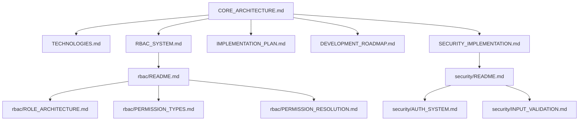

# Documentation Knowledge Graph

> **Version**: 1.0.0  
> **Last Updated**: 2025-05-23

## Overview

This document defines the explicit relationships between all documentation files to help AI platforms navigate the knowledge base effectively.

## Core Architecture Relationships



## Implementation Phase Dependencies

### Phase 1 Dependencies
- **Foundation**: `implementation/phase1/DOCUMENT_MAP.md`
  - **Requires**: `CORE_ARCHITECTURE.md`, `TECHNOLOGIES.md`
  - **Implements**: Database, Authentication, RBAC Foundation
  - **Validates**: `implementation/phase1/TESTING_INTEGRATION.md`

### Phase 2 Dependencies  
- **Core Features**: `implementation/phase2/DOCUMENT_MAP.md`
  - **Requires**: Phase 1 completion
  - **Implements**: Advanced RBAC, Enhanced Multi-tenant
  - **Validates**: `implementation/phase2/TESTING_INTEGRATION.md`

### Phase 3 Dependencies
- **Advanced Features**: `implementation/phase3/DOCUMENT_MAP.md`
  - **Requires**: Phase 2 completion
  - **Implements**: Dashboards, Security Monitoring
  - **Validates**: `implementation/phase3/TESTING_INTEGRATION.md`

### Phase 4 Dependencies
- **Production**: `implementation/phase4/DOCUMENT_MAP.md`
  - **Requires**: Phase 3 completion
  - **Implements**: Mobile, Security Hardening
  - **Validates**: `implementation/phase4/TESTING_INTEGRATION.md`

## System Integration Relationships

### RBAC System Connections
- **Core**: `rbac/README.md`
- **Security Integration**: `integration/SECURITY_RBAC_INTEGRATION.md`
- **Audit Integration**: `integration/RBAC_AUDIT_INTEGRATION.md`
- **User Management**: `user-management/RBAC_INTEGRATION.md`
- **Multi-tenant**: `rbac/ENTITY_BOUNDARIES.md`

### Security System Connections
- **Core**: `security/README.md`
- **Authentication**: `security/AUTH_SYSTEM.md`
- **RBAC Integration**: `integration/SECURITY_RBAC_INTEGRATION.md`
- **Audit Integration**: `integration/SECURITY_AUDIT_INTEGRATION.md`
- **Mobile**: `mobile/SECURITY.md`

### Multi-tenancy Connections
- **Core**: `multitenancy/README.md`
- **Data Isolation**: `multitenancy/DATA_ISOLATION.md`
- **RBAC Boundaries**: `rbac/ENTITY_BOUNDARIES.md`
- **User Management**: `user-management/MULTITENANCY_INTEGRATION.md`
- **Database Patterns**: `multitenancy/DATABASE_QUERY_PATTERNS.md`

### Audit System Connections
- **Core**: `audit/README.md`
- **Security Integration**: `integration/SECURITY_AUDIT_INTEGRATION.md`
- **RBAC Integration**: `integration/RBAC_AUDIT_INTEGRATION.md`
- **Log Format**: `audit/LOG_FORMAT_STANDARDIZATION.md`
- **Dashboard**: `audit/DASHBOARD.md`

## AI Navigation Paths

### For Implementation
1. **Start**: `ai-development/STREAMLINED_IMPLEMENTATION_GUIDE.md`
2. **Context**: `ai-development/CONTEXT_MANAGEMENT_STRATEGY.md`
3. **Phase Maps**: `implementation/phase[1-4]/DOCUMENT_MAP.md`
4. **Validation**: `AI_DEVELOPMENT_CHECKLIST.md`

### For Understanding Architecture
1. **Start**: `CORE_ARCHITECTURE.md`
2. **Systems**: `RBAC_SYSTEM.md`, `SECURITY_IMPLEMENTATION.md`
3. **Details**: `rbac/README.md`, `security/README.md`
4. **Integration**: `integration/README.md`

### For Specific Features
1. **Authentication**: `security/AUTH_SYSTEM.md` → `user-management/AUTHENTICATION.md`
2. **Permissions**: `rbac/PERMISSION_TYPES.md` → `rbac/PERMISSION_RESOLUTION.md`
3. **Multi-tenant**: `multitenancy/DATA_ISOLATION.md` → `multitenancy/DATABASE_QUERY_PATTERNS.md`
4. **Audit**: `audit/LOG_FORMAT_STANDARDIZATION.md` → `audit/DASHBOARD.md`

## Document Relationship Matrix

| Document | Depends On | Required By | Integrates With |
|----------|------------|-------------|-----------------|
| `CORE_ARCHITECTURE.md` | None | All systems | `TECHNOLOGIES.md` |
| `rbac/README.md` | `RBAC_SYSTEM.md` | All RBAC docs | `security/README.md` |
| `security/AUTH_SYSTEM.md` | `security/README.md` | `user-management/AUTHENTICATION.md` | `rbac/PERMISSION_RESOLUTION.md` |
| `multitenancy/DATA_ISOLATION.md` | `CORE_ARCHITECTURE.md` | `rbac/ENTITY_BOUNDARIES.md` | `security/README.md` |
| `audit/LOG_FORMAT_STANDARDIZATION.md` | `audit/README.md` | All integrations | `integration/EVENT_CORE_PATTERNS.md` |

## Cross-Reference Standards

All cross-references must use absolute paths from the docs root:

### Standard Format
```markdown
[Document Title](docs/path/to/DOCUMENT.md)
```

### Examples
- RBAC reference: `[Role Architecture](docs/rbac/ROLE_ARCHITECTURE.md)`
- Security reference: `[Authentication System](docs/security/AUTH_SYSTEM.md)`
- Integration reference: `[Event Architecture](docs/integration/EVENT_ARCHITECTURE.md)`

## Validation Rules

### For AI Navigation
1. **Maximum 3 documents per implementation session**
2. **Always start with phase-specific document map**
3. **Follow dependency order within phases**
4. **Validate completion before proceeding to next phase**

### For Cross-References
1. **Use absolute paths from docs root**
2. **Include `.md` extension**
3. **Match document titles exactly**
4. **Include brief description of relationship**

## Version History

- **1.0.0**: Initial knowledge graph creation (2025-05-23)
