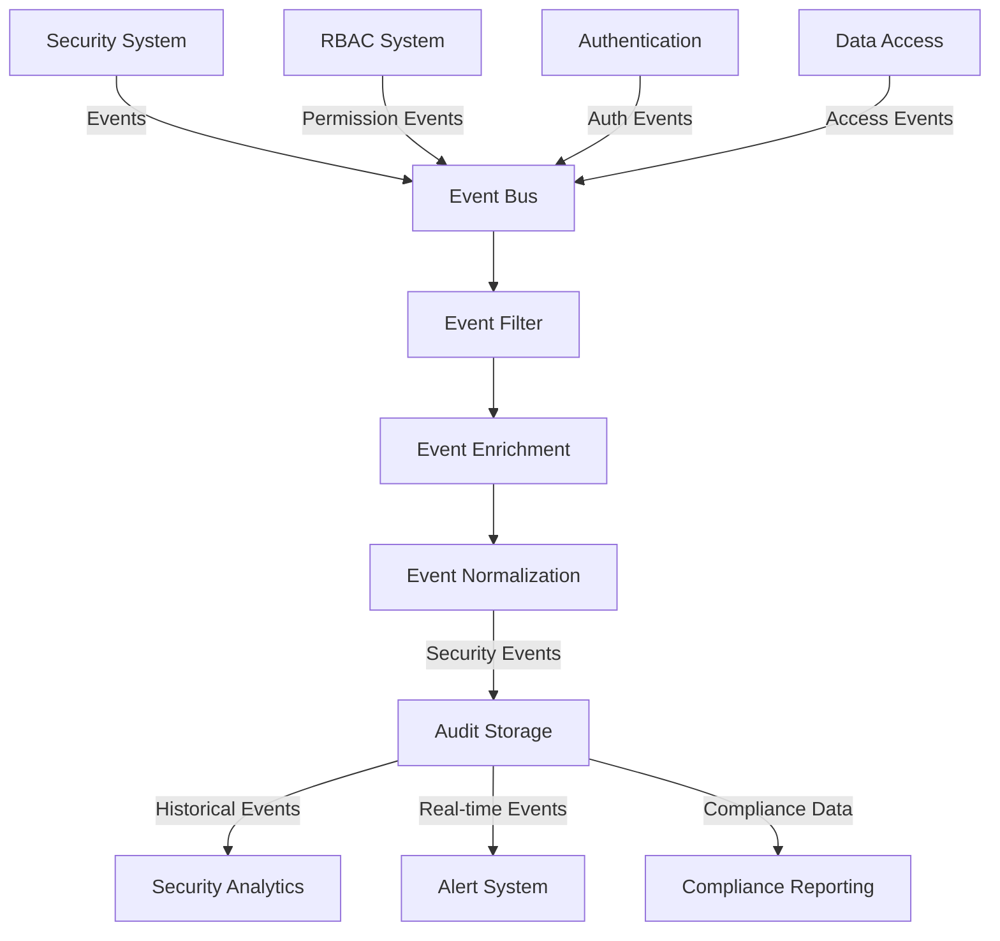
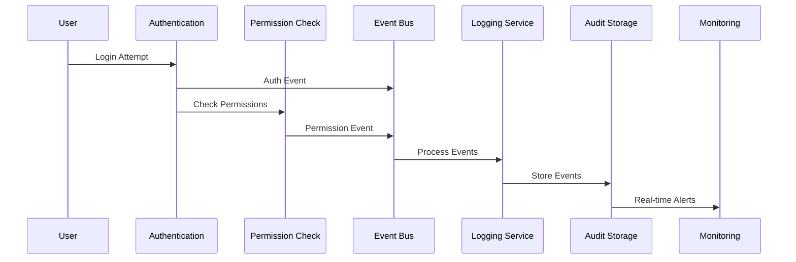

# Integration with Security Implementation

> **Version**: 1.6.0  
> **Last Updated**: 2025-05-22

This document outlines the architectural integration between the audit logging framework and the security implementation.

## Security Event Logging Architecture

The audit logging system captures all security events through an event-driven architecture:

- **Authentication Events**: Login attempts, password changes, and multi-factor authentication activities
- **Authorization Events**: Permission checks, access denials, and privilege escalations
- **Security Setting Changes**: Modifications to security configurations and policies
- **Sensitive Data Access**: Access to restricted information with proper attribution

Security events use a dedicated categorization system with appropriate severity levels and protected storage.

## Integration Architecture Diagram



## Integration Architecture Components

1. **Event Bus Architecture**: Centralized event handling for security events
   - Message queue implementation for high throughput
   - Topic-based routing for event types
   - Guarantees message delivery for critical security events
   - Details in [LOGGING_SERVICE.md](LOGGING_SERVICE.md#event-bus-implementation)
   - **Follows canonical event architecture defined in [../integration/EVENT_ARCHITECTURE.md](../integration/EVENT_ARCHITECTURE.md)**

2. **Security Hooks**: Standardized hook points in security-critical paths
   - Authentication hooks ([../security/AUTH_SYSTEM.md](../security/AUTH_SYSTEM.md#logging-hooks))
   - Authorization hooks ([../RBAC_SYSTEM.md](../RBAC_SYSTEM.md#audit-logging))
   - Data access hooks ([../security/DATA_PROTECTION.md](../security/DATA_PROTECTION.md#audit-integration))
   - Configuration change hooks

3. **Shared Context Framework**: Common context format for security events
   - Actor identification and attribution
   - Resource context (affected systems/data)
   - Action details with timestamps
   - Result outcome (success/failure/error)
   - Related event correlation
   - **Uses standard event metadata structure from [../integration/EVENT_ARCHITECTURE.md](../integration/EVENT_ARCHITECTURE.md)**

4. **Unified Timestamp Strategy**: Synchronized timing for cross-system correlation
   - Server-based timestamps for consistency
   - Client timestamps for latency analysis
   - Standardized timestamp format (ISO 8601)
   - Timestamp synchronization mechanisms

## Access Control Framework

The logging system implements the same RBAC principles described in the RBAC System:

- **Permission-based Access**: Log visibility controlled by specific permissions
  - ViewSecurityLogs: Ability to view security-related logs
  - ViewAuditEvents: Access to general audit events
  - ViewSensitiveEvents: Access to high-sensitivity events
  - ExportLogs: Permission to export log data
  - DeleteLogs: Permission to delete logs (restricted)

- **Direct Permission Assignment**: Permissions directly assigned to roles
  - Implementation matches [../RBAC_SYSTEM.md](../RBAC_SYSTEM.md)
  - No inheritance hierarchy for log access permissions
  - Special handling for SuperAdmin access

- **Data Filtering**: Context-aware filtering of sensitive information
  - PII redaction in logs (details in [PII_PROTECTION.md](PII_PROTECTION.md))
  - Credential masking in authentication logs
  - Dynamic filtering based on access scope
  - Policy-driven log field visibility

- **Least Privilege**: Minimum necessary access to log data
  - Default deny for log access
  - Time-limited access grants
  - Purpose limitation enforcement
  - Access justification logging

- **Entity Context**: Entity-specific log access controls
  - Implemented via [../security/MULTI_TENANT_ROLES.md](../security/MULTI_TENANT_ROLES.md)
  - Log visibility scoped to entity boundaries
  - Cross-entity access strictly controlled
  - Entity hierarchy respects for log access

## Entity Boundary Enforcement

The audit logging system enforces entity boundaries through the **exact same mechanisms** as the RBAC system, referring to [../rbac/ENTITY_BOUNDARIES.md](../rbac/ENTITY_BOUNDARIES.md) as the canonical implementation:

### Permission Boundary Enforcement

The audit system enforces the principle that entity administrators can only access audit logs within their entity boundaries:

1. **Entity Context Validation**: Every audit log access request includes entity context
   - Direct integration with [../rbac/ENTITY_BOUNDARIES.md](../rbac/ENTITY_BOUNDARIES.md) validation algorithm
   - Consistent boundary checking with RBAC system
   - Entity ID embedded in log access tokens
   - Implementation details in [DATABASE_STRUCTURE.md](DATABASE_STRUCTURE.md#entity-context-validation)

2. **Permission Grant Validation**: Uses the standardized algorithm from RBAC
   ```typescript
   // Using the canonical function from ../rbac/ENTITY_BOUNDARIES.md
   function validatePermissionGrant(grantor, permission, target) {
     // Check if grantor has the permission they're trying to grant
     if (!hasPermission(grantor, permission)) {
       return {
         valid: false,
         reason: 'MISSING_PERMISSION',
         details: `Grantor does not possess the ${permission} permission`
       };
     }
     
     // Check if grantor has permission management capability
     if (!hasPermission(grantor, 'ManagePermissions')) {
       return {
         valid: false,
         reason: 'CANNOT_MANAGE_PERMISSIONS',
         details: 'Grantor lacks permission management capability'
       };
     }
     
     // Check entity boundary if applicable
     if (target.entityId && grantor.entityId !== target.entityId) {
       if (!hasPermission(grantor, 'CrossEntityManagement')) {
         return {
           valid: false,
           reason: 'ENTITY_BOUNDARY_VIOLATION',
           details: 'Cannot grant permissions across entity boundaries'
         };
       }
     }
     
     return { valid: true };
   }
   ```

3. **Database-Level Enforcement**: Using identical trigger mechanisms as RBAC
   ```sql
   CREATE OR REPLACE FUNCTION enforce_entity_log_access_boundaries()
   RETURNS TRIGGER AS $$
   DECLARE
     accessor_id uuid;
     has_access boolean;
   BEGIN
     -- Get current user ID from application context
     accessor_id := current_setting('app.current_user_id', true)::uuid;
     
     -- Skip check for system operations
     IF current_setting('app.system_operation', true) = 'true' THEN
       RETURN NEW;
     END IF;

     -- Verify the accessor has access to the entity's logs
     SELECT EXISTS (
       SELECT 1 
       FROM effective_user_permissions 
       WHERE user_id = accessor_id
       AND permission_id IN (
         SELECT id FROM permissions 
         WHERE action = 'ViewAuditLogs' 
         AND resource_id = (SELECT id FROM resources WHERE name = 'audit_logs')
       )
       AND entity_id = NEW.entity_id
     ) INTO has_access;
     
     IF NOT has_access THEN
       RAISE EXCEPTION 'Entity boundary violation: Cannot access logs for this entity';
     END IF;

     -- All checks passed
     RETURN NEW;
   END;
   $$ LANGUAGE plpgsql;
   ```

### Entity-Level Log Partitioning

Entity-specific audit logs are partitioned using the same entity boundary model as the RBAC system:

- **Entity Context Capture**: All security events include entity context where applicable
  - Entity ID embedded in log records using the same format as in RBAC
  - Entity-hierarchy mapping for organizational structure with consistent hierarchy model
  - Entity attribute preservation in events using standardized attribute schema
  - Implementation matches [../rbac/ENTITY_BOUNDARIES.md](../rbac/ENTITY_BOUNDARIES.md#entity-specific-role-management)

- **Hierarchical Entity Permission Management**:
  - **Parent-Child Relationship**: Parent entity admins can view child entity audit logs
  - **Permission Flow Direction**: Log access permissions flow downward in hierarchy, consistent with RBAC
  - **Scope Limitation**: Child entity admins have log access scoped to their entity only
  - **Permission Propagation**: Changes to parent entity roles can optionally propagate to children
  - **Override Prevention**: Child entities cannot override restrictions set by parent entities

### Entity Permission Boundary Conflict Resolution

The audit system implements the same conflict resolution strategy as the RBAC system:

- **Most Restrictive Wins**: In case of conflicting boundaries, the most restrictive one is applied
- **Explicit Denial Priority**: Explicit log access denials override grants
- **System Overrides**: System-critical audit requirements cannot be overridden by entity admins
- **Audit Trail**: All boundary conflicts are logged with full context for review

## Multi-Tenant Audit Security

The audit logging system supports multi-tenant security through the standardized entity boundary model:

- **Entity-Specific Access Control**: Entity administrators can only access their own audit logs
  - Permission boundary enforcement matches RBAC implementation
  - Entity context in access control decisions uses the same context model
  - Integration with the entity permission boundary system defined in [../rbac/ENTITY_BOUNDARIES.md](../rbac/ENTITY_BOUNDARIES.md)

- **Cross-Entity Visibility Control**: System administrators can view logs across entities
  - Requires specific cross-entity permissions defined in the RBAC system
  - Visibility tracked as security event with consistent event schema
  - Justification requirement for cross-boundary access
  - Configurable policy controls for cross-entity access

## Standardized Event Format

All security events logged by the audit system follow the canonical event format defined in [../integration/EVENT_ARCHITECTURE.md](../integration/EVENT_ARCHITECTURE.md):

```typescript
// Using the canonical event schema from EVENT_ARCHITECTURE.md
interface AuditSecurityEvent extends BaseEvent {
  id: string;                // Unique event identifier
  type: string;              // Event type identifier
  source: string;            // System component that generated the event
  time: string;              // ISO timestamp when the event occurred
  dataVersion: string;       // Schema version for the data payload
  correlationId?: string;    // Request correlation ID for tracing
  data: {
    action: string;          // What was attempted
    result: string;          // Outcome of the action
    resource: {              // What was affected
      type: string;
      id: string;
    }
  };
  metadata: {
    userId?: string;         // Who performed the action
    entityId?: string;       // Entity context
    ipAddress?: string;      // Origin IP address
    userAgent?: string;      // Browser/client information
    severity: string;        // Event severity level
    [key: string]: any;      // Additional metadata
  };
}
```

## High-Performance Event Processing

The audit system is optimized for high throughput through:

- **Event Batching**: Efficient processing of multiple security events
  - Configurable batch sizes
  - Priority-based processing queues
  - Batch commit strategies
  - Technical details in [PERFORMANCE_STRATEGIES.md](PERFORMANCE_STRATEGIES.md#event-batching)

- **Asynchronous Logging**: Non-blocking security event recording
  - Performance impact mitigation
  - Critical path optimization
  - Guaranteed delivery mechanisms
  - Implementation details in [LOGGING_SERVICE.md](LOGGING_SERVICE.md#asynchronous-processing)

- **Optimized Storage**: Efficient log storage and retrieval strategies
  - Index optimization strategies
  - Compression techniques for log data
  - Hot/warm/cold storage tiers
  - Details in [STORAGE_RETENTION.md](STORAGE_RETENTION.md#storage-optimization)

- **Partitioned Indexes**: Performance-optimized query patterns
  - Time-based partitioning
  - Entity-based partitioning
  - Severity-based indexing
  - Query optimization guidelines in [DATABASE_STRUCTURE.md](DATABASE_STRUCTURE.md#index-design)

## Architectural Patterns

### Event Categorization Framework
Security events follow a standardized categorization schema:
- **Category**: Security
- **Subcategory**: Authentication, Authorization, Configuration, etc.
- **Severity**: Info, Warning, Error, Critical
- **Scope**: System, Resource, User
- **Entity**: Entity context for multi-tenant events

### Security Context Framework
Each security event includes standardized context:
- **Actor**: Who performed the action (user ID, system process)
- **Target**: What was affected (resource, setting)
- **Action**: What was attempted (view, modify, delete)
- **Result**: Outcome of the action (success, failure, error)
- **Entity**: Entity context for the event
- **Metadata**: Additional context-specific information

## Permission Resolution Logging

The system logs permission resolution events for audit and debugging:

1. **Permission Check Events**: Each permission check is logged with context
   - Resource being accessed
   - Action being attempted
   - User and context information
   - Integration with [../security/AUTH_SYSTEM.md](../security/AUTH_SYSTEM.md#authorization-decision-points)

2. **Resolution Path**: The decision path for permission grants/denials
   - Direct permission references
   - Role-based resolution path
   - Applied rule details
   - Integration with [../RBAC_SYSTEM.md](../RBAC_SYSTEM.md)

3. **Role Context**: Which roles influenced the permission decision
   - Direct role assignments
   - Special handling for system roles
   - Entity context for role resolution
   - Details in [../security/MULTI_TENANT_ROLES.md](../security/MULTI_TENANT_ROLES.md#role-administration)

4. **Performance Metrics**: Time taken to resolve permissions
   - Resolution latency tracking
   - Cache hit/miss rates
   - Optimization opportunities
   - Analysis capabilities in [PERFORMANCE_STRATEGIES.md](PERFORMANCE_STRATEGIES.md#permission-resolution-performance)

5. **Cached vs. Live Checks**: Whether permission was resolved from cache
   - Cache utilization tracking
   - Cache invalidation events
   - Permission resolution source tracking
   - Cache accuracy verification

## Security Event Flow



## Related Documentation

- **[../integration/EVENT_ARCHITECTURE.md](../integration/EVENT_ARCHITECTURE.md)**: Canonical event architecture definition
- **[../security/README.md](../security/README.md)**: Security implementation details
- **[../security/SECURITY_MONITORING.md](../security/SECURITY_MONITORING.md)**: Security monitoring architecture
- **[../security/AUTH_SYSTEM.md](../security/AUTH_SYSTEM.md)**: Authentication and authorization system
- **[../RBAC_SYSTEM.md](../RBAC_SYSTEM.md)**: Role-based access control architecture
- **[../rbac/ENTITY_BOUNDARIES.md](../rbac/ENTITY_BOUNDARIES.md)**: Definitive source for entity boundary implementation
- **[../security/MULTI_TENANT_ROLES.md](../security/MULTI_TENANT_ROLES.md)**: Multi-tenant role management
- **[DASHBOARD.md](DASHBOARD.md)**: Audit dashboard architecture
- **[DATABASE_STRUCTURE.md](DATABASE_STRUCTURE.md)**: How security events are stored
- **[../DOCUMENTATION_MAP.md](../DOCUMENTATION_MAP.md)**: Visual guide to documentation relationships

## Version History

- **1.6.0**: Aligned with canonical event architecture in EVENT_ARCHITECTURE.md (2025-05-22)
- **1.5.0**: Aligned entity boundary enforcement with RBAC system implementation (2025-05-22)
- **1.4.0**: Added detailed architecture diagrams, security event flow, and enhanced cross-references
- **1.3.1**: Standardized security event terminology across documentation
- **1.3.0**: Added permission resolution logging section
- **1.2.0**: Added multi-tenant audit security and high-performance event processing
- **1.1.0**: Updated access control framework to reflect direct permission assignment model
- **1.0.3**: Updated relative paths and added version history
- **1.0.2**: Enhanced architectural patterns section
- **1.0.1**: Added integration architecture details
- **1.0.0**: Initial security integration framework

