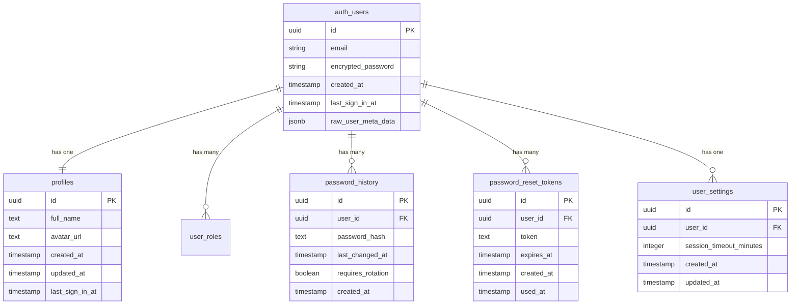
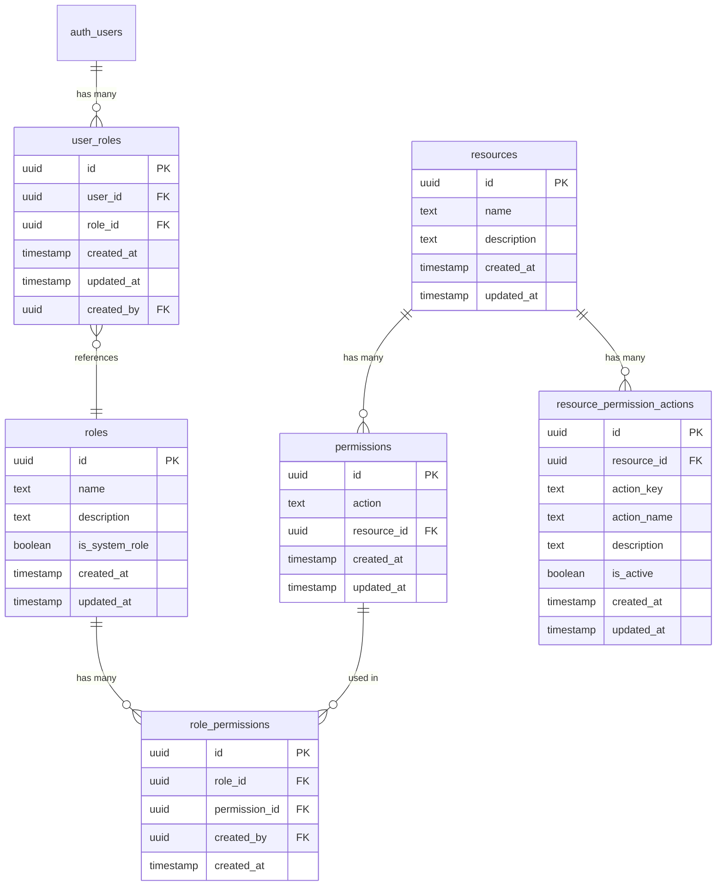
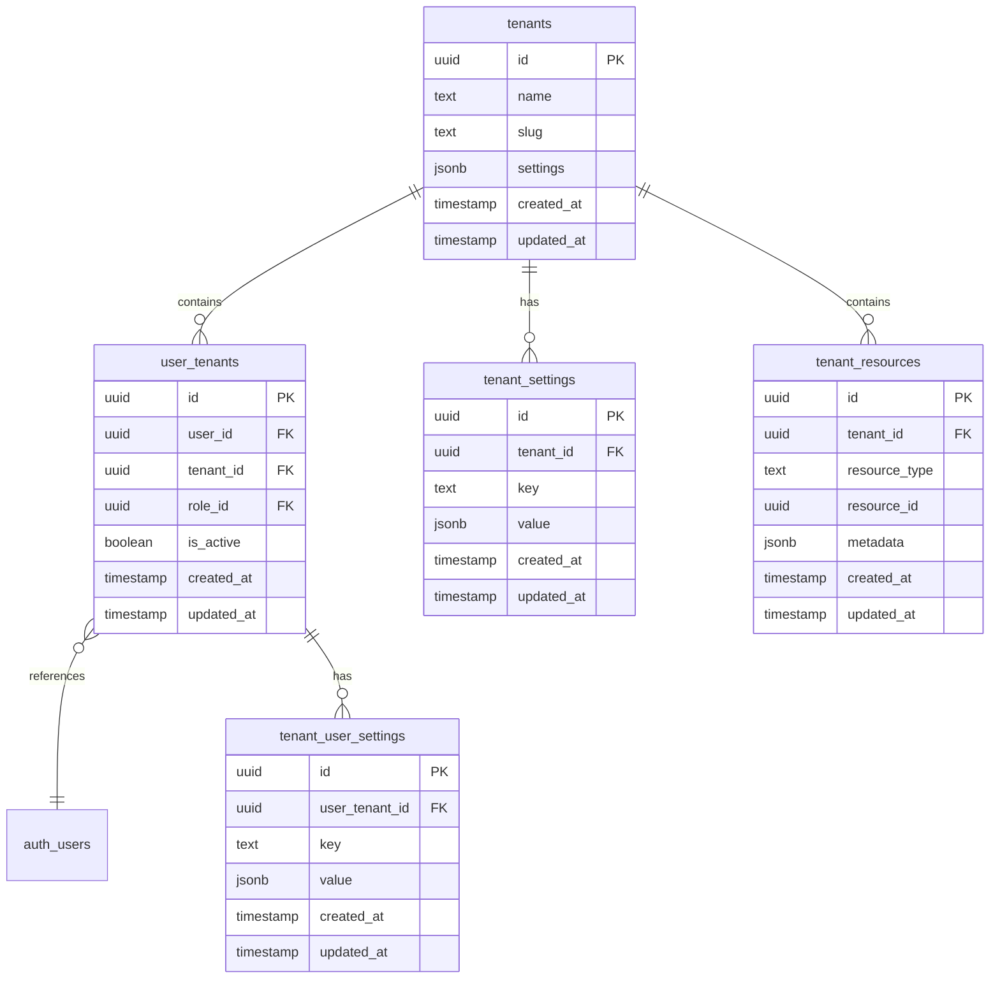
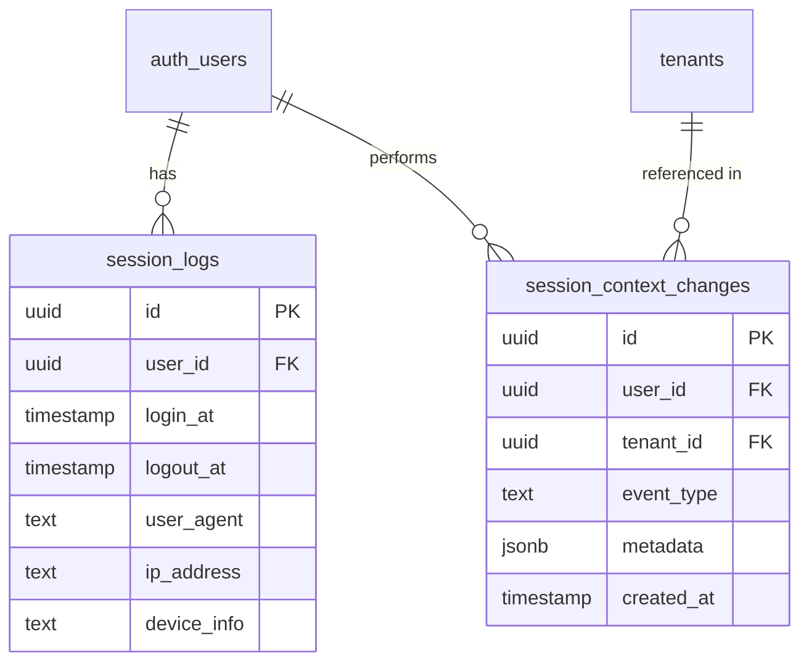
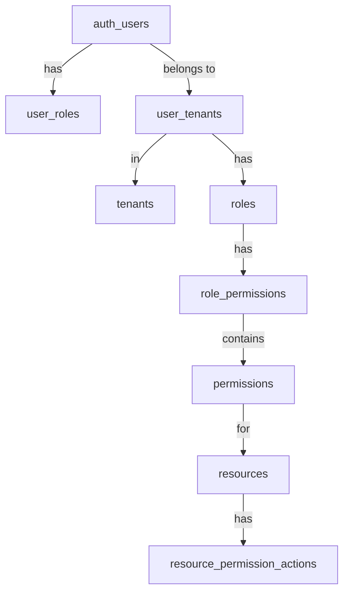
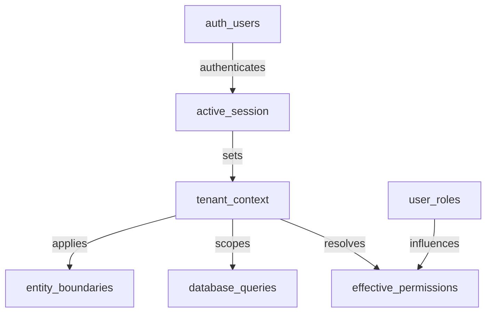

# Entity Relationship Documentation

> **Version**: 1.0.0  
> **Last Updated**: 2025-05-22

## Overview

This document defines the entity relationships between key system components including users, roles, permissions, and tenants. It provides clear visual documentation of the data model to guide implementation.

## Core Entity Relationships

### User Authentication and Identity Model



### Role-Based Access Control (RBAC) Model



### Multi-Tenant Data Model



### Session and Context Management



## Cross-Entity Relationships

### User to Tenant Permission Flow



### Session Context Resolution



## Database Implementation

### Key Table Constraints and Relationships

1. **User Identity**:
   - `auth.users` is the primary identity table (managed by Supabase Auth)
   - `profiles` has a 1:1 relationship with `auth.users` via foreign key
   - User profile data is split across multiple tables for security and performance

2. **Role Assignment**:
   - `user_roles` contains global roles outside of tenant context
   - `user_tenants` associates users with tenants and tenant-specific roles
   - System ensures roles can only be assigned by users with appropriate permissions

3. **Permission Resolution**:
   - Permission checks follow the flow defined in [../rbac/PERMISSION_RESOLUTION.md](../rbac/PERMISSION_RESOLUTION.md)
   - Permissions are resolved through database functions that implement the canonical patterns
   - The resolution logic respects entity boundaries as defined in [../rbac/ENTITY_BOUNDARIES.md](../rbac/ENTITY_BOUNDARIES.md)

## Query Patterns

The entity relationships dictate specific query patterns that must be followed for data consistency and security. All queries against tenant-bound entities must:

1. Always include tenant context as described in [../multitenancy/DATABASE_QUERY_PATTERNS.md](../multitenancy/DATABASE_QUERY_PATTERNS.md)
2. Apply Row-Level Security (RLS) policies based on the authenticated user and active tenant
3. Use session context functions for permission checks

Example pattern for tenant-scoped queries:

```sql
-- Function implementing canonical multi-tenant query pattern
CREATE OR REPLACE FUNCTION get_tenant_resources(tenant_id UUID)
RETURNS SETOF tenant_resources
LANGUAGE plpgsql
SECURITY DEFINER
AS $$
BEGIN
  -- Set tenant context
  PERFORM set_tenant_context(tenant_id);
  
  -- Return tenant resources (RLS will automatically filter based on context)
  RETURN QUERY SELECT * FROM tenant_resources;
END;
$$;
```

## Related Documentation

- **[../rbac/README.md](../rbac/README.md)**: RBAC system overview
- **[../multitenancy/DATABASE_QUERY_PATTERNS.md](../multitenancy/DATABASE_QUERY_PATTERNS.md)**: Canonical multi-tenant query patterns
- **[../multitenancy/SESSION_MANAGEMENT.md](../multitenancy/SESSION_MANAGEMENT.md)**: Session management in multi-tenant environments
- **[../integration/SESSION_AUTH_INTEGRATION.md](../integration/SESSION_AUTH_INTEGRATION.md)**: Session and authentication integration
- **[../security/MULTI_TENANT_ROLES.md](../security/MULTI_TENANT_ROLES.md)**: Multi-tenant role management

## Version History

- **1.0.0**: Initial entity relationship documentation (2025-05-22)
