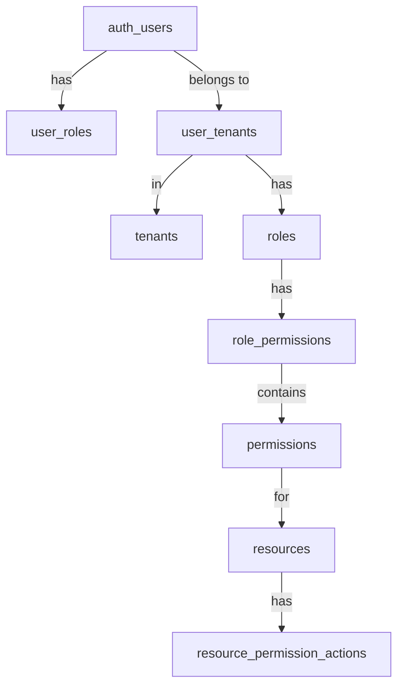
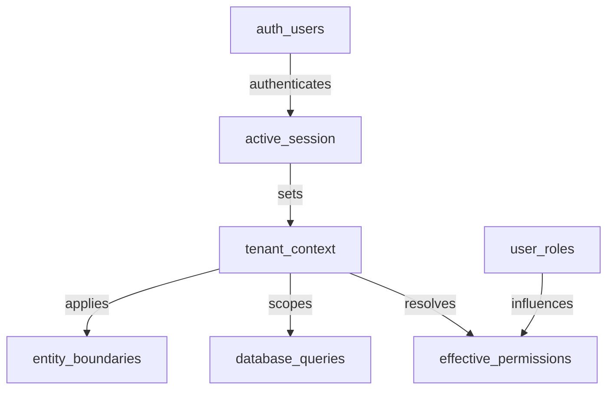

# Cross-Entity Relationships

> **Version**: 1.0.0  
> **Last Updated**: 2025-05-22

## Overview

This document describes cross-cutting relationships that span multiple entity types, including permission flows and session context resolution.

## User to Tenant Permission Flow

The diagram illustrates how user permissions are resolved through:
1. Direct role assignments (user_roles)
2. Tenant-specific role assignments (user_tenants)
3. Roles linked to permissions via role_permissions
4. Permissions connected to resources and their actions

## Session Context Resolution

This diagram shows how:
1. User authentication establishes a session
2. Session maintains an active tenant context
3. Tenant context determines effective permissions
4. User roles contribute to permission resolution
5. Tenant context scopes all database queries
6. Entity boundaries are enforced based on context

## Permission Resolution Process

The permission resolution follows these steps:

1. **Context Establishment**:
   - Authenticate user
   - Determine active tenant context

2. **Permission Collection**:
   - Gather permissions from all user roles
   - Apply union-based resolution for direct permission assignments

3. **Context Application**:
   - Apply tenant context to database queries
   - Enforce entity boundaries based on context

4. **Permission Caching**:
   - Cache permissions per user-tenant combination
   - Invalidate cache on role or permission changes

## Database Implementation

### Key Table Constraints and Relationships

1. **User Identity**:
   - `auth.users` is the primary identity table (managed by Supabase Auth)
   - `profiles` has a 1:1 relationship with `auth.users` via foreign key
   - User profile data is split across multiple tables for security and performance

2. **Role Assignment**:
   - `user_roles` contains global roles outside of tenant context
   - `user_tenants` associates users with tenants and tenant-specific roles
   - System ensures roles can only be assigned by users with appropriate permissions

3. **Permission Resolution**:
   - Permission checks follow the flow defined in [../../rbac/permission-resolution/README.md](../../rbac/permission-resolution/README.md)
   - Permissions are resolved through database functions that implement the canonical patterns
   - The resolution logic respects entity boundaries as defined in [../../rbac/ENTITY_BOUNDARIES.md](../../rbac/ENTITY_BOUNDARIES.md)

## Related Documentation

- **[USER_IDENTITY_MODEL.md](USER_IDENTITY_MODEL.md)**: User identity model
- **[RBAC_MODEL.md](RBAC_MODEL.md)**: Role-based access control model
- **[MULTI_TENANT_MODEL.md](MULTI_TENANT_MODEL.md)**: Multi-tenant data model
- **[SESSION_CONTEXT_MODEL.md](SESSION_CONTEXT_MODEL.md)**: Session and context management
- **[../../rbac/permission-resolution/README.md](../../rbac/permission-resolution/README.md)**: Permission resolution process

## Version History

- **1.0.0**: Initial document creation from entity relationships refactoring (2025-05-22)
