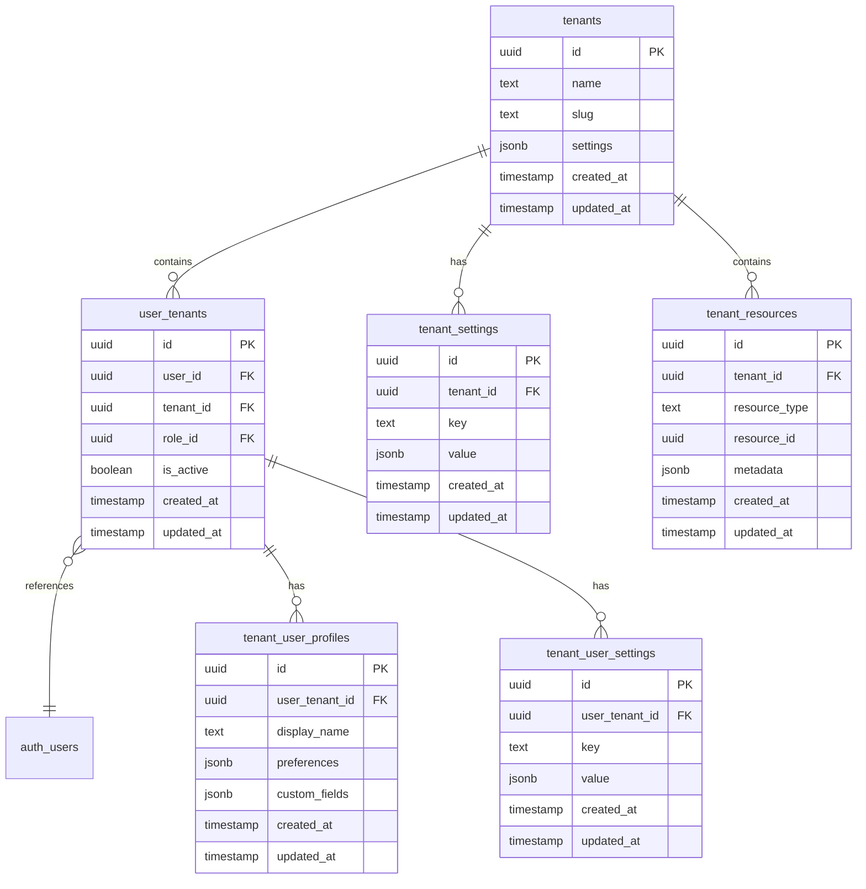

# Multi-Tenant Data Model

> **Version**: 1.1.0  
> **Last Updated**: 2025-05-22

## Overview

This document defines the entity relationships for the multi-tenant architecture, describing how tenants, users, and tenant-specific resources interact.

## Entity Relationship Diagram

## Entity Descriptions

### Tenants

Defines separate tenant spaces within the application.

**Key Properties**:
- Name and slug (URL-friendly identifier)
- General settings as JSON

**Relationships**:
- One-to-many with user tenants
- One-to-many with tenant settings
- One-to-many with tenant resources

### User Tenants

Associates users with tenants and tenant-specific roles.

**Key Properties**:
- User reference
- Tenant reference
- Role reference for tenant-specific role
- Active status

**Relationships**:
- Many-to-one with users
- Many-to-one with tenants
- One-to-many with tenant user settings
- One-to-one with tenant user profiles (new)

### Tenant Settings

Stores tenant-level configuration settings.

**Key Properties**:
- Setting key
- Setting value as JSON
- Tenant reference

**Relationships**:
- Many-to-one with tenants

### Tenant User Profiles

Stores comprehensive tenant-specific user profile data.

**Key Properties**:
- User-tenant reference (links to specific user in specific tenant)
- Display name (tenant-specific user display name)
- Preferences (as JSON)
- Custom fields (tenant-defined profile extensions)
- Last tenant access timestamp

**Relationships**:
- One-to-one with user tenants

### Tenant User Settings

Stores user-specific settings within a tenant context.

**Key Properties**:
- Setting key
- Setting value as JSON
- User-tenant reference

**Relationships**:
- Many-to-one with user tenants

### Tenant Resources

Tracks resources owned by specific tenants.

**Key Properties**:
- Resource type
- Resource identifier
- Tenant reference
- Metadata as JSON

**Relationships**:
- Many-to-one with tenants

## Multi-Tenant Implementation Strategy

The multi-tenant model supports:

1. **Complete Data Isolation**: Tenant data is fully isolated with no possibility of data leakage
2. **Tenant-Specific Roles**: Users can have different roles in different tenants
3. **Tenant Context Switching**: Users can switch active tenant context while maintaining authentication
4. **Tenant-Specific User Profiles**: Users have distinct profiles in each tenant context that extend their global identity

For detailed implementation of user profile isolation across tenants, see [../multitenancy/DATA_ISOLATION.md#user-profiles-and-tenant-specific-settings](../multitenancy/DATA_ISOLATION.md#user-profiles-and-tenant-specific-settings).

## Related Documentation

- **[USER_IDENTITY_MODEL.md](USER_IDENTITY_MODEL.md)**: User identity model
- **[RBAC_MODEL.md](RBAC_MODEL.md)**: Role-based access control
- **[SESSION_CONTEXT_MODEL.md](SESSION_CONTEXT_MODEL.md)**: Session and tenant context
- **[../../multitenancy/README.md](../../multitenancy/README.md)**: Multitenancy architecture overview
- **[../../multitenancy/DATA_ISOLATION.md](../../multitenancy/DATA_ISOLATION.md)**: Tenant data isolation with user profile implementation
- **[../../user-management/MULTITENANCY_INTEGRATION.md](../../user-management/MULTITENANCY_INTEGRATION.md)**: User management integration with multitenancy

## Version History

- **1.1.0**: Updated with tenant user profiles and references to enhanced data isolation documentation (2025-05-22)
- **1.0.0**: Initial document creation from entity relationships refactoring (2025-05-22)
