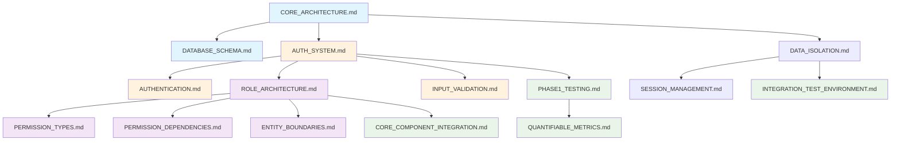

# Phase 1: Foundation - Document Map

> **Version**: 1.2.0  
> **Last Updated**: 2025-05-23

## AI Context Management

### 📋 Document Processing Groups
**Process these documents in separate AI sessions to maintain context:**

#### Session 1A: Project Foundation
- `docs/CORE_ARCHITECTURE.md`
- `docs/TECHNOLOGIES.md`
- `docs/data-model/DATABASE_SCHEMA.md`

#### Session 1B: Authentication
- `docs/security/AUTH_SYSTEM.md`
- `docs/user-management/AUTHENTICATION.md`
- `docs/implementation/testing/PHASE1_TESTING.md`

#### Session 1C: RBAC Foundation
- `docs/rbac/ROLE_ARCHITECTURE.md`
- `docs/rbac/PERMISSION_TYPES.md`
- `docs/rbac/PERMISSION_DEPENDENCIES.md`

#### Session 1D: Multi-Tenant & Security
- `docs/multitenancy/DATA_ISOLATION.md`
- `docs/security/INPUT_VALIDATION.md`
- `docs/testing/CORE_COMPONENT_INTEGRATION.md`

**⚠️ AI Implementation Rule**: Maximum 3-4 documents per session. Complete current session before proceeding to next.

## Overview

This map consolidates all documentation references needed for Phase 1 implementation.

## Document Count: 18 Total
- Project Setup: 2 documents
- Database Foundation: 2 documents  
- Authentication: 2 documents
- RBAC Foundation: 4 documents
- Security Infrastructure: 2 documents
- Multi-Tenant Foundation: 2 documents
- Testing Integration: 4 documents

## Visual Relationship Diagram



## Essential Documents for Phase 1

### 1. Project Setup
- **[../../CORE_ARCHITECTURE.md](../../CORE_ARCHITECTURE.md)**: System architecture
- **[../../TECHNOLOGIES.md](../../TECHNOLOGIES.md)**: Technology stack

### 2. Database Foundation  
- **[../../data-model/DATABASE_SCHEMA.md](../../data-model/DATABASE_SCHEMA.md)**: Database schema
- **[../../data-model/ENTITY_RELATIONSHIPS.md](../../data-model/ENTITY_RELATIONSHIPS.md)**: Entity relationships

### 3. Authentication
- **[../../security/AUTH_SYSTEM.md](../../security/AUTH_SYSTEM.md)**: Authentication system
- **[../../user-management/AUTHENTICATION.md](../../user-management/AUTHENTICATION.md)**: User authentication

### 4. RBAC Foundation
- **[../../rbac/ROLE_ARCHITECTURE.md](../../rbac/ROLE_ARCHITECTURE.md)**: Role architecture
- **[../../rbac/PERMISSION_TYPES.md](../../rbac/PERMISSION_TYPES.md)**: Permission types
- **[../../rbac/PERMISSION_DEPENDENCIES.md](../../rbac/PERMISSION_DEPENDENCIES.md)**: Permission dependencies
- **[../../rbac/ENTITY_BOUNDARIES.md](../../rbac/ENTITY_BOUNDARIES.md)**: Entity boundaries

### 5. Security Infrastructure
- **[../../security/INPUT_VALIDATION.md](../../security/INPUT_VALIDATION.md)**: Input validation
- **[../FORM_SANITIZATION_ARCHITECTURE.md](../FORM_SANITIZATION_ARCHITECTURE.md)**: Form sanitization

### 6. Multi-Tenant Foundation
- **[../../multitenancy/DATA_ISOLATION.md](../../multitenancy/DATA_ISOLATION.md)**: Data isolation
- **[../../multitenancy/SESSION_MANAGEMENT.md](../../multitenancy/SESSION_MANAGEMENT.md)**: Session management

### 7. Testing Integration
- **[../testing/PHASE1_TESTING.md](../testing/PHASE1_TESTING.md)**: Phase 1 testing integration
- **[../../testing/CORE_COMPONENT_INTEGRATION.md](../../testing/CORE_COMPONENT_INTEGRATION.md)**: Core component integration tests
- **[../../testing/INTEGRATION_TEST_ENVIRONMENT.md](../../testing/INTEGRATION_TEST_ENVIRONMENT.md)**: Test environment setup
- **[../testing/QUANTIFIABLE_METRICS.md](../testing/QUANTIFIABLE_METRICS.md)**: Validation metrics

## Implementation Sequence

```
Week 1: Setup + Database
├── CORE_ARCHITECTURE.md → PROJECT_SETUP.md
├── TECHNOLOGIES.md → PROJECT_SETUP.md  
├── DATABASE_SCHEMA.md → DATABASE_FOUNDATION.md
├── ENTITY_RELATIONSHIPS.md → DATABASE_FOUNDATION.md
└── PHASE1_TESTING.md → Validation Framework

Week 2: Authentication
├── AUTH_SYSTEM.md → AUTH_IMPLEMENTATION.md
├── AUTHENTICATION.md → AUTH_IMPLEMENTATION.md
└── CORE_COMPONENT_INTEGRATION.md → Auth Tests

Week 3: RBAC + Security
├── ROLE_ARCHITECTURE.md → RBAC_FOUNDATION.md
├── PERMISSION_TYPES.md → RBAC_FOUNDATION.md
├── PERMISSION_DEPENDENCIES.md → RBAC_FOUNDATION.md
├── ENTITY_BOUNDARIES.md → RBAC_FOUNDATION.md
├── INPUT_VALIDATION.md → SECURITY_INFRASTRUCTURE.md
├── FORM_SANITIZATION_ARCHITECTURE.md → SECURITY_INFRASTRUCTURE.md
└── INTEGRATION_TEST_ENVIRONMENT.md → Test Setup

Week 4: Multi-Tenant Foundation
├── DATA_ISOLATION.md → MULTI_TENANT_FOUNDATION.md
├── SESSION_MANAGEMENT.md → MULTI_TENANT_FOUNDATION.md
└── QUANTIFIABLE_METRICS.md → Final Validation
```

## Success Criteria
✅ All 18 documents referenced and implemented correctly  
✅ Permission dependencies functional  
✅ Entity boundaries enforced  
✅ Multi-tenant foundation operational  
✅ All phase 1 validation metrics met  

## Version History
- **1.2.0**: Added testing integration documents and visual relationship diagram (2025-05-23)
- **1.1.0**: Added AI context management rules (2025-05-23)
- **1.0.0**: Created from MASTER_DOCUMENT_MAP.md refactoring (2025-05-23)
