# Phase 2: Core Features - Document Map

> **Version**: 1.2.0  
> **Last Updated**: 2025-05-23

## AI Context Management

### 📋 Document Processing Groups
**Process these documents in separate AI sessions to maintain context:**

#### Session 2A: Advanced RBAC
- `docs/rbac/permission-resolution/CORE_ALGORITHM.md`
- `docs/rbac/CACHING_STRATEGY.md`
- `docs/rbac/PERFORMANCE_OPTIMIZATION.md`

#### Session 2B: Enhanced Features
- `docs/multitenancy/DATABASE_QUERY_PATTERNS.md`
- `docs/audit/LOG_FORMAT_STANDARDIZATION.md`
- `docs/audit/PERFORMANCE_STRATEGIES.md`

#### Session 2C: User Management
- `docs/user-management/RBAC_INTEGRATION.md`
- `docs/user-management/MULTITENANCY_INTEGRATION.md`
- `docs/implementation/testing/PHASE2_TESTING.md`

**⚠️ AI Implementation Rule**: Maximum 3-4 documents per session. Must complete Phase 1 validation checkpoint before starting Phase 2.

## Overview

This map consolidates all documentation references needed for Phase 2 implementation.

## Document Count: 14 Total
- Advanced RBAC: 3 documents
- Enhanced Multi-Tenant: 2 documents
- Enhanced Audit Logging: 2 documents
- User Management System: 2 documents
- Testing Integration: 4 documents
- Integration Guide: 1 document

## Visual Relationship Diagram

```mermaid
graph TD
    P1[Phase 1 Complete] --> RBAC_ADV[Advanced RBAC]
    P1 --> MULTI_ENH[Enhanced Multi-Tenant]
    P1 --> AUDIT_ENH[Enhanced Audit]
    
    RBAC_ADV --> CORE_ALG[CORE_ALGORITHM.md]
    RBAC_ADV --> CACHE[CACHING_STRATEGY.md]
    RBAC_ADV --> PERF_OPT[PERFORMANCE_OPTIMIZATION.md]
    
    MULTI_ENH --> DB_QUERY[DATABASE_QUERY_PATTERNS.md]
    MULTI_ENH --> DB_PERF[DATABASE_PERFORMANCE.md]
    
    AUDIT_ENH --> LOG_STD[LOG_FORMAT_STANDARDIZATION.md]
    AUDIT_ENH --> AUDIT_PERF[PERFORMANCE_STRATEGIES.md]
    
    RBAC_ADV --> USER_MGT[User Management]
    MULTI_ENH --> USER_MGT
    USER_MGT --> RBAC_INT[RBAC_INTEGRATION.md]
    USER_MGT --> MULTI_INT[MULTITENANCY_INTEGRATION.md]
    
    %% Testing Integration
    RBAC_ADV --> PHASE2_TEST[PHASE2_TESTING.md]
    MULTI_ENH --> ADV_INT[ADVANCED_INTEGRATION_PATTERNS.md]
    AUDIT_ENH --> PERF_TEST[PERFORMANCE_TESTING.md]
    USER_MGT --> QUANT_MET[QUANTIFIABLE_METRICS.md]
    
    classDef rbac fill:#f3e5f5
    classDef multi fill:#e3f2fd
    classDef audit fill:#fff3e0
    classDef user fill:#e8f5e8
    classDef testing fill:#fce4ec
    
    class CORE_ALG,CACHE,PERF_OPT rbac
    class DB_QUERY,DB_PERF multi
    class LOG_STD,AUDIT_PERF audit
    class RBAC_INT,MULTI_INT user
    class PHASE2_TEST,ADV_INT,PERF_TEST,QUANT_MET testing
```



## Essential Documents for Phase 2

### 1. Advanced RBAC
- **[../../rbac/permission-resolution/CORE_ALGORITHM.md](../../rbac/permission-resolution/CORE_ALGORITHM.md)**: Core algorithm
- **[../../rbac/CACHING_STRATEGY.md](../../rbac/CACHING_STRATEGY.md)**: Caching strategy
- **[../../rbac/PERFORMANCE_OPTIMIZATION.md](../../rbac/PERFORMANCE_OPTIMIZATION.md)**: Performance optimization

### 2. Enhanced Multi-Tenant
- **[../../multitenancy/DATABASE_QUERY_PATTERNS.md](../../multitenancy/DATABASE_QUERY_PATTERNS.md)**: Database query patterns
- **[../../multitenancy/DATABASE_PERFORMANCE.md](../../multitenancy/DATABASE_PERFORMANCE.md)**: Performance optimization

### 3. Enhanced Audit Logging
- **[../../audit/LOG_FORMAT_STANDARDIZATION.md](../../audit/LOG_FORMAT_STANDARDIZATION.md)**: Log format standardization
- **[../../audit/PERFORMANCE_STRATEGIES.md](../../audit/PERFORMANCE_STRATEGIES.md)**: Performance strategies

### 4. User Management System
- **[../../user-management/RBAC_INTEGRATION.md](../../user-management/RBAC_INTEGRATION.md)**: RBAC integration
- **[../../user-management/MULTITENANCY_INTEGRATION.md](../../user-management/MULTITENANCY_INTEGRATION.md)**: Multi-tenancy integration

### 5. Testing Integration
- **[../testing/PHASE2_TESTING.md](../testing/PHASE2_TESTING.md)**: Phase 2 testing integration
- **[../../testing/ADVANCED_INTEGRATION_PATTERNS.md](../../testing/ADVANCED_INTEGRATION_PATTERNS.md)**: Advanced integration tests
- **[../../testing/PERFORMANCE_TESTING.md](../../testing/PERFORMANCE_TESTING.md)**: Performance testing
- **[../testing/QUANTIFIABLE_METRICS.md](../testing/QUANTIFIABLE_METRICS.md)**: Validation metrics

### 6. Integration Guide
- **[IMPLEMENTATION_DOCUMENT_MAP.md](IMPLEMENTATION_DOCUMENT_MAP.md)**: Implementation document map

## Implementation Sequence

```
Week 5-6: Advanced RBAC
├── CORE_ALGORITHM.md → ADVANCED_RBAC.md
├── CACHING_STRATEGY.md → ADVANCED_RBAC.md
├── PERFORMANCE_OPTIMIZATION.md → ADVANCED_RBAC.md
└── PHASE2_TESTING.md → RBAC Testing

Week 7: Enhanced Multi-Tenant + Audit
├── DATABASE_QUERY_PATTERNS.md → ENHANCED_MULTI_TENANT.md
├── DATABASE_PERFORMANCE.md → ENHANCED_MULTI_TENANT.md
├── LOG_FORMAT_STANDARDIZATION.md → ENHANCED_AUDIT_LOGGING.md
├── PERFORMANCE_STRATEGIES.md → ENHANCED_AUDIT_LOGGING.md
└── ADVANCED_INTEGRATION_PATTERNS.md → Integration Testing

Week 8: User Management
├── RBAC_INTEGRATION.md → USER_MANAGEMENT_SYSTEM.md
├── MULTITENANCY_INTEGRATION.md → USER_MANAGEMENT_SYSTEM.md
├── PERFORMANCE_TESTING.md → Performance Validation
└── QUANTIFIABLE_METRICS.md → Final Validation
```

## Success Criteria
✅ All 14 documents referenced and implemented correctly  
✅ Advanced RBAC with sub-50ms permission checks  
✅ Enhanced multi-tenant queries optimized  
✅ User management with proper permission enforcement  
✅ All actions logged to audit system  
✅ All phase 2 validation metrics met  

## Version History
- **1.2.0**: Added testing integration documents and visual relationship diagram (2025-05-23)
- **1.1.0**: Added AI context management rules (2025-05-23)
- **1.0.0**: Created from MASTER_DOCUMENT_MAP.md refactoring (2025-05-23)
