# Phase 3: Advanced Features - Document Map

> **Version**: 1.1.0  
> **Last Updated**: 2025-05-23

## AI Context Management

### 📋 Document Processing Groups
**Process these documents in separate AI sessions to maintain context:**

#### Session 3A: Audit Dashboard
- `docs/audit/DASHBOARD.md`
- `docs/ui/DESIGN_SYSTEM.md`
- `docs/ui/examples/TABLE_EXAMPLES.md`

#### Session 3B: Security Monitoring
- `docs/security/SECURITY_MONITORING.md`
- `docs/security/SECURITY_EVENTS.md`
- `docs/testing/SECURITY_TESTING.md`

#### Session 3C: Performance Optimization
- `docs/testing/PERFORMANCE_TESTING.md`
- `docs/PERFORMANCE_STANDARDS.md`
- `docs/implementation/testing/PHASE3_TESTING.md`

**⚠️ AI Implementation Rule**: Maximum 3-4 documents per session. Must complete Phase 2 validation checkpoint before starting Phase 3.

## Overview

This map consolidates all documentation references needed for Phase 3 implementation.

## Document Count: 15 Total
- Audit Dashboard: 3 documents
- Security Monitoring: 3 documents
- Dashboard System: 2 documents
- Multi-Tenant Advanced: 1 document
- Testing Framework: 3 documents
- Performance Optimization: 1 document
- Integration Guide: 1 document
- Testing Integration: 1 document

## Visual Relationship Diagram

```mermaid
graph TD
    P2[Phase 2 Complete] --> AUDIT_DASH[Audit Dashboard]
    P2 --> SEC_MON[Security Monitoring]
    P2 --> PERF_OPT[Performance Optimization]
    
    AUDIT_DASH --> DASH_MD[DASHBOARD.md]
    AUDIT_DASH --> DESIGN[DESIGN_SYSTEM.md]
    AUDIT_DASH --> TABLE_EX[TABLE_EXAMPLES.md]
    
    SEC_MON --> SEC_MONITORING[SECURITY_MONITORING.md]
    SEC_MON --> SEC_EVENTS[SECURITY_EVENTS.md]
    SEC_MON --> SEC_TEST[SECURITY_TESTING.md]
    
    PERF_OPT --> PERF_TEST[PERFORMANCE_TESTING.md]
    PERF_OPT --> PERF_STD[PERFORMANCE_STANDARDS.md]
    PERF_OPT --> DB_OPT[DATABASE_OPTIMIZATION.md]
    
    AUDIT_DASH --> UI_COMP[COMPONENT_ARCHITECTURE.md]
    SEC_MON --> MULTI_ADV[IMPLEMENTATION_EXAMPLES.md]
    
    %% Testing Integration
    AUDIT_DASH --> PHASE3_TEST[PHASE3_TESTING.md]
    SEC_MON --> MULTI_TEST[MULTI_TENANT_TESTING.md]
    PERF_OPT --> QUANT_MET[QUANTIFIABLE_METRICS.md]
    
    classDef audit fill:#fff3e0
    classDef security fill:#ffebee
    classDef perf fill:#e8f5e8
    classDef ui fill:#f3e5f5
    classDef testing fill:#e3f2fd
    
    class DASH_MD,DESIGN,TABLE_EX audit
    class SEC_MONITORING,SEC_EVENTS,SEC_TEST security
    class PERF_TEST,PERF_STD,DB_OPT perf
    class UI_COMP,MULTI_ADV ui
    class PHASE3_TEST,MULTI_TEST,QUANT_MET testing
```



## Essential Documents for Phase 3

### 1. Audit Dashboard
- **[../../audit/DASHBOARD.md](../../audit/DASHBOARD.md)**: Audit dashboard
- **[../../ui/DESIGN_SYSTEM.md](../../ui/DESIGN_SYSTEM.md)**: Design system
- **[../../ui/examples/TABLE_EXAMPLES.md](../../ui/examples/TABLE_EXAMPLES.md)**: Table examples

### 2. Security Monitoring
- **[../../security/SECURITY_MONITORING.md](../../security/SECURITY_MONITORING.md)**: Security monitoring
- **[../../security/SECURITY_EVENTS.md](../../security/SECURITY_EVENTS.md)**: Security events
- **[../../testing/SECURITY_TESTING.md](../../testing/SECURITY_TESTING.md)**: Security testing

### 3. Dashboard System
- **[../../ui/COMPONENT_ARCHITECTURE.md](../../ui/COMPONENT_ARCHITECTURE.md)**: Component architecture
- **[../../multitenancy/IMPLEMENTATION_EXAMPLES.md](../../multitenancy/IMPLEMENTATION_EXAMPLES.md)**: Implementation examples

### 4. Testing Framework
- **[../../testing/PERFORMANCE_TESTING.md](../../testing/PERFORMANCE_TESTING.md)**: Performance testing
- **[../../testing/MULTI_TENANT_TESTING.md](../../testing/MULTI_TENANT_TESTING.md)**: Multi-tenant testing
- **[../../PERFORMANCE_STANDARDS.md](../../PERFORMANCE_STANDARDS.md)**: Performance standards

### 5. Performance Optimization
- **[../../rbac/DATABASE_OPTIMIZATION.md](../../rbac/DATABASE_OPTIMIZATION.md)**: Database optimization

### 6. Testing Integration
- **[../testing/PHASE3_TESTING.md](../testing/PHASE3_TESTING.md)**: Phase 3 testing integration
- **[../testing/QUANTIFIABLE_METRICS.md](../testing/QUANTIFIABLE_METRICS.md)**: Validation metrics

### 7. Integration Guide
- **[IMPLEMENTATION_DOCUMENT_MAP.md](IMPLEMENTATION_DOCUMENT_MAP.md)**: Implementation document map

## Implementation Sequence

```
Week 9-10: Audit + Security
├── DASHBOARD.md → AUDIT_DASHBOARD.md
├── DESIGN_SYSTEM.md → AUDIT_DASHBOARD.md
├── TABLE_EXAMPLES.md → AUDIT_DASHBOARD.md
├── SECURITY_MONITORING.md → SECURITY_MONITORING.md
├── SECURITY_EVENTS.md → SECURITY_MONITORING.md
├── SECURITY_TESTING.md → Security Validation
└── PHASE3_TESTING.md → Testing Framework

Week 11: Dashboard System
├── COMPONENT_ARCHITECTURE.md → DASHBOARD_SYSTEM.md
├── IMPLEMENTATION_EXAMPLES.md → MULTI_TENANT_ADVANCED.md
└── MULTI_TENANT_TESTING.md → Multi-tenant Validation

Week 12: Performance + Testing
├── PERFORMANCE_TESTING.md → TESTING_FRAMEWORK.md
├── PERFORMANCE_STANDARDS.md → TESTING_FRAMEWORK.md
├── DATABASE_OPTIMIZATION.md → PERFORMANCE_OPTIMIZATION.md
└── QUANTIFIABLE_METRICS.md → Final Validation
```

## Success Criteria
✅ All 15 documents referenced and implemented correctly  
✅ Audit dashboard shows real-time data  
✅ Security monitoring detects threats  
✅ Performance meets requirements  
✅ All phase 3 validation metrics met  

## Version History
- **1.1.0**: Added testing integration documents and visual relationship diagram (2025-05-23)
- **1.0.0**: Created from MASTER_DOCUMENT_MAP.md refactoring (2025-05-23)
