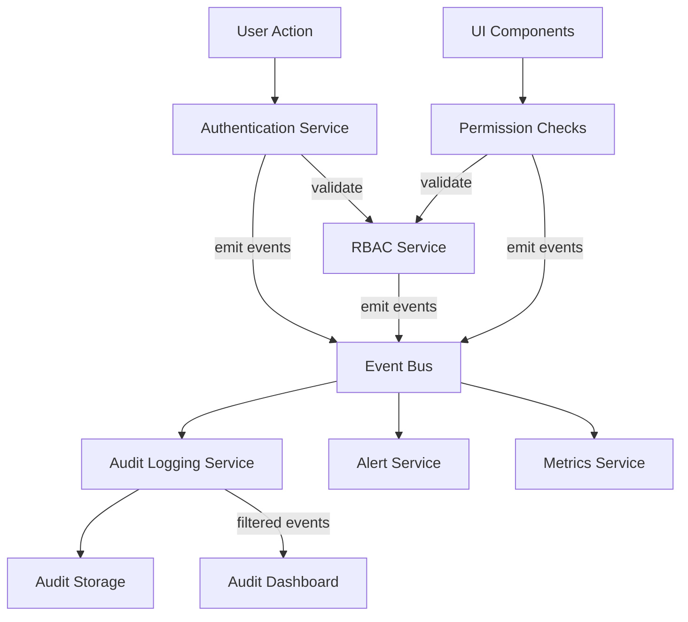

# Event-Driven Architecture

> **Version**: 2.0.0  
> **Last Updated**: 2025-05-23

## Overview

This document provides an overview of the event-driven architecture used for system integration. For detailed information, refer to the focused documentation below.

## Architecture Components

The integration between systems follows this standardized event-driven architecture pattern:

## Documentation Structure

### Core Patterns
- **[EVENT_CORE_PATTERNS.md](EVENT_CORE_PATTERNS.md)**: **Canonical event schemas and interfaces**
- **[EVENT_IMPLEMENTATION_GUIDE.md](EVENT_IMPLEMENTATION_GUIDE.md)**: Implementation details and configuration
- **[EVENT_EXAMPLES.md](EVENT_EXAMPLES.md)**: Practical code examples

### Integration Specifications
- **[SECURITY_RBAC_INTEGRATION.md](SECURITY_RBAC_INTEGRATION.md)**: Security and RBAC integration
- **[RBAC_AUDIT_INTEGRATION.md](RBAC_AUDIT_INTEGRATION.md)**: RBAC and Audit integration
- **[SECURITY_AUDIT_INTEGRATION.md](SECURITY_AUDIT_INTEGRATION.md)**: Security and Audit integration
- **[API_CONTRACTS.md](API_CONTRACTS.md)**: API contracts between components

## Integration Requirements

All subsystems using the event architecture must implement:

1. **Standard Event Schema**: Follow patterns in EVENT_CORE_PATTERNS.md
2. **Event Bus Configuration**: Use configuration from EVENT_IMPLEMENTATION_GUIDE.md
3. **Resilience Patterns**: Implement retry, circuit breaker, and back pressure handling
4. **Multi-Tenant Context**: Include tenant context for all events
5. **Error Handling**: Implement proper error handling and fallback mechanisms

## Related Documentation

- **[../audit/SECURITY_INTEGRATION.md](../audit/SECURITY_INTEGRATION.md)**: Audit system integration with security
- **[../rbac/ENTITY_BOUNDARIES.md](../rbac/ENTITY_BOUNDARIES.md)**: Entity boundary implementation
- **[../multitenancy/DATA_ISOLATION.md](../multitenancy/DATA_ISOLATION.md)**: Multi-tenant data isolation strategies

## Version History

- **2.0.0**: Refactored into focused documents for better maintainability and AI processing (2025-05-23)
- **1.2.0**: Added comprehensive multi-tenant event considerations section (2025-05-22)
- **1.1.0**: Established as canonical reference for event architecture across all subsystems (2025-05-22)
- **1.0.0**: Initial event architecture specification
