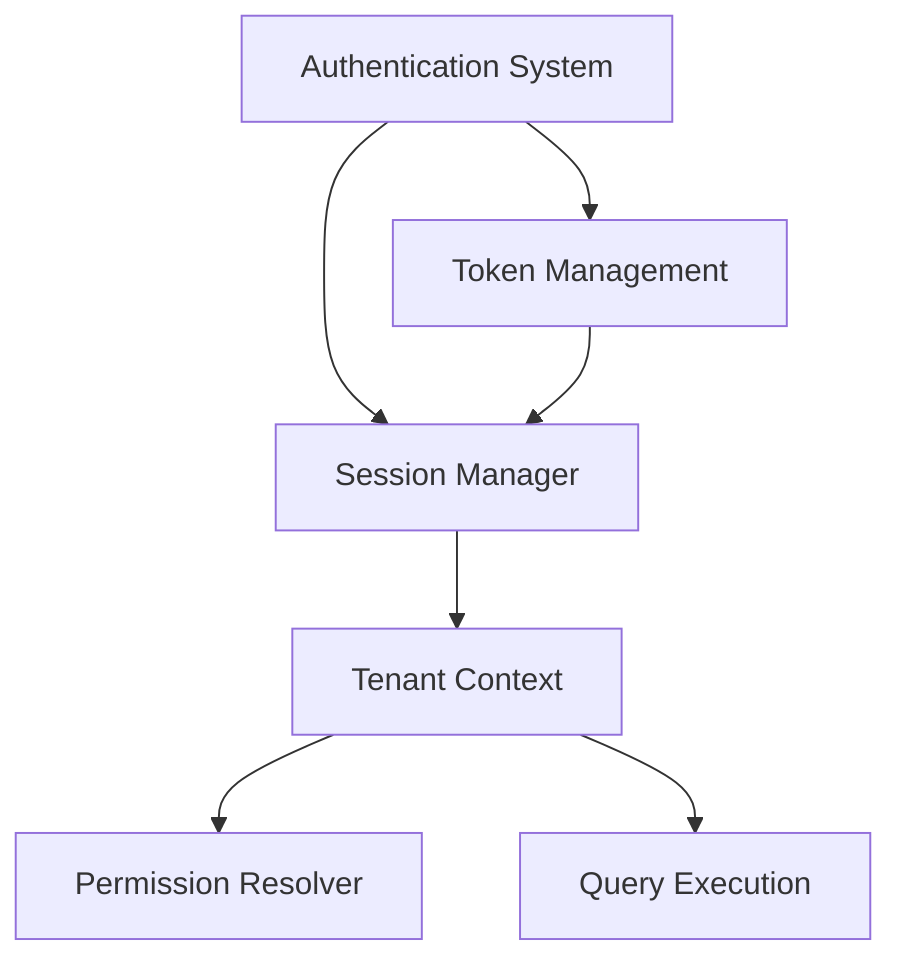
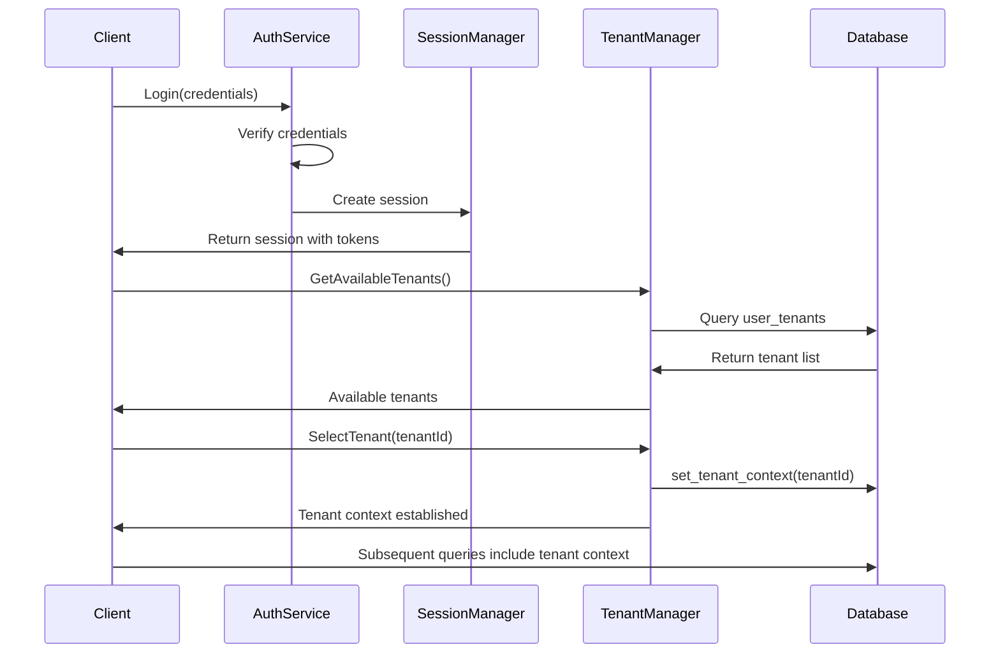

# Session and Authentication Integration

> **Version**: 1.0.0  
> **Last Updated**: 2025-05-22

## Overview

This document defines the integration between the Authentication system, Session Management system, and Tenant Context in a multi-tenant environment. It provides patterns for implementing proper session state coordination across these systems.

## Integration Architecture



## Authentication to Tenant Context Flow

The following diagram illustrates the flow from user authentication to establishing the tenant context:



## Implementation Patterns

### 1. Unified Session Context Pattern

To ensure consistent tenant context across frontend and backend:

```typescript
/**
 * Unified session context that coordinates auth state and tenant context
 */
class SessionContextService {
  constructor(
    private authService: AuthService,
    private tenantService: TenantService,
    private eventBus: EventBus
  ) {
    // Listen for auth state changes
    this.authService.onAuthStateChanged(this.handleAuthStateChange);
    
    // Listen for tenant context changes
    this.tenantService.onTenantContextChanged(this.handleTenantContextChange);
  }
  
  private handleAuthStateChange = async (authState: AuthState) => {
    if (authState.isAuthenticated) {
      // Load tenant context after successful authentication
      await this.restoreTenantContext(authState.userId);
    } else {
      // Clear tenant context on logout or auth expiry
      this.clearTenantContext();
    }
    
    // Notify application of session state change
    this.eventBus.emit('sessionStateChanged', {
      isAuthenticated: authState.isAuthenticated,
      userId: authState.userId,
      hasTenantContext: !!this.tenantService.getCurrentTenantId()
    });
  };
  
  private handleTenantContextChange = (tenantContext: TenantContext) => {
    // Update token claims with tenant context if applicable
    if (this.authService.supportsContextualTokenClaims()) {
      this.authService.updateTokenClaims({
        currentTenantId: tenantContext.tenantId
      });
    }
    
    // Notify application of session context change
    this.eventBus.emit('sessionContextChanged', {
      tenantId: tenantContext.tenantId,
      tenantName: tenantContext.tenantName,
      userRole: tenantContext.userRole
    });
  };
  
  private async restoreTenantContext(userId: string): Promise<boolean> {
    try {
      // Get last used tenant from persistent storage
      const lastTenantId = localStorage.getItem('lastTenantId');
      
      if (lastTenantId) {
        // Check if user still has access to this tenant
        const hasAccess = await this.tenantService.verifyTenantAccess(userId, lastTenantId);
        
        if (hasAccess) {
          await this.tenantService.activateTenantContext(lastTenantId);
          return true;
        }
      }
      
      // Get user's available tenants
      const availableTenants = await this.tenantService.getUserTenants(userId);
      
      if (availableTenants.length > 0) {
        // Get default tenant from user settings or use first available
        const defaultTenantId = await this.getUserDefaultTenantId(userId) || 
                               availableTenants[0].id;
        
        await this.tenantService.activateTenantContext(defaultTenantId);
        return true;
      }
      
      return false;
    } catch (error) {
      console.error('Error restoring tenant context:', error);
      return false;
    }
  }
  
  private clearTenantContext(): void {
    this.tenantService.clearTenantContext();
    sessionStorage.removeItem('currentTenantId');
    // Keep lastTenantId in localStorage for future logins
  }
  
  private async getUserDefaultTenantId(userId: string): Promise<string | null> {
    try {
      const { data } = await this.authService.supabase
        .from('user_settings')
        .select('default_tenant_id')
        .eq('user_id', userId)
        .maybeSingle();
        
      return data?.default_tenant_id || null;
    } catch (error) {
      console.error('Error getting user default tenant:', error);
      return null;
    }
  }
}
```

### 2. Session Token Enhancement Pattern

To include tenant context in auth tokens for API calls:

```typescript
/**
 * Enhance session tokens with tenant context
 */
class SessionTokenEnhancer {
  constructor(
    private authService: AuthService,
    private tenantContextService: TenantContextService
  ) {}
  
  /**
   * Get enhanced authorization headers that include tenant context
   */
  async getRequestHeaders(): Promise<Record<string, string>> {
    // Get base authorization headers from auth service
    const authHeaders = await this.authService.getAuthHeaders();
    
    // Get current tenant context
    const tenantId = this.tenantContextService.getCurrentTenantId();
    
    if (tenantId) {
      // Add tenant context header
      return {
        ...authHeaders,
        'X-Tenant-ID': tenantId
      };
    }
    
    return authHeaders;
  }
  
  /**
   * Intercept outgoing API requests to add tenant context
   */
  setupRequestInterceptors(axiosInstance: AxiosInstance): void {
    axiosInstance.interceptors.request.use(async (config) => {
      const headers = await this.getRequestHeaders();
      
      // Merge with existing headers
      config.headers = {
        ...config.headers,
        ...headers
      };
      
      return config;
    });
  }
}
```

### 3. Session Persistence Coordination Pattern

To ensure consistent session state across browser tabs and page reloads:

```typescript
/**
 * Coordinate session state across browser tabs
 */
class SessionPersistenceCoordinator {
  constructor(
    private authService: AuthService,
    private tenantService: TenantService
  ) {
    // Listen for storage events from other tabs
    window.addEventListener('storage', this.handleStorageEvent);
    
    // Set up periodic session validation
    this.setupSessionValidation();
    
    // Listen for visibility changes (tab activation)
    document.addEventListener('visibilitychange', this.handleVisibilityChange);
  }
  
  private handleStorageEvent = (event: StorageEvent) => {
    // React to auth token changes from other tabs
    if (event.key === 'supabase.auth.token') {
      this.authService.refreshAuthState();
    }
    
    // React to tenant context changes from other tabs
    if (event.key === 'currentTenantId') {
      const newTenantId = event.newValue;
      
      if (newTenantId && newTenantId !== this.tenantService.getCurrentTenantId()) {
        this.tenantService.activateTenantContext(newTenantId);
      }
    }
  };
  
  private handleVisibilityChange = () => {
    if (document.visibilityState === 'visible') {
      // Tab became active, validate session state
      this.validateSessionState();
    }
  };
  
  private setupSessionValidation() {
    // Check session validity every minute
    setInterval(() => {
      this.validateSessionState();
    }, 60000);
  }
  
  private async validateSessionState() {
    try {
      // Check if auth session is still valid
      const isAuthValid = await this.authService.validateSession();
      
      if (!isAuthValid) {
        // Auth session expired, trigger logout
        await this.authService.signOut();
        return;
      }
      
      // Check if tenant context is still valid
      const tenantId = this.tenantService.getCurrentTenantId();
      
      if (tenantId) {
        const isTenantValid = await this.tenantService.validateTenantContext(tenantId);
        
        if (!isTenantValid) {
          // Tenant context invalid, try to restore from available tenants
          await this.tenantService.restoreTenantContext();
        }
      }
    } catch (error) {
      console.error('Error validating session state:', error);
    }
  }
  
  /**
   * Cleanup resources when component is unmounted
   */
  dispose() {
    window.removeEventListener('storage', this.handleStorageEvent);
    document.removeEventListener('visibilitychange', this.handleVisibilityChange);
  }
}
```

### 4. Backend API Context Resolution Pattern

To consistently resolve tenant context in API endpoints:

```typescript
/**
 * API middleware for resolving tenant context from requests
 */
const resolveTenantContext = async (req: Request, res: Response, next: NextFunction) => {
  try {
    // Get user ID from authenticated request
    const userId = req.user?.id;
    
    if (!userId) {
      return res.status(401).json({ error: 'Unauthenticated request' });
    }
    
    // Resolve tenant context in priority order:
    // 1. From specific X-Tenant-ID header if present
    const headerTenantId = req.headers['x-tenant-id'] as string;
    
    // 2. From tenant_id query parameter
    const queryTenantId = req.query.tenant_id as string;
    
    // 3. From request body tenant_id if present
    const bodyTenantId = req.body?.tenant_id;
    
    // Determine tenant ID from available sources
    const tenantId = headerTenantId || queryTenantId || bodyTenantId;
    
    if (tenantId) {
      // Verify user has access to requested tenant
      const hasAccess = await verifyTenantAccess(userId, tenantId);
      
      if (!hasAccess) {
        return res.status(403).json({ 
          error: 'Access denied to tenant',
          code: 'TENANT_ACCESS_DENIED' 
        });
      }
      
      // Set tenant context for the request
      await setRequestTenantContext(req, tenantId);
      
      // Expose tenant context to downstream handlers
      req.tenantContext = {
        tenantId,
        timestamp: new Date().toISOString()
      };
      
      // Continue to next middleware
      return next();
    }
    
    // No tenant context provided, check if endpoint requires it
    if (requiresTenantContext(req.path, req.method)) {
      return res.status(400).json({ 
        error: 'Tenant context required',
        code: 'MISSING_TENANT_CONTEXT'
      });
    }
    
    // Continue without tenant context
    next();
  } catch (error) {
    console.error('Error resolving tenant context:', error);
    res.status(500).json({ error: 'Failed to resolve tenant context' });
  }
};

/**
 * Set tenant context for database operations in the request
 */
async function setRequestTenantContext(req: Request, tenantId: string): Promise<void> {
  // Get database client from request
  const supabase = req.supabase;
  
  if (!supabase) {
    throw new Error('Supabase client not found in request');
  }
  
  // Set tenant context for database operations
  await supabase.rpc('set_tenant_context', { tenant_id: tenantId });
  
  // Log context change for audit
  await supabase.from('api_context_logs').insert({
    user_id: req.user.id,
    tenant_id: tenantId,
    endpoint: req.path,
    method: req.method,
    ip_address: req.ip,
    timestamp: new Date()
  });
}
```

## Tenant Handshake Protocol

For securing tenant context switching operations:

```typescript
/**
 * Tenant handshake protocol for secure tenant context switching
 */
class TenantHandshakeProtocol {
  constructor(
    private authService: AuthService,
    private securityTokenService: SecurityTokenService
  ) {}
  
  /**
   * Generate a secure handshake token for tenant switching
   */
  async generateHandshakeToken(targetTenantId: string): Promise<string> {
    const user = this.authService.getCurrentUser();
    
    if (!user) {
      throw new Error('User not authenticated');
    }
    
    // Create payload with limited validity period
    const payload = {
      userId: user.id,
      targetTenantId,
      timestamp: Date.now(),
      nonce: this.generateNonce()
    };
    
    // Sign payload with user session information
    return this.securityTokenService.signTokenPayload(payload);
  }
  
  /**
   * Validate a handshake token for tenant switching
   */
  async validateHandshakeToken(
    token: string, 
    tenantId: string
  ): Promise<boolean> {
    try {
      // Verify token signature
      const payload = await this.securityTokenService.verifyToken(token);
      
      // Check if token is for correct tenant
      if (payload.targetTenantId !== tenantId) {
        return false;
      }
      
      // Check if token is expired (valid for 5 minutes)
      const tokenAge = Date.now() - payload.timestamp;
      if (tokenAge > 5 * 60 * 1000) {
        return false;
      }
      
      // Check if token is for current user
      const currentUser = this.authService.getCurrentUser();
      if (!currentUser || payload.userId !== currentUser.id) {
        return false;
      }
      
      return true;
    } catch (error) {
      console.error('Error validating handshake token:', error);
      return false;
    }
  }
  
  private generateNonce(): string {
    return Math.random().toString(36).substring(2, 15) + 
           Math.random().toString(36).substring(2, 15);
  }
}
```

## Session State Synchronization

### Client-Side Implementation

```typescript
/**
 * Hook for synchronizing session state across browser tabs
 */
function useSessionSync() {
  const { session, user } = useAuth();
  const { currentTenantId } = useTenantContext();
  
  useEffect(() => {
    const broadcastChannel = new BroadcastChannel('session_sync');
    
    // Listen for session events from other tabs
    broadcastChannel.addEventListener('message', (event) => {
      if (event.data.type === 'SESSION_CHANGE') {
        handleExternalSessionChange(event.data.payload);
      }
    });
    
    // Function to handle session changes from other tabs
    const handleExternalSessionChange = async (payload: any) => {
      // Handle changes to authentication state
      if (payload.authChanged) {
        // Force refresh auth state
        await supabase.auth.refreshSession();
      }
      
      // Handle changes to tenant context
      if (payload.tenantChanged && 
          payload.tenantId !== currentTenantId) {
        // Switch to new tenant context if user has access
        const { switchTenant } = useTenantContext();
        await switchTenant(payload.tenantId);
      }
    };
    
    // Set up listener for local session changes to broadcast
    const publishSessionChange = () => {
      broadcastChannel.postMessage({
        type: 'SESSION_CHANGE',
        payload: {
          authChanged: !!user,
          tenantChanged: !!currentTenantId,
          tenantId: currentTenantId,
          timestamp: Date.now()
        }
      });
    };
    
    // Subscribe to auth state changes
    const authUnsubscribe = supabase.auth.onAuthStateChange(() => {
      publishSessionChange();
    });
    
    // Subscribe to tenant context changes
    window.addEventListener('tenantContextChanged', publishSessionChange);
    
    return () => {
      broadcastChannel.close();
      authUnsubscribe.data.subscription.unsubscribe();
      window.removeEventListener('tenantContextChanged', publishSessionChange);
    };
  }, [user, currentTenantId]);
}
```

## Related Documentation

- **[../multitenancy/DATABASE_QUERY_PATTERNS.md](../multitenancy/DATABASE_QUERY_PATTERNS.md)**: Canonical multi-tenant database query patterns
- **[../multitenancy/SESSION_MANAGEMENT.md](../multitenancy/SESSION_MANAGEMENT.md)**: Session management in multi-tenant environments
- **[../security/AUTH_SYSTEM.md](../security/AUTH_SYSTEM.md)**: Authentication system documentation
- **[EVENT_ARCHITECTURE.md](EVENT_ARCHITECTURE.md)**: Event-driven architecture for system integration
- **[../security/MULTI_TENANT_ROLES.md](../security/MULTI_TENANT_ROLES.md)**: Multi-tenant role management

## Version History

- **1.0.0**: Initial session and authentication integration documentation (2025-05-22)
