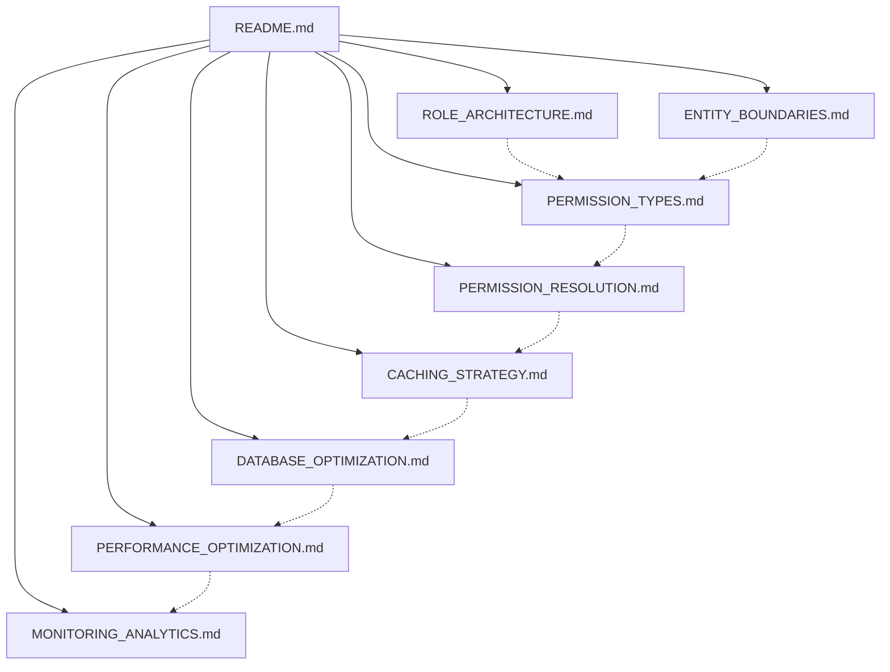
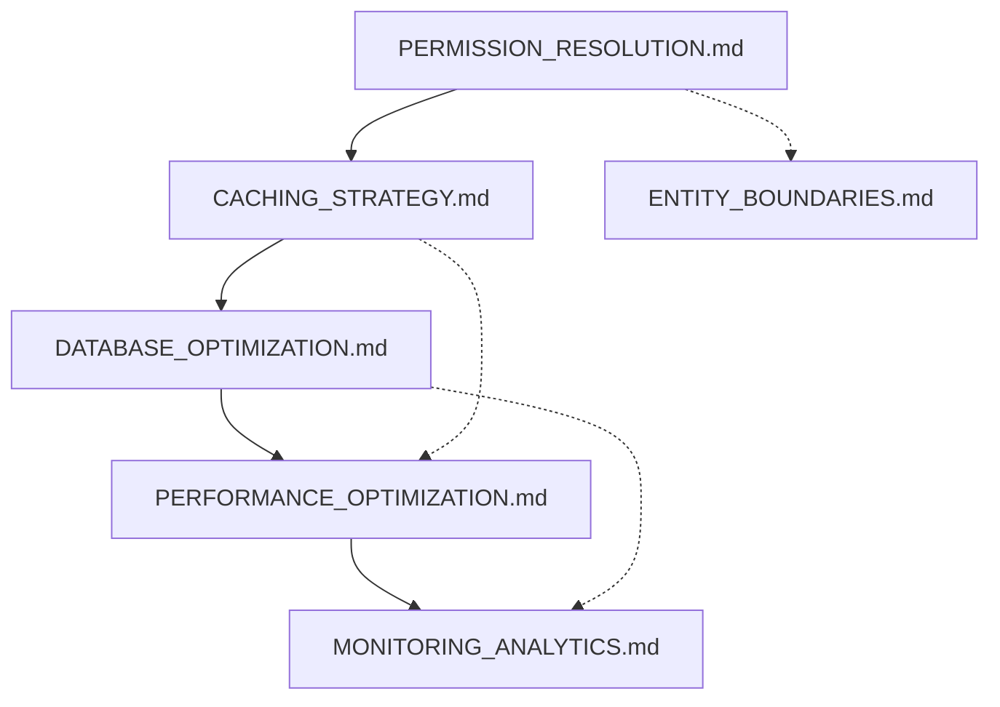
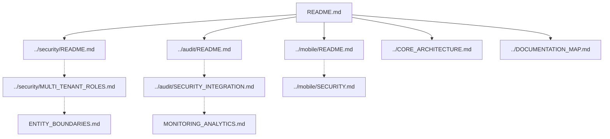

# RBAC Documentation Map

> **Version**: 1.1.0  
> **Last Updated**: 2025-05-24

This document provides a visual guide to the relationships between RBAC documentation files.

## Core Documentation Structure

```
rbac/
├── README.md                      # Entry point and overview
├── DOCUMENTATION_MAP.md           # This file - navigation guide
├── ROLE_ARCHITECTURE.md           # Role definition and structure
├── PERMISSION_TYPES.md            # Permission taxonomy and implementation
├── PERMISSION_RESOLUTION.md       # How permissions are resolved for users
├── ENTITY_BOUNDARIES.md           # Entity-level permission isolation
├── CACHING_STRATEGY.md            # Multi-level caching approach
├── DATABASE_OPTIMIZATION.md       # Database design for permissions
├── PERFORMANCE_OPTIMIZATION.md    # Performance techniques
└── MONITORING_ANALYTICS.md        # Monitoring and analytics
```

## Document Relationships

### Core RBAC Architecture



### Implementation Relationships



## Integration with Other Systems



## Navigation Guide

1. Start with **[README.md](src/docs/rbac/README.md)** for a high-level overview of the RBAC system
2. For **role management**, continue to **[ROLE_ARCHITECTURE.md](src/docs/rbac/ROLE_ARCHITECTURE.md)**
3. For **permission types**, see **[PERMISSION_TYPES.md](src/docs/rbac/PERMISSION_TYPES.md)**
4. For **permission resolution**, refer to **[PERMISSION_RESOLUTION.md](src/docs/rbac/PERMISSION_RESOLUTION.md)**
5. For **multi-tenant boundaries**, check **[ENTITY_BOUNDARIES.md](src/docs/rbac/ENTITY_BOUNDARIES.md)**
6. For **performance and optimization**:
   - **[CACHING_STRATEGY.md](src/docs/rbac/CACHING_STRATEGY.md)**: Caching implementation
   - **[DATABASE_OPTIMIZATION.md](src/docs/rbac/DATABASE_OPTIMIZATION.md)**: Database design
   - **[PERFORMANCE_OPTIMIZATION.md](src/docs/rbac/PERFORMANCE_OPTIMIZATION.md)**: Advanced optimization
7. For **monitoring and analytics**, see **[MONITORING_ANALYTICS.md](src/docs/rbac/MONITORING_ANALYTICS.md)**

## Explicit Integration Points

### Authentication System Integration
- **Entry Point**: [src/docs/integration/SECURITY_RBAC_INTEGRATION.md](src/docs/integration/SECURITY_RBAC_INTEGRATION.md)
- **Flow**: User authentication context → Permission resolution
- **Validation**: Authenticated user permissions cached and validated

### Audit System Integration
- **Entry Point**: [src/docs/integration/RBAC_AUDIT_INTEGRATION.md](src/docs/integration/RBAC_AUDIT_INTEGRATION.md)
- **Flow**: Permission changes → Standardized audit events
- **Validation**: All role/permission modifications logged

### Multi-Tenant Integration
- **Entry Point**: [src/docs/multitenancy/RBAC_INTEGRATION.md](src/docs/multitenancy/RBAC_INTEGRATION.md)
- **Flow**: Tenant context → Permission boundary enforcement
- **Validation**: Cross-tenant permission access prevented

### Mobile Platform Integration
- **Entry Point**: [src/docs/mobile/SECURITY.md](src/docs/mobile/SECURITY.md)
- **Flow**: Mobile auth context → RBAC permission resolution
- **Validation**: Mobile permissions align with web permissions

## Version History

- **1.1.0**: Fixed cross-reference consistency and added explicit integration points (2025-05-24)
- **1.0.0**: Initial document created for RBAC system documentation
