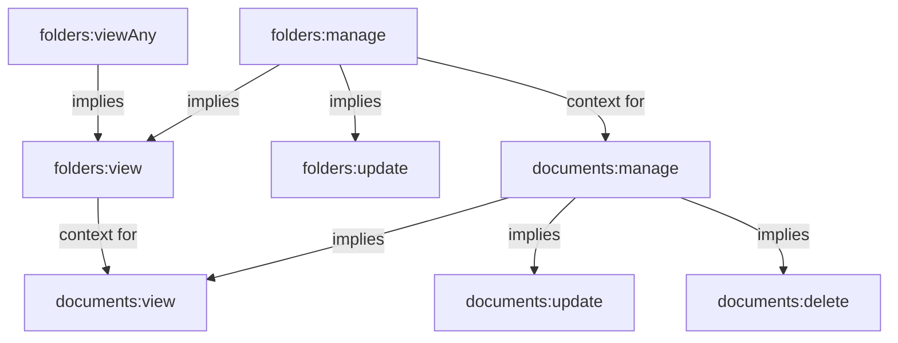

# Permission Dependencies and Relationships

> **Version**: 1.0.0  
> **Last Updated**: 2025-05-22

## Overview

This document describes the functional dependencies between different permission types within the Role-Based Access Control (RBAC) system. While the system uses a direct permission assignment model without hierarchical inheritance, certain logical and functional relationships exist between permissions that guide effective role configuration.

## Permission Dependency Types

### 1. Action Hierarchy Dependencies

Certain actions logically imply capabilities for other actions:

| Primary Action | Implied Capabilities |
|---------------|---------------------|
| `Update` | `View` |
| `Delete` | `View` |
| `ManagePermissions` | `View`, `Update` |
| `ViewAny` | Ability to `View` any specific instance |
| `UpdateAny` | Ability to `Update` any specific instance |
| `DeleteAny` | Ability to `Delete` any specific instance |

### 2. Resource Relationship Dependencies

Resources that have parent-child or ownership relationships create logical dependencies:

| Relationship Type | Dependency Pattern |
|------------------|-------------------|
| Parent-Child | Access to parent may imply limited access to children |
| Ownership | Creators of resources may have implied permissions |
| Containment | Container resources may grant access to contained items |

### 3. Contextual Dependencies

Permissions that depend on specific contexts:

| Context | Permission Dependency |
|---------|----------------------|
| Tenant-Specific | Permissions may only apply within specific tenant contexts |
| Time-Bound | Permissions may only be valid during specific time periods |
| Approval-Based | Permissions may require secondary approval to be exercised |

## Implementation Approach

Although these dependencies exist conceptually, they are **not automatically enforced** through inheritance in the permission system. Rather, they are:

1. **Guidance for Administrators**: When configuring roles, administrators should follow these dependencies
2. **Implemented via Application Logic**: Application code enforces these relationships where appropriate
3. **Validated During Testing**: Test cases verify that these dependencies function properly

## Permission Dependency Matrix

Below is a matrix of common permissions and their dependencies:

```
┌─────────────────┬───────────────────────────────────────────┐
│ Permission      │ Functional Dependencies                   │
├─────────────────┼───────────────────────────────────────────┤
│ users:create    │ None                                      │
│ users:view      │ None                                      │
│ users:viewAny   │ Implies users:view                        │
│ users:update    │ Implies users:view                        │
│ users:updateAny │ Implies users:update, users:viewAny       │
│ users:delete    │ Implies users:view                        │
│ users:deleteAny │ Implies users:delete, users:viewAny       │
├─────────────────┼───────────────────────────────────────────┤
│ roles:create    │ None                                      │
│ roles:view      │ None                                      │
│ roles:update    │ Implies roles:view                        │
│ roles:delete    │ Implies roles:view                        │
│ roles:assign    │ Implies roles:view                        │
├─────────────────┼───────────────────────────────────────────┤
│ reports:create  │ None                                      │
│ reports:view    │ None                                      │
│ reports:viewAny │ Implies reports:view                      │
│ reports:publish │ Implies reports:view, reports:update      │
└─────────────────┴───────────────────────────────────────────┘
```

## Example: Resource Access Flow

The following diagram illustrates how permission dependencies might flow in a document management system:



## Permission Check Implementation

When checking permissions in code, these dependencies should be considered:

```typescript
function checkPermission(user, action, resource, resourceId) {
  // Direct permission check
  if (hasExplicitPermission(user, action, resource, resourceId)) {
    return true;
  }
  
  // Check for higher-level permissions that imply this one
  if (action === 'view' && hasExplicitPermission(user, 'update', resource, resourceId)) {
    return true;
  }
  
  if (action === 'view' && hasExplicitPermission(user, 'delete', resource, resourceId)) {
    return true;
  }
  
  // Special case for "Any" permissions
  if (resourceId && hasExplicitPermission(user, `${action}Any`, resource)) {
    return true;
  }
  
  // No applicable permission found
  return false;
}
```

## Best Practices

When configuring roles and permissions:

1. **Minimize Special Cases**: Stick to standard dependency patterns
2. **Document Exceptions**: When breaking from standard dependency patterns, document why
3. **Regular Auditing**: Review permission assignments to ensure they follow dependency rules
4. **Test Boundary Cases**: Ensure permission checks handle edge cases correctly
5. **Prefer Explicit Over Implicit**: When in doubt, explicitly assign permissions rather than relying on dependencies

## Related Documentation

- **[PERMISSION_TYPES.md](PERMISSION_TYPES.md)**: Permission taxonomy and implementation
- **[PERMISSION_RESOLUTION.md](PERMISSION_RESOLUTION.md)**: How permissions are resolved for users
- **[ROLE_ARCHITECTURE.md](ROLE_ARCHITECTURE.md)**: Role definition and structure
- **[permission-resolution/PERMISSION_MODEL.md](permission-resolution/PERMISSION_MODEL.md)**: Core permission model details

## Version History

- **1.0.0**: Initial document creation (2025-05-22)
