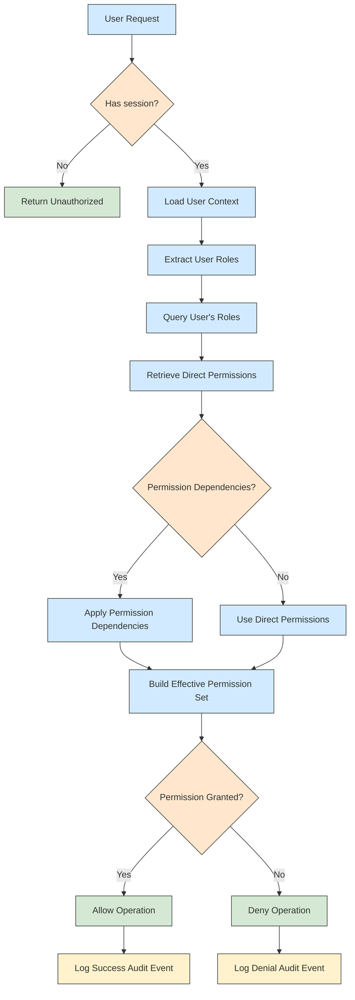

# Permission Resolution Flow Diagram

> **Version**: 1.0.0  
> **Last Updated**: 2025-05-22

This document provides a visual representation of how permissions are resolved when a user has multiple roles in the system.

## Permission Resolution Process

## Key Components

1. **User Context Retrieval**: The system first retrieves the user's context from their session
2. **Role Collection**: All roles assigned to the user are collected
3. **Direct Permission Retrieval**: All permissions directly assigned to these roles are retrieved
4. **Permission Dependency Resolution**: Additional permissions are derived based on functional dependencies
5. **Permission Verification**: The operation is allowed only if the required permission is present in the effective set
6. **Audit Logging**: The permission check result is logged for audit purposes

## Caching Considerations

At multiple points in this flow, the system may use cached data to improve performance:

- Session-level permission cache
- Role-permission assignment cache
- Computed effective permissions cache

For detailed caching strategies, see [CACHING_STRATEGY.md](../CACHING_STRATEGY.md).

## Related Documentation

- **[../PERMISSION_RESOLUTION.md](../PERMISSION_RESOLUTION.md)**: Detailed permission resolution process
- **[../PERMISSION_DEPENDENCIES.md](../PERMISSION_DEPENDENCIES.md)**: Functional dependencies between permissions
- **[../PERMISSION_QUERY_OPTIMIZATION.md](../PERMISSION_QUERY_OPTIMIZATION.md)**: Query optimization strategies
- **[../../integration/SECURITY_RBAC_INTEGRATION.md](../../integration/SECURITY_RBAC_INTEGRATION.md)**: Security and RBAC integration

## Version History

- **1.0.0**: Initial diagram creation (2025-05-22)
