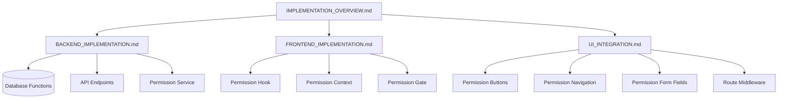

# Permission Resolution Implementation

> **Version**: 2.0.0  
> **Last Updated**: 2025-05-23

## Overview

This document has been refactored into smaller, more manageable documents for better readability and maintenance. Please refer to the specialized documents below for implementation details.

## Implementation Documentation Structure

The implementation documentation is now organized into these specialized documents:

1. **[IMPLEMENTATION_OVERVIEW.md](IMPLEMENTATION_OVERVIEW.md)**: High-level overview of the implementation
2. **[BACKEND_IMPLEMENTATION.md](BACKEND_IMPLEMENTATION.md)**: Backend implementation details
3. **[FRONTEND_IMPLEMENTATION.md](FRONTEND_IMPLEMENTATION.md)**: Frontend implementation details
4. **[UI_INTEGRATION.md](UI_INTEGRATION.md)**: UI integration patterns and examples

## Architecture Diagram

## Related Documentation

- **[PERMISSION_MODEL.md](PERMISSION_MODEL.md)**: Core permission model
- **[RESOLUTION_ALGORITHM.md](RESOLUTION_ALGORITHM.md)**: Permission resolution algorithm
- **[../CACHING_STRATEGY.md](../CACHING_STRATEGY.md)**: Permission caching approach
- **[../DATABASE_OPTIMIZATION.md](../DATABASE_OPTIMIZATION.md)**: SQL optimization for permissions
- **[../../integration/SECURITY_RBAC_INTEGRATION.md](../../integration/SECURITY_RBAC_INTEGRATION.md)**: Security and RBAC integration

## Version History

- **2.0.0**: Refactored into smaller specialized documents (2025-05-23)
- **1.0.0**: Initial document creation from permission resolution refactoring (2025-05-22)
