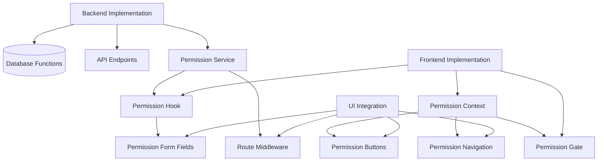

# Permission Implementation Overview

> **Version**: 1.0.0  
> **Last Updated**: 2025-05-23

## Overview

This document provides a high-level overview of the permission implementation across different parts of the system. It serves as an entry point to the more detailed implementation documents.

## Implementation Components

The permission implementation is divided into these key components:

### 1. Backend Implementation

The backend implementation handles the core permission checking logic, database queries, and API endpoints:

- Database functions for permission checks
- API endpoints for permission verification
- Permission service layer with caching

[Learn more in BACKEND_IMPLEMENTATION.md](BACKEND_IMPLEMENTATION.md)

### 2. Frontend Implementation

The frontend implementation provides React hooks and contexts for permission-based UI rendering:

- Permission hook for component-level checks
- Permission context for application-wide state
- Permission gate component for conditional rendering

[Learn more in FRONTEND_IMPLEMENTATION.md](FRONTEND_IMPLEMENTATION.md)

### 3. UI Integration

The UI integration patterns demonstrate how to build permission-aware UI components:

- Permission-aware buttons and form fields
- Dynamic navigation based on permissions
- API route protection middleware

[Learn more in UI_INTEGRATION.md](UI_INTEGRATION.md)

## Architecture Diagram

## Implementation Approach

1. **Direct Permission Assignment**: The system uses direct permission assignment without role hierarchy
2. **Context-Aware Resolution**: Permissions are resolved within tenant context
3. **Performance Optimization**: Multi-level caching for optimized performance
4. **UI Protection**: Consistent UI protection patterns
5. **Security First**: Defense-in-depth approach to permission checking

## Related Documentation

- **[../README.md](../README.md)**: RBAC system overview
- **[../PERMISSION_MODEL.md](../PERMISSION_MODEL.md)**: Core permission model
- **[RESOLUTION_ALGORITHM.md](RESOLUTION_ALGORITHM.md)**: Permission resolution algorithm
- **[../CACHING_STRATEGY.md](../CACHING_STRATEGY.md)**: Permission caching approach
- **[../DATABASE_OPTIMIZATION.md](../DATABASE_OPTIMIZATION.md)**: SQL optimization for permissions
- **[../../integration/SECURITY_RBAC_INTEGRATION.md](../../integration/SECURITY_RBAC_INTEGRATION.md)**: Security and RBAC integration

## Version History

- **1.0.0**: Initial document created from IMPLEMENTATION.md refactoring (2025-05-23)
