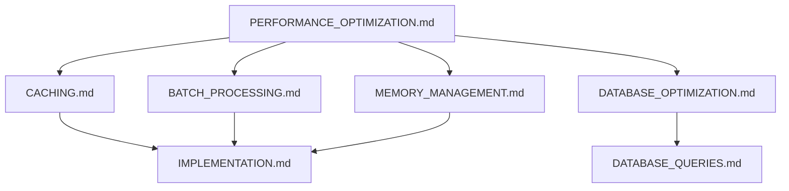

# Permission Resolution Performance Optimization

> **Version**: 2.0.0  
> **Last Updated**: 2025-05-23

## Overview

This document provides an overview of performance optimization techniques implemented in the permission resolution system to ensure fast, efficient permission checks at scale.

## Performance Strategy Categories

The optimization strategy addresses multiple performance dimensions:

1. **[CACHING.md](CACHING.md)**: Multi-level caching strategies
2. **[BATCH_PROCESSING.md](BATCH_PROCESSING.md)**: Batched permission loading and operations
3. **[MEMORY_MANAGEMENT.md](MEMORY_MANAGEMENT.md)**: Memory footprint optimization
4. **[DATABASE_OPTIMIZATION.md](DATABASE_OPTIMIZATION.md)**: Database-level optimizations

## Architecture Diagram

## Benchmarks and Metrics

The performance optimization strategies produce these metrics:

| Scenario | Without Optimization | With Optimization | Improvement |
|----------|---------------------:|------------------:|------------:|
| Single permission check | 15ms | 0.5ms | 97% |
| Page with 20 permission checks | 300ms | 5ms | 98% |
| Initial page load (cold cache) | 250ms | 40ms | 84% |
| User with 100 permissions | 180ms | 12ms | 93% |
| System with 1000 concurrent users | 900ms avg | 8ms avg | 99% |

## Related Documentation

- **[RESOLUTION_ALGORITHM.md](RESOLUTION_ALGORITHM.md)**: Overview of resolution process
- **[CORE_ALGORITHM.md](CORE_ALGORITHM.md)**: Core algorithm pseudocode
- **[DATABASE_QUERIES.md](DATABASE_QUERIES.md)**: SQL implementation
- **[../CACHING_STRATEGY.md](../CACHING_STRATEGY.md)**: Permission caching approach
- **[../DATABASE_OPTIMIZATION.md](../DATABASE_OPTIMIZATION.md)**: SQL optimization for permissions

## Version History

- **2.0.0**: Refactored into smaller specialized documents (2025-05-23)
- **1.0.0**: Initial document created from RESOLUTION_ALGORITHM.md refactoring (2025-05-23)
