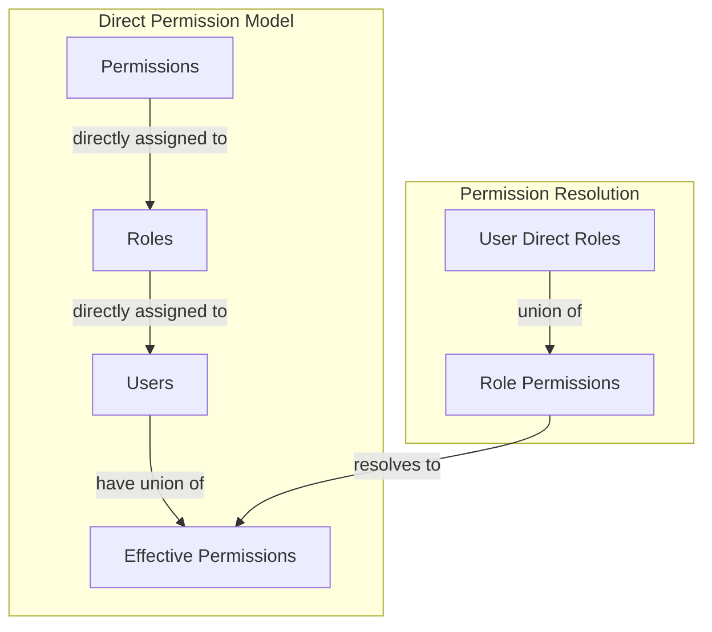

# Permission Model

> **Version**: 1.3.0  
> **Last Updated**: 2025-05-23

## Overview

This document defines the core direct permission assignment model and its characteristics within the Role-Based Access Control (RBAC) system.

## Direct Permission Assignment Model

The RBAC system uses a **direct permission assignment model** with the following key characteristics:

1. **Flat Permission Structure**: Permissions are directly assigned to roles without hierarchical inheritance
2. **Union-Based Resolution**: Users with multiple roles have the union of all permissions from their roles
3. **Explicit Permissions**: All permissions must be explicitly granted to roles
4. **No Role Hierarchy**: Roles have no parent-child relationships or inheritance

### Why Direct Assignment

The direct assignment model was chosen over hierarchical models because it:
- Simplifies permission resolution (no need to traverse role hierarchies)
- Provides clearer security boundaries and audit trails
- Eliminates inheritance ambiguity and conflicts
- Supports multi-tenant deployment scenarios effectively
- Makes permission debugging and troubleshooting straightforward

## Permission Assignment Architecture



### Permission Units

The fundamental units in the direct permission model are:

1. **Resources**: Entities in the system that can be protected
   - Examples: users, roles, tenants, reports, settings

2. **Actions**: Operations that can be performed on resources
   - Standard actions: View, ViewAny, Create, Update, Delete
   - Resource-specific actions: Publish, Approve, Clone, Export

3. **Permissions**: Direct combination of a resource and an action
   - Example: `users:create`, `reports:view`, `settings:update`
   - No inheritance or hierarchy between permissions

### Permission Storage

Permissions are stored using a flat structure with direct relationships:

```sql
-- Resources table
CREATE TABLE resources (
  id UUID PRIMARY KEY DEFAULT uuid_generate_v4(),
  name TEXT NOT NULL,
  description TEXT,
  created_at TIMESTAMP WITH TIME ZONE DEFAULT now(),
  updated_at TIMESTAMP WITH TIME ZONE DEFAULT now()
);

-- Permissions (direct resource-action combinations)
CREATE TABLE permissions (
  id UUID PRIMARY KEY DEFAULT uuid_generate_v4(),
  resource_id UUID NOT NULL REFERENCES resources(id) ON DELETE CASCADE,
  action TEXT NOT NULL,
  created_at TIMESTAMP WITH TIME ZONE DEFAULT now(),
  updated_at TIMESTAMP WITH TIME ZONE DEFAULT now(),
  UNIQUE(resource_id, action)
);

-- Direct role permissions (no inheritance)
CREATE TABLE role_permissions (
  id UUID PRIMARY KEY DEFAULT uuid_generate_v4(),
  role_id UUID NOT NULL REFERENCES roles(id) ON DELETE CASCADE,
  permission_id UUID NOT NULL REFERENCES permissions(id) ON DELETE CASCADE,
  created_by UUID REFERENCES auth.users(id),
  created_at TIMESTAMP WITH TIME ZONE DEFAULT now(),
  UNIQUE(role_id, permission_id)
);
```

## Permission Relationships

### Functional Dependencies

While the model does not use hierarchical inheritance, it recognizes functional dependencies between permissions for logical consistency:

1. **Implied Capabilities**: Some permissions logically imply others
   - Example: `Update` action implies capability for `View` operations
   - Example: `Delete` action implies capabilities for `Update` and `View` operations

2. **Resource Relationships**: Resources may have logical relationships
   - Example: Department admin may logically need access to department resources
   - Example: Project manager may need access to project-related resources

3. **Action Precedence**: Some actions are more powerful than others
   - Example: `ManagePermissions` encompasses other management actions
   - Example: `Admin` action includes all resource-specific actions

For comprehensive definition of these functional dependencies, see [../PERMISSION_DEPENDENCIES.md](../PERMISSION_DEPENDENCIES.md).

**Important**: These relationships exist conceptually but are NOT automatically enforced by the system. They guide permission assignment by administrators and are enforced through application logic when relevant.

## Direct Permission Resolution

### SuperAdmin Role

The SuperAdmin role has a special exemption from normal permission checks:

```typescript
// SuperAdmin permission check bypass in direct model
async function hasDirectPermission(userId: string, action: string, resource: string): Promise<boolean> {
  // Check if user is SuperAdmin (direct assignment)
  const isSuperAdmin = await checkDirectSuperAdminRole(userId);
  
  // SuperAdmin always has all permissions
  if (isSuperAdmin) {
    return true;
  }
  
  // Normal direct permission resolution for non-SuperAdmin users
  return await checkDirectUserPermission(userId, action, resource);
}
```

### System Resources

System-level resources have special protection with direct assignment:
- Cannot be created, updated, or deleted by normal users
- Protected by database-level security mechanisms
- Only accessible to SuperAdmin and system processes
- No inheritance or hierarchical access patterns

## Related Documentation

- **[RESOLUTION_ALGORITHM.md](RESOLUTION_ALGORITHM.md)**: Algorithm for direct permission resolution
- **[../PERMISSION_TYPES.md](../PERMISSION_TYPES.md)**: Permission taxonomy
- **[../PERMISSION_DEPENDENCIES.md](../PERMISSION_DEPENDENCIES.md)**: Functional dependencies between permissions
- **[../ROLE_ARCHITECTURE.md](../ROLE_ARCHITECTURE.md)**: Role definition and flat structure
- **[ENTITY_BOUNDARIES.md](ENTITY_BOUNDARIES.md)**: Entity-level permission boundaries
- **[IMPLEMENTATION.md](IMPLEMENTATION.md)**: Implementation details

## Version History

- **1.3.0**: Complete alignment with direct assignment model, removed all hierarchy references (2025-05-23)
- **1.2.0**: Added comprehensive reference to PERMISSION_DEPENDENCIES.md (2025-05-22)
- **1.1.0**: Added reference to PERMISSION_DEPENDENCIES.md (2025-05-22)
- **1.0.0**: Initial document creation from permission resolution refactoring (2025-05-22)
