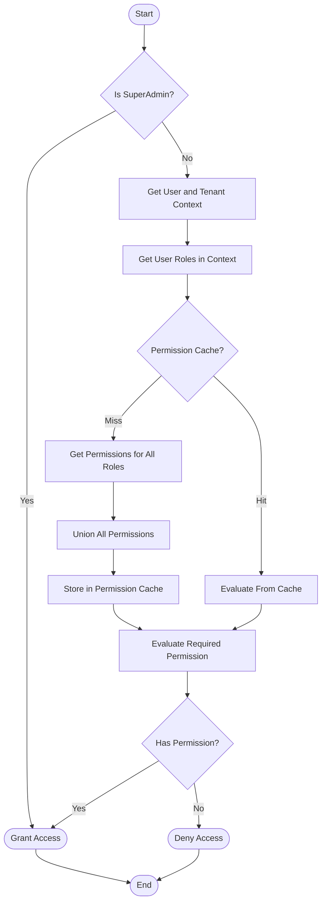

# Permission Resolution Algorithm

> **Version**: 2.1.0  
> **Last Updated**: 2025-05-23

## Overview

This document provides a high-level overview of the permission resolution process. For detailed implementation, see the specialized documents linked below.

## Resolution Process

The permission resolution algorithm follows these key steps:

1. **Context Establishment**: Determine user and tenant context
2. **Role Collection**: Gather all roles assigned to the user
3. **Permission Aggregation**: Collect all permissions from those roles
4. **Permission Evaluation**: Check if the required permission exists in the aggregated set
5. **Decision**: Grant or deny access based on the evaluation

### Resolution Flow Diagram

## Algorithm Components

The permission resolution algorithm has been divided into these specialized documents:

1. **[CORE_ALGORITHM.md](CORE_ALGORITHM.md)**: Core algorithm pseudocode and flow
2. **[DATABASE_QUERIES.md](DATABASE_QUERIES.md)**: SQL implementation of permission checks
3. **[SPECIAL_CASES.md](SPECIAL_CASES.md)**: Resource-specific permissions and wildcards
4. **[PERFORMANCE_OPTIMIZATION.md](PERFORMANCE_OPTIMIZATION.md)**: Caching and optimization strategies

## Related Documentation

- **[PERMISSION_MODEL.md](PERMISSION_MODEL.md)**: Core permission model
- **[IMPLEMENTATION.md](IMPLEMENTATION.md)**: Implementation details
- **[../CACHING_STRATEGY.md](../CACHING_STRATEGY.md)**: Permission caching approach
- **[ENTITY_BOUNDARIES.md](ENTITY_BOUNDARIES.md)**: Entity-level permission boundaries
- **[DATABASE_OPTIMIZATION.md](DATABASE_OPTIMIZATION.md)**: SQL optimization for permissions
- **[UI_INTEGRATION.md](UI_INTEGRATION.md)**: Integration with UI components
- **[BATCH_PROCESSING.md](BATCH_PROCESSING.md)**: Batch permission resolution
- **[FRONTEND_IMPLEMENTATION.md](FRONTEND_IMPLEMENTATION.md)**: Client-side permission checking

## Version History

- **2.1.0**: Added more comprehensive related document references (2025-05-23)
- **2.0.0**: Refactored into smaller specialized documents (2025-05-23)
- **1.0.0**: Initial document creation from permission resolution refactoring (2025-05-22)
