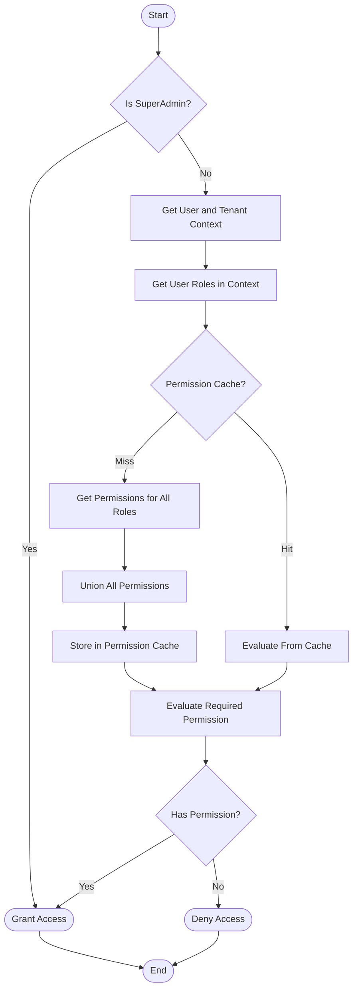

# Permission Resolution Algorithm Core

> **Version**: 1.0.0  
> **Last Updated**: 2025-05-22

## Overview

This document details the core algorithm used to resolve permissions for a user in a specific context. The permission resolution process determines whether a user has access to perform a specific action on a resource.

## Resolution Process

The permission resolution algorithm follows these key steps:

1. **Context Establishment**: Determine user and tenant context
2. **Role Collection**: Gather all roles assigned to the user
3. **Permission Aggregation**: Collect all permissions from those roles
4. **Permission Evaluation**: Check if the required permission exists in the aggregated set
5. **Decision**: Grant or deny access based on the evaluation

### Resolution Flow Diagram



## Algorithm Pseudocode

```typescript
/**
 * Resolve whether a user has a specific permission
 */
async function resolvePermission(
  userId: string,
  actionKey: string,
  resourceType: string,
  resourceId?: string,
  tenantId?: string
): Promise<boolean> {
  // 1. SuperAdmin check (always returns true for SuperAdmins)
  if (await isSuperAdmin(userId)) {
    return true;
  }
  
  // 2. Get effective tenant context
  const effectiveTenantId = tenantId || await getCurrentTenantContext(userId);
  if (!effectiveTenantId) {
    return false; // No tenant context, cannot resolve permissions
  }
  
  // 3. Check permission cache
  const cacheKey = `${userId}:${effectiveTenantId}:${resourceType}:${actionKey}`;
  const cachedResult = permissionCache.get(cacheKey);
  if (cachedResult !== undefined) {
    return cachedResult;
  }
  
  // 4. Get all roles for the user in this tenant
  const roles = await getUserRolesInTenant(userId, effectiveTenantId);
  
  // 5. If no roles, user has no permissions
  if (roles.length === 0) {
    permissionCache.set(cacheKey, false);
    return false;
  }
  
  // 6. Get the resource ID for this resource type
  const resourceId = await getResourceIdByName(resourceType);
  if (!resourceId) {
    permissionCache.set(cacheKey, false);
    return false;
  }
  
  // 7. Check if any role has the required permission
  const hasPermission = await checkRolesForPermission(
    roles,
    resourceId,
    actionKey,
    resourceId
  );
  
  // 8. Cache and return the result
  permissionCache.set(cacheKey, hasPermission);
  return hasPermission;
}
```

## Database Query Implementation

For the database query implementation that powers this algorithm, see [SQL_IMPLEMENTATION.md](SQL_IMPLEMENTATION.md).

## Related Documentation

- **[PERMISSION_MODEL.md](PERMISSION_MODEL.md)**: Core permission model
- **[SQL_IMPLEMENTATION.md](SQL_IMPLEMENTATION.md)**: SQL implementation details
- **[SPECIAL_CASES.md](SPECIAL_CASES.md)**: Special resolution cases
- **[PERFORMANCE_OPTIMIZATION.md](PERFORMANCE_OPTIMIZATION.md)**: Optimization techniques
- **[../CACHING_STRATEGY.md](../CACHING_STRATEGY.md)**: Permission caching approach

## Version History

- **1.0.0**: Refactored core algorithm from RESOLUTION_ALGORITHM.md (2025-05-22)
