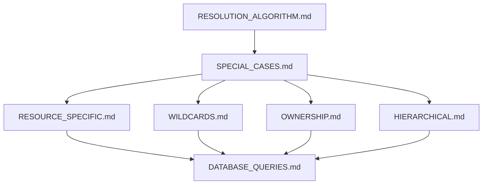

# Permission Resolution Special Cases

> **Version**: 2.0.0  
> **Last Updated**: 2025-05-23

## Overview

This document provides an overview of special permission resolution cases that require additional handling beyond the standard algorithm. For detailed implementation, see the specialized documents below.

## Special Case Categories

The permission system handles several categories of special cases:

1. **[RESOURCE_SPECIFIC.md](RESOURCE_SPECIFIC.md)**: Permissions that apply to specific resource instances
2. **[WILDCARDS.md](WILDCARDS.md)**: Permission wildcards and pattern matching
3. **[OWNERSHIP.md](OWNERSHIP.md)**: Owner-based permissions
4. **[HIERARCHICAL.md](HIERARCHICAL.md)**: Hierarchical resource permission inheritance

## Architecture Diagram

## Related Documentation

- **[RESOLUTION_ALGORITHM.md](RESOLUTION_ALGORITHM.md)**: Overview of resolution process
- **[CORE_ALGORITHM.md](CORE_ALGORITHM.md)**: Core algorithm pseudocode
- **[DATABASE_QUERIES.md](DATABASE_QUERIES.md)**: SQL implementation
- **[PERMISSION_MODEL.md](PERMISSION_MODEL.md)**: Core permission model
- **[ENTITY_BOUNDARIES.md](ENTITY_BOUNDARIES.md)**: Entity-level permission boundaries

## Version History

- **2.0.0**: Refactored into smaller specialized documents (2025-05-23)
- **1.0.0**: Initial document created from RESOLUTION_ALGORITHM.md refactoring (2025-05-23)
