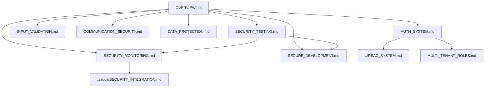

# Security Implementation Overview

> **Version**: 3.0.0  
> **Last Updated**: 2025-05-23

## Core Principles

This document provides an overview of the security architecture, connecting all security components into a cohesive system. The security architecture is based on these core principles:

1. **Defense in Depth**: Multiple layers of security controls
2. **Least Privilege**: Minimum necessary access rights
3. **Secure by Default**: Security enabled by default
4. **Privacy by Design**: Privacy considerations from the start

## Security Architecture Map

## Core Security Components

For detailed information about specific security components, please refer to:

1. **[AUTH_SYSTEM.md](AUTH_SYSTEM.md)**: Authentication and session management
2. **[INPUT_VALIDATION.md](INPUT_VALIDATION.md)**: Input validation and sanitization
3. **[COMMUNICATION_SECURITY.md](COMMUNICATION_SECURITY.md)**: Secure communication
4. **[DATA_PROTECTION.md](DATA_PROTECTION.md)**: Data protection and encryption
5. **[AUTH_ALGORITHMS.md](AUTH_ALGORITHMS.md)**: Authentication algorithms
6. **[PERMISSION_ENFORCEMENT.md](PERMISSION_ENFORCEMENT.md)**: Permission enforcement
7. **[SECURITY_EVENTS.md](SECURITY_EVENTS.md)**: Security event logging

## Security Responsibility Matrix

| Security Area | Developers | Security Team | SuperAdmin | User |
|---------------|------------|--------------|------------|------|
| Input Validation | Implement | Review & Audit | - | Report Issues |
| Authentication | Implement | Review & Test | Configure MFA Policy | Enable MFA |
| Authorization | Implement | Audit | Manage Roles | - |
| Data Protection | Implement | Review | Configure Policies | Manage Personal Data |
| Audit Logging | Implement | Monitor | Review Logs | - |
| Theme Security | Implement | Review | Set Global Themes | Set Personal Themes |
| Mobile Security | Implement | Test & Verify | Set Policies | Follow Guidelines |

## Implementation Roadmap

The security features follow this implementation roadmap:

1. **Phase 1: Foundation**
   - Core authentication mechanisms
   - Basic RBAC implementation
   - Input validation framework
   - Security event logging infrastructure

2. **Phase 2: Core Functionality**
   - Advanced authorization controls
   - Multi-factor authentication
   - Enhanced security monitoring
   - Security dashboard implementation

3. **Phase 3: Feature Development**
   - Multi-tenant security isolation
   - API security enhancements
   - Mobile security features
   - Theme security framework

4. **Phase 4: Polish and Compliance**
   - Security performance optimization
   - Compliance reporting
   - Advanced threat monitoring
   - Security documentation and training

## Related Documentation

- **[../RBAC_SYSTEM.md](../RBAC_SYSTEM.md)**: Role-based access control system
- **[../audit/README.md](../audit/README.md)**: Audit logging framework
- **[../audit/SECURITY_INTEGRATION.md](../audit/SECURITY_INTEGRATION.md)**: Security event integration
- **[../DOCUMENTATION_MAP.md](../DOCUMENTATION_MAP.md)**: Documentation relationships

## Version History

- **3.0.0**: Refactored into smaller specialized documents (2025-05-23)
- **2.1.0**: Standardized document references with consistent paths (2025-05-22)
- **2.0.0**: Added detailed technical implementation algorithms
- **1.0.0**: Initial document detailing core security principles and architecture
