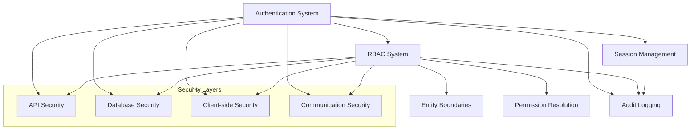

# Security Framework Overview

> **Version**: 1.0.0  
> **Last Updated**: 2025-05-22

## Introduction

This document provides a comprehensive overview of the security framework, connecting all security components into a cohesive system. It serves as the entry point for understanding the security architecture and implementation.

## Security Architecture Diagram



## Core Security Components

### 1. Authentication System
The authentication system verifies user identity through multiple factors and establishes secure sessions.

**Key Features:**
- Multi-factor authentication
- JWT-based session management
- Secure credential storage
- Brute force protection

**Implementation Details:** [AUTH_SYSTEM.md](AUTH_SYSTEM.md)

### 2. Authorization (RBAC)
The Role-Based Access Control system ensures users only access resources they have permission for.

**Key Features:**
- Direct permission assignment model
- Resource-specific permissions
- Cross-entity permission boundaries
- Performance-optimized permission resolution

**Implementation Details:** [../rbac/README.md](../rbac/README.md)

### 3. Session Management
Secure handling of user sessions with appropriate controls.

**Key Features:**
- Token rotation
- Secure storage mechanisms
- Expiration and refresh policies
- Revocation capabilities

**Implementation Details:** [SESSION_MANAGEMENT.md](SESSION_MANAGEMENT.md)

### 4. Secure Communication
Protection of data in transit between system components.

**Key Features:**
- TLS 1.3+ enforcement
- Certificate validation
- HSTS implementation
- Content Security Policy

**Implementation Details:** [COMMUNICATION_SECURITY.md](COMMUNICATION_SECURITY.md)

## Security Implementation by Layer

### API Layer Security

```typescript
// Example API security implementation
import { authenticate } from '../middleware/auth';
import { authorize } from '../middleware/rbac';

router.get('/resources/:id', 
  authenticate,                        // Verify user identity
  authorize('resources', 'View'),      // Check permission
  validateInput(resourceSchema),       // Validate input
  rateLimiter({ max: 10, window: 60 }),// Prevent abuse
  async (req, res) => {
    // Handle request
    auditLogger.log({
      eventType: 'resource_access',
      userId: req.user.id,
      resource: 'resources',
      resourceId: req.params.id
    });
    
    // Return data
    res.json({ data: resource });
  }
);
```

### Database Layer Security

```typescript
// Example RLS policy implementation
CREATE POLICY resource_access_policy ON resources
  USING (
    tenant_id = current_setting('app.current_tenant_id')::uuid
    AND 
    check_permission(auth.uid(), 'View', 'resources')
  );
```

## Security Decision Framework

When implementing security controls, follow this decision framework:

1. **Identify the asset** being protected
2. **Assess the threats** to that asset
3. **Evaluate vulnerabilities** that could be exploited
4. **Implement controls** at appropriate layers
5. **Log and monitor** security events
6. **Test and validate** security controls

## Security Testing Approach

All security controls must be tested using:

1. **Unit tests** for individual security functions
2. **Integration tests** for security component interactions
3. **Penetration tests** for real-world vulnerabilities
4. **Security review** for comprehensive evaluation

## Common Security Implementation Patterns

### Secure API Endpoint Pattern

```typescript
// Secure API endpoint implementation pattern
export function createSecureEndpoint<T>(
  resource: string,
  action: string,
  handler: RequestHandler
): RequestHandler {
  return [
    authenticate,
    authorize(resource, action),
    validateInput(getSchemaForResource(resource)),
    rateLimiter(getRateLimitForResource(resource)),
    auditMiddleware(resource, action),
    handler
  ];
}

// Usage:
router.get('/users/:id', createSecureEndpoint('users', 'View', 
  async (req, res) => {
    // Implementation
  }
));
```

### Secure Database Query Pattern

```typescript
// Secure database query pattern
async function secureQuery<T>(
  userId: string, 
  resource: string, 
  query: QueryFunction<T>
): Promise<T[]> {
  // 1. Check permission
  const hasPermission = await permissionService.checkPermission(
    userId, resource, 'View'
  );
  
  if (!hasPermission) {
    throw new Error('Permission denied');
  }
  
  // 2. Get tenant context
  const tenantId = await tenantService.getCurrentTenant(userId);
  
  // 3. Execute query with tenant context
  return withTenantContext(tenantId, async () => {
    return query();
  });
}
```

## Related Documentation

- **[AUTH_SYSTEM.md](AUTH_SYSTEM.md)**: Authentication system details
- **[../rbac/README.md](../rbac/README.md)**: RBAC system documentation
- **[ERROR_HANDLING.md](ERROR_HANDLING.md)**: Security error handling
- **[../audit/README.md](../audit/README.md)**: Audit logging framework
- **[MOBILE_SECURITY.md](MOBILE_SECURITY.md)**: Mobile-specific security

## Version History

- **1.0.0**: Initial security framework overview document (2025-05-22)
