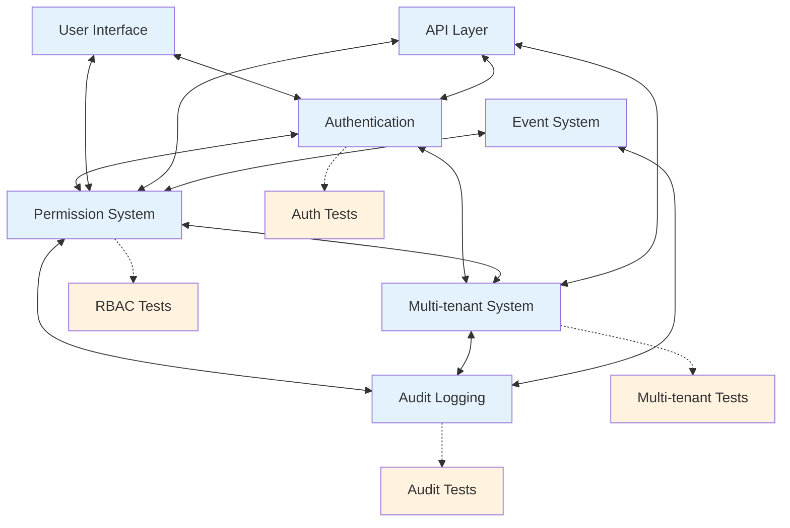
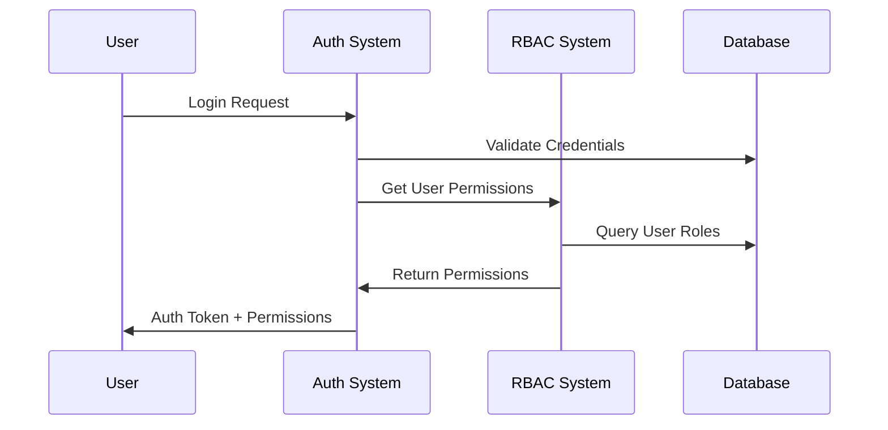
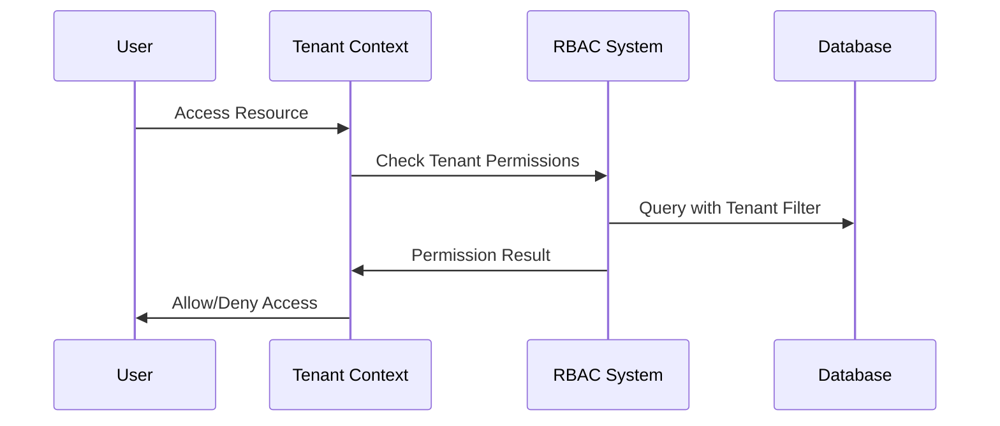

# Component Integration Testing Map

> **Version**: 2.1.0  
> **Last Updated**: 2025-05-23

## Overview

This document maps the integration points between major system components and references the focused integration testing documents.

## Visual System Integration Map

## Focused Integration Testing Documents

- **[CORE_COMPONENT_INTEGRATION.md](docs/testing/CORE_COMPONENT_INTEGRATION.md)**: Essential component integration tests
- **[ADVANCED_INTEGRATION_PATTERNS.md](docs/testing/ADVANCED_INTEGRATION_PATTERNS.md)**: Complex integration scenarios
- **[INTEGRATION_TEST_ENVIRONMENT.md](docs/testing/INTEGRATION_TEST_ENVIRONMENT.md)**: Test environment setup

## Core Integration Points

### Authentication ↔ RBAC Integration

### Multi-tenant ↔ RBAC Integration

## Integration Test Matrix

| Primary Component | Secondary Component | Integration Tests Required | Test Location |
|-------------------|---------------------|----------------------------|---------------|
| Authentication    | RBAC                | Login permission resolution, Session permission context | [CORE_COMPONENT_INTEGRATION.md](docs/testing/CORE_COMPONENT_INTEGRATION.md) |
| Authentication    | Multi-tenant        | Tenant context during auth, Cross-tenant auth boundaries | [CORE_COMPONENT_INTEGRATION.md](docs/testing/CORE_COMPONENT_INTEGRATION.md) |
| RBAC              | Multi-tenant        | Tenant-specific permissions, Cross-tenant permission isolation | [CORE_COMPONENT_INTEGRATION.md](docs/testing/CORE_COMPONENT_INTEGRATION.md) |
| RBAC              | Audit               | Permission change audit events, Permission check logging | [CORE_COMPONENT_INTEGRATION.md](docs/testing/CORE_COMPONENT_INTEGRATION.md) |
| Multi-tenant      | Audit               | Tenant-specific audit logs, Cross-tenant audit boundaries | [CORE_COMPONENT_INTEGRATION.md](docs/testing/CORE_COMPONENT_INTEGRATION.md) |
| End-to-End Flows  | All Components      | Complete user journeys, Complex permission flows | [ADVANCED_INTEGRATION_PATTERNS.md](docs/testing/ADVANCED_INTEGRATION_PATTERNS.md) |
| Event System      | All Components      | Event propagation, Cross-component events | [ADVANCED_INTEGRATION_PATTERNS.md](docs/testing/ADVANCED_INTEGRATION_PATTERNS.md) |
| Performance       | All Components      | Concurrent operations, Load testing | [ADVANCED_INTEGRATION_PATTERNS.md](docs/testing/ADVANCED_INTEGRATION_PATTERNS.md) |

## Tier 1 Integration Tests (Essential)

**Implementation Guide**: [CORE_COMPONENT_INTEGRATION.md](docs/testing/CORE_COMPONENT_INTEGRATION.md)

1. **Basic Auth-RBAC Integration**: Verify login sets correct permissions
2. **Simple Tenant Context**: Confirm auth establishes tenant context
3. **Basic Audit Logging**: Verify critical actions create audit records
4. **Multi-tenant Data Isolation**: Test basic tenant data separation

## Tier 2 Integration Tests (Standard)

**Implementation Guide**: [ADVANCED_INTEGRATION_PATTERNS.md](docs/testing/ADVANCED_INTEGRATION_PATTERNS.md)

1. **End-to-End User Flows**: Complete onboarding and permission workflows
2. **Multi-tenant Permission Resolution**: Test cross-tenant permission boundaries
3. **Event-driven Integration**: Test event propagation across components
4. **Performance Integration**: Basic performance testing at integration points

## Tier 3 Integration Tests (Advanced)

**Implementation Guide**: [ADVANCED_INTEGRATION_PATTERNS.md](docs/testing/ADVANCED_INTEGRATION_PATTERNS.md)

1. **Concurrent Multi-tenant Operations**: Test simultaneous operations across tenants
2. **Complex Permission Hierarchies**: Test nested organization structures
3. **Performance Under Load**: Test integration points under high concurrency
4. **Cross-system Security Boundaries**: Test security across component boundaries

## Test Environment Setup

**Configuration Guide**: [INTEGRATION_TEST_ENVIRONMENT.md](docs/testing/INTEGRATION_TEST_ENVIRONMENT.md)

- Database setup and isolation
- Service mocking strategies
- Test fixtures and helpers
- CI/CD integration

## Related Documentation

- **[INTEGRATION_TESTING.md](docs/testing/INTEGRATION_TESTING.md)**: Integration testing strategy overview
- **[RBAC Testing Strategy](docs/rbac/TESTING_STRATEGY.md)**: RBAC-specific testing approach
- **[TEST_FRAMEWORK.md](docs/TEST_FRAMEWORK.md)**: Overall testing framework
- **[PERFORMANCE_STANDARDS.md](docs/PERFORMANCE_STANDARDS.md)**: Performance benchmarks

## Version History

- **2.1.0**: Added visual system integration map and sequence diagrams (2025-05-23)
- **2.0.0**: Updated to reference focused integration testing documents (2025-05-23)
- **1.0.0**: Initial component integration testing map (2025-05-23)
