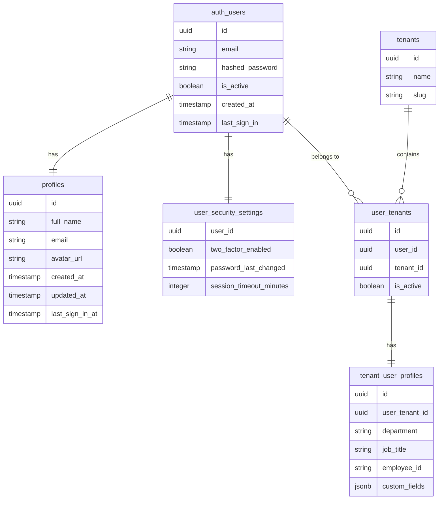

# User Identity Architecture

> **Version**: 1.0.0  
> **Last Updated**: 2025-05-22

## Overview

This document outlines the architecture of user identity within the system, including the core components and data model.

## Core Identity Components

The user identity consists of three main components:

1. **Authentication Identity**: 
   - Managed by the authentication system
   - Contains credentials and security information
   - Globally unique across the entire system

2. **Base User Profile**:
   - Core attributes common to all users
   - Consistent across tenant boundaries
   - Includes fundamental contact and identification information

3. **Tenant-specific Profiles**:
   - Extended attributes specific to each tenant
   - May differ based on tenant requirements
   - Isolated within tenant boundaries

## User Data Model

```sql
-- Base profile - consistent across tenants
CREATE TABLE profiles(
  id UUID PRIMARY KEY REFERENCES auth.users(id),
  full_name TEXT,
  email TEXT UNIQUE,
  avatar_url TEXT,
  created_at TIMESTAMP WITH TIME ZONE DEFAULT now(),
  updated_at TIMESTAMP WITH TIME ZONE DEFAULT now(),
  last_sign_in_at TIMESTAMP WITH TIME ZONE
);

-- User security settings
CREATE TABLE user_security_settings(
  user_id UUID PRIMARY KEY REFERENCES auth.users(id),
  two_factor_enabled BOOLEAN DEFAULT false,
  password_last_changed TIMESTAMP WITH TIME ZONE,
  session_timeout_minutes INTEGER DEFAULT 60,
  created_at TIMESTAMP WITH TIME ZONE DEFAULT now(),
  updated_at TIMESTAMP WITH TIME ZONE DEFAULT now()
);

-- User tenant relationship (for multi-tenant environments)
CREATE TABLE user_tenants(
  id UUID PRIMARY KEY,
  user_id UUID REFERENCES auth.users(id),
  tenant_id UUID REFERENCES tenants(id),
  is_active BOOLEAN DEFAULT true,
  created_at TIMESTAMP WITH TIME ZONE DEFAULT now(),
  UNIQUE(user_id, tenant_id)
);

-- Example tenant-specific profile extension
CREATE TABLE tenant_user_profiles(
  id UUID PRIMARY KEY,
  user_tenant_id UUID REFERENCES user_tenants(id),
  department TEXT,
  job_title TEXT,
  employee_id TEXT,
  custom_fields JSONB DEFAULT '{}'::jsonb,
  created_at TIMESTAMP WITH TIME ZONE DEFAULT now(),
  updated_at TIMESTAMP WITH TIME ZONE DEFAULT now()
);
```

## Identity Model Diagram



## Identity Component Interactions

1. **Authentication Process**:
   - Authentication system verifies credentials against `auth.users`
   - Upon successful authentication, retrieves base profile from `profiles`
   - Sets up user security context from `user_security_settings`

2. **Tenant Context Switching**:
   - System loads available tenants from `user_tenants`
   - When user selects a tenant, loads tenant-specific profile from `tenant_user_profiles`
   - Establishes security context for the selected tenant

3. **Profile Updates**:
   - Updates to base profile affect `profiles` table
   - Tenant-specific profile updates only affect relevant tenant profile

## Design Considerations

1. **Global vs. Tenant-Specific Information**:
   - Globally consistent information stored in `profiles`
   - Tenant-specific information isolated in `tenant_user_profiles`
   - Security settings maintained at the global level in `user_security_settings`

2. **Identity Uniqueness**:
   - Single authentication identity (email/password) across all tenants
   - User can have different roles and profiles in different tenants
   - Primary user identifier (`auth.users.id`) used across all tables

3. **Performance Optimization**:
   - Common profile data in `profiles` minimizes joins for basic operations
   - Tenant-specific data loaded only when operating in that tenant context
   - Indexes on foreign keys optimize relationship traversal

## Related Documentation

- **[AUTHENTICATION.md](AUTHENTICATION.md)**: Authentication methods and security features
- **[PROFILE_MANAGEMENT.md](PROFILE_MANAGEMENT.md)**: Profile management details
- **[MULTITENANCY_INTEGRATION.md](MULTITENANCY_INTEGRATION.md)**: Tenant-specific user extensions
- **[../data-model/entity-relationships/USER_IDENTITY_MODEL.md](../data-model/entity-relationships/USER_IDENTITY_MODEL.md)**: Detailed entity relationships
- **[../security/AUTH_SYSTEM.md](../security/AUTH_SYSTEM.md)**: Authentication system implementation

## Version History

- **1.0.0**: Initial document created from user management refactoring (2025-05-22)
