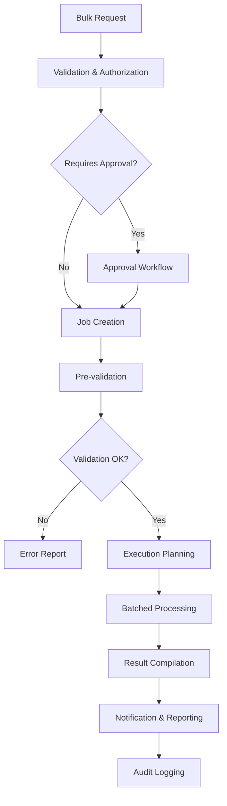

# Bulk User Operations

> **Version**: 1.0.0  
> **Last Updated**: 2025-05-23

## Overview

This document outlines the design and implementation of bulk user operations in the system, with a focus on security, performance, and reliability.

## Bulk Operations Framework

### Core Principles

1. **Transaction Integrity**
   - All-or-nothing execution when appropriate
   - Partial success handling with clear reporting
   - Rollback capabilities for failed operations
   - Consistent state maintenance

2. **Scalability**
   - Support for large user sets (10,000+ users)
   - Performance optimization for bulk operations
   - Resource usage throttling and management
   - Background processing with priority levels

3. **Security**
   - Elevated permission requirements
   - Impact assessment for large operations
   - Approval workflows for sensitive changes
   - Comprehensive audit logging

4. **Reliability**
   - Idempotent operations where possible
   - Retry logic for transient failures
   - Checkpoint/resume capability for large sets
   - Detailed error handling and reporting

### Supported Bulk Operations

| Operation Type | Description | Required Permission | Impact Level |
|--------------|-------------|---------------------|-------------|
| Create | Provision multiple users | users:createBulk | High |
| Update | Modify multiple user profiles | users:updateBulk | Medium |
| Activate | Activate multiple users | users:activateBulk | Medium |
| Deactivate | Deactivate multiple users | users:deactivateBulk | High |
| Delete | Delete multiple users | users:deleteBulk | Critical |
| Role Assignment | Assign roles to multiple users | roles:assignBulk | High |
| Permission Grant | Grant specific permissions to users | permissions:grantBulk | High |
| Tenant Assignment | Add users to tenants | tenants:assignUsersBulk | Medium |
| Export | Export user data in bulk | users:exportBulk | Low |
| Import | Import users from external system | users:importBulk | Critical |
| Password Reset | Force password reset for multiple users | users:resetPasswordBulk | High |
| State Change | Change lifecycle state for multiple users | users:changeStateBulk | High |

## Bulk Processing Architecture

### Processing Pipeline

1. **Request Phase**
   - Bulk operation request validation
   - Permission verification
   - Impact assessment
   - Approval routing if needed
   - Job creation and queuing

2. **Preparation Phase**
   - Resource allocation
   - Dependency analysis
   - Pre-validation of all items
   - Success probability assessment
   - Operation plan generation

3. **Execution Phase**
   - Batched processing
   - Progress tracking
   - Error handling and grouping
   - State maintenance
   - Resource management

4. **Completion Phase**
   - Result compilation
   - Notification generation
   - Report creation
   - Audit record finalization
   - Resource cleanup



### Queue Management

1. **Queue Structure**
   - Priority-based job queuing
   - Job categorization by operation type
   - Tenant-specific queues
   - Parallel processing capabilities

2. **Job Scheduling**
   - Time-based scheduling options
   - Load-based execution timing
   - Maintenance window alignment
   - User impact minimization

3. **Resource Control**
   - System load monitoring
   - Adaptive batch sizing
   - Database connection pooling
   - CPU/memory consumption limitation

### Fault Tolerance

1. **Error Handling Strategy**
   - Item-level error isolation
   - Error categorization and grouping
   - Retry policies by error type
   - Circuit breaking for system protection

2. **Recovery Mechanisms**
   - Checkpoint creation during processing
   - Resume from last successful item
   - Partial completion acceptance
   - Manual intervention interfaces

## Security Framework

### Authorization Model

1. **Permission Requirements**
   - Special bulk operation permissions
   - Scale-based additional permissions
   - Tenant context requirements
   - Resource-based access controls

2. **Approval Workflows**
   - Threshold-based approval triggers
   - Multi-level approval for critical operations
   - Time-limited approval grants
   - Approval delegation rules

3. **Impact Assessment**
   - Automatic impact calculation
   - Risk scoring of bulk operations
   - Affected system area analysis
   - Downstream impact prediction

### Audit Requirements

1. **Pre-Execution Logging**
   - Request details including justification
   - Approvals and authorizations
   - Input validation results
   - Projected impact assessment

2. **Execution Logging**
   - Per-item status changes
   - Error conditions encountered
   - Resource utilization metrics
   - Progress milestones

3. **Completion Logging**
   - Final operation statistics
   - Error distribution analysis
   - Performance metrics
   - Follow-up actions required

## User Interface Components

### Bulk Operation Interfaces

1. **Request Interfaces**
   - Operation type selection
   - Target user selection methods
   - Parameter configuration
   - Scheduling options
   - Justification documentation

2. **User Selection Methods**
   - Direct user list upload
   - Query-based selection
   - Role-based selection
   - Organization hierarchy selection
   - Activity-based selection

3. **Execution Monitoring**
   - Real-time progress tracking
   - Current operation visualization
   - Estimated time remaining
   - Encountered error display
   - Operation pause/resume controls

### Result Presentation

1. **Summary Dashboards**
   - Operation success/failure ratio
   - Processing time metrics
   - Error distribution visualization
   - Affected user categories
   - Follow-up action recommendations

2. **Detailed Reporting**
   - Per-user operation results
   - Grouped error reporting
   - Action item generation
   - Export capabilities for results
   - Filtering and searching of results

3. **Notification Options**
   - Completion notifications
   - Error threshold alerts
   - Progress milestone notifications
   - Required action notifications
   - Scheduled status updates

## Implementation Examples

### Bulk Creation Example

```typescript
// Bulk user creation service
async function bulkCreateUsers(
  creatorId: string,
  userDataList: UserCreationData[],
  options: BulkOperationOptions
): Promise<BulkOperationResult> {
  // 1. Validate permission
  const canCreateBulk = await permissionService.hasPermission(
    creatorId, 
    'users:createBulk',
    options.tenantId
  );
  
  if (!canCreateBulk) {
    throw new SecurityError('Insufficient permissions for bulk user creation');
  }
  
  // 2. Calculate impact level
  const impactLevel = calculateImpactLevel(userDataList.length);
  
  // 3. Get approvals if needed
  if (impactLevel >= ImpactLevel.HIGH) {
    await approvalService.requireApproval({
      operationType: 'BULK_USER_CREATE',
      requesterId: creatorId,
      itemCount: userDataList.length,
      impactLevel,
      tenantId: options.tenantId
    });
  }
  
  // 4. Create bulk operation record
  const operationId = await bulkOperationRepository.createOperation({
    type: 'USER_CREATE',
    requesterId: creatorId,
    itemCount: userDataList.length,
    status: 'PENDING',
    tenantId: options.tenantId
  });
  
  // 5. Queue the operation
  await bulkOperationQueue.enqueue({
    operationId,
    items: userDataList,
    options
  });
  
  // 6. Return tracking information
  return {
    operationId,
    status: 'QUEUED',
    estimatedCompletionTime: calculateEstimatedCompletionTime(
      userDataList.length,
      'USER_CREATE'
    )
  };
}

// Bulk processing executor
async function processBulkUserCreation(
  operationId: string,
  items: UserCreationData[],
  options: BulkOperationOptions
): Promise<void> {
  const batchSize = determineBatchSize(items.length);
  const results: ItemOperationResult[] = [];
  
  // 1. Update operation status to processing
  await bulkOperationRepository.updateStatus(operationId, 'PROCESSING');
  
  // 2. Process in batches
  for (let i = 0; i < items.length; i += batchSize) {
    const batch = items.slice(i, i + batchSize);
    
    // Process batch with transaction
    const batchResults = await db.transaction(async (tx) => {
      return Promise.all(
        batch.map(async (userData) => {
          try {
            // Create user with transaction
            const user = await userService.createUser(userData, options, tx);
            
            return {
              identifier: userData.email,
              success: true,
              resultId: user.id
            };
          } catch (error) {
            return {
              identifier: userData.email,
              success: false,
              error: error.message
            };
          }
        })
      );
    });
    
    // Collect results
    results.push(...batchResults);
    
    // Update progress
    await bulkOperationRepository.updateProgress(
      operationId,
      Math.round(((i + batch.length) / items.length) * 100)
    );
  }
  
  // 3. Compile final results
  const successCount = results.filter(r => r.success).length;
  const failureCount = results.filter(r => !r.success).length;
  
  // 4. Update operation with results
  await bulkOperationRepository.completeOperation(operationId, {
    status: failureCount === 0 ? 'COMPLETED' : 'COMPLETED_WITH_ERRORS',
    successCount,
    failureCount,
    results
  });
  
  // 5. Send notifications
  await notificationService.notifyBulkOperationComplete(
    operationId,
    successCount,
    failureCount
  );
}
```

### Bulk Role Assignment Example

```typescript
// Bulk role assignment service
async function bulkAssignRoles(
  assignerId: string,
  assignments: Array<{ userId: string, roleId: string }>,
  tenantId: string
): Promise<BulkOperationResult> {
  // 1. Verify permission
  const canAssignBulk = await permissionService.hasPermission(
    assignerId, 
    'roles:assignBulk',
    tenantId
  );
  
  if (!canAssignBulk) {
    throw new SecurityError('Insufficient permissions for bulk role assignment');
  }
  
  // 2. Create operation record
  const operationId = await bulkOperationRepository.createOperation({
    type: 'ROLE_ASSIGN',
    requesterId: assignerId,
    itemCount: assignments.length,
    status: 'PENDING',
    tenantId
  });
  
  // 3. Pre-validate all assignments
  const validationResults = await Promise.all(
    assignments.map(async (assignment) => {
      try {
        // Verify user exists and is active in tenant
        const userExists = await userService.checkUserActive(
          assignment.userId, 
          tenantId
        );
        
        if (!userExists) {
          return {
            userId: assignment.userId,
            roleId: assignment.roleId,
            valid: false,
            error: 'User does not exist or is not active in tenant'
          };
        }
        
        // Verify role exists
        const roleExists = await roleService.checkRoleExists(
          assignment.roleId,
          tenantId
        );
        
        if (!roleExists) {
          return {
            userId: assignment.userId,
            roleId: assignment.roleId,
            valid: false,
            error: 'Role does not exist in tenant'
          };
        }
        
        // Check for permission to assign this specific role
        const canAssignRole = await permissionService.hasPermission(
          assignerId,
          `roles:assign:${assignment.roleId}`,
          tenantId
        );
        
        if (!canAssignRole) {
          return {
            userId: assignment.userId,
            roleId: assignment.roleId,
            valid: false,
            error: 'No permission to assign this specific role'
          };
        }
        
        return {
          userId: assignment.userId,
          roleId: assignment.roleId,
          valid: true
        };
      } catch (error) {
        return {
          userId: assignment.userId,
          roleId: assignment.roleId,
          valid: false,
          error: error.message
        };
      }
    })
  );
  
  // 4. Filter valid assignments
  const validAssignments = validationResults
    .filter(result => result.valid)
    .map(result => ({
      userId: result.userId,
      roleId: result.roleId
    }));
  
  // 5. Execute valid assignments in batches
  const results = await executeBatchedRoleAssignments(
    validAssignments,
    assignerId,
    tenantId,
    operationId
  );
  
  // 6. Compile and return results
  return {
    operationId,
    success: results.failureCount === 0,
    processedCount: results.successCount + results.failureCount,
    successCount: results.successCount,
    failureCount: results.failureCount,
    errors: results.errors
  };
}
```

## Performance Optimization

### Database Strategies

1. **Query Optimization**
   - Indexed fields for bulk operations
   - Prepared statement usage
   - Query plan optimization
   - Connection pooling

2. **Batch Sizing**
   - Dynamic batch size determination
   - System load-based adjustment
   - Memory usage monitoring
   - Database specific optimizations

3. **Data Access Patterns**
   - Read-then-write pattern minimization
   - Bulk insert/update operations
   - Cache utilization
   - Denormalized data for bulk operations

### Throughput Enhancement

1. **Parallelization**
   - Multi-threaded processing where appropriate
   - Workload distribution strategies
   - Synchronization point minimization
   - Resource contention management

2. **Asynchronous Processing**
   - Background job execution
   - Non-blocking operations
   - Event-driven completion notification
   - Progress tracking without blocking

## Integration Points

### Notification System Integration

1. **Operation Status Updates**
   - Start notification
   - Progress milestones
   - Completion notification
   - Error threshold alerts

2. **User Communication**
   - Affected user notifications
   - Administrator updates
   - Error resolution communication
   - Result summary distribution

### Audit System Integration

1. **Bulk Operation Logging**
   - Complete operation metadata
   - Per-item result logging
   - Approval chain documentation
   - Performance metrics recording

2. **Compliance Evidence**
   - Authority documentation
   - Decision justification
   - Impact assessment results
   - Approval workflow evidence

### External System Integration

1. **Import/Export Framework**
   - External system connectivity
   - Data mapping configuration
   - Transformation rules
   - Validation against source

2. **Identity Provider Synchronization**
   - Bulk synchronization with IdP
   - Status reconciliation
   - Credential management
   - Federation mapping updates

## Related Documentation

- **[USER_LIFECYCLE.md](USER_LIFECYCLE.md)**: User lifecycle state management
- **[RBAC_INTEGRATION.md](RBAC_INTEGRATION.md)**: Role and permission management
- **[USER_DATA_PORTABILITY.md](USER_DATA_PORTABILITY.md)**: Data export and import
- **[MULTITENANCY_INTEGRATION.md](MULTITENANCY_INTEGRATION.md)**: Multi-tenant user management
- **[../rbac/PERMISSION_DEPENDENCIES.md](../rbac/PERMISSION_DEPENDENCIES.md)**: Permission dependency resolution
- **[../security/AUDIT_REQUIREMENTS.md](../security/AUDIT_REQUIREMENTS.md)**: Audit logging requirements

## Version History

- **1.0.0**: Initial bulk user operations document (2025-05-23)
