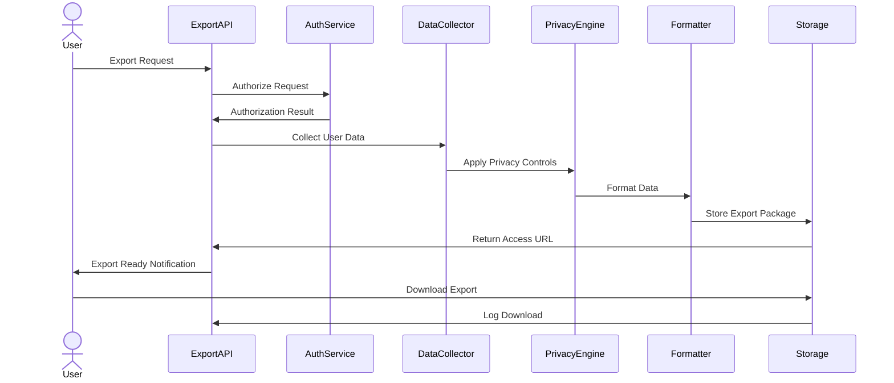
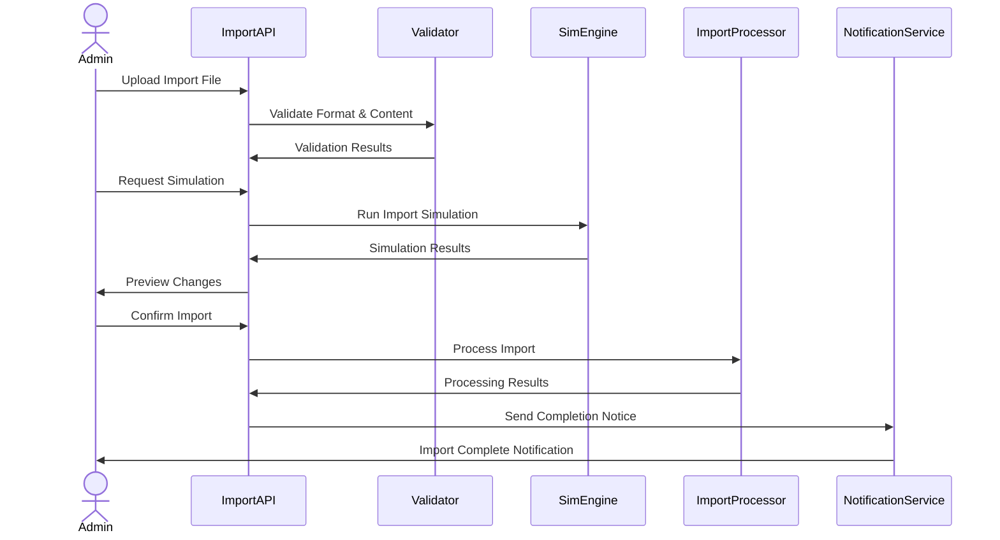

# User Data Portability

> **Version**: 1.0.0  
> **Last Updated**: 2025-05-23

## Overview

This document outlines the system's capabilities for user data export and import, addressing both compliance requirements (such as GDPR) and operational needs for data migration and synchronization.

## Data Portability Framework

### Core Principles

1. **Comprehensive Coverage**
   - All user-related data accessible
   - Complete profile information
   - Activity history within retention periods
   - Configuration and preferences
   - Relationships and permissions
   - Tenant-specific extensions

2. **Format Standardization**
   - Structured data formats (JSON, CSV, XML)
   - Schema documentation and validation
   - Consistent naming conventions
   - Version compatibility
   - Self-contained data packages

3. **Security Controls**
   - Access authorization
   - Data minimization options
   - Encryption of exports
   - Secure transmission channels
   - Audit logging of all transfers

4. **Privacy Compliance**
   - GDPR Article 20 implementation
   - Right to data portability support
   - Machine-readable format provision
   - Direct transfer capabilities (when feasible)
   - Privacy-by-design principles

## Data Export Capabilities

### Export Content Options

1. **Core User Profile**
   - Identity information
   - Contact information
   - Profile attributes
   - Account metadata
   - Security settings

2. **Extended User Data**
   - User preferences
   - Configuration settings
   - Custom attributes
   - Tenant-specific profile extensions
   - Historical profile versions

3. **Activity and History**
   - Authentication events
   - System actions and changes
   - Access history
   - Communication history
   - Tracked user behaviors

4. **Relationships and Permissions**
   - Role assignments
   - Permission grants
   - Group memberships
   - Tenant associations
   - Organizational relationships

### Export Format Options

1. **JSON Export**
   - Complete hierarchical data
   - Full relationship preservation
   - Type information included
   - Schema references
   - Metadata embedding

2. **CSV Export**
   - Flat data representation
   - Easy spreadsheet compatibility
   - Relationship linking via IDs
   - Header documentation
   - Multi-file packaging

3. **XML Export**
   - Schema-validated structure
   - Namespace definitions
   - Entity relationship preservation
   - XSD schema documentation
   - Integration-friendly format

4. **PDF Reports**
   - Human-readable summaries
   - Formatted data presentation
   - Visual data organization
   - Non-technical user focus
   - Official documentation usage

### Export Privacy Controls

1. **Data Minimization Options**
   - Selective field export
   - Retention-aware export (time-bounded)
   - PII anonymization options
   - Relationship anonymization
   - Statistical aggregation instead of raw data

2. **Export Authorization Controls**
   - Purpose specification requirement
   - Approval workflow for sensitive exports
   - Volume-based authorization escalation
   - Destination verification for transfers
   - Export justification documentation

3. **PII Protection Mechanisms**
   - Field-level encryption options
   - Hash-based anonymization
   - Pseudonymization techniques
   - Redaction capabilities
   - Differential privacy implementations

## Data Import Capabilities

### Import Content Types

1. **User Creation Import**
   - New user batch creation
   - Initial profile setup
   - Default settings application
   - Initial role assignment
   - Tenant association

2. **User Update Import**
   - Existing user data updates
   - Profile enrichment
   - Configuration updates
   - Role and permission adjustments
   - Relationship updates

3. **Complete User Migration**
   - Full user identity transfer
   - Profile and history migration
   - Permission and role migration
   - Setting and preference migration
   - Relationship preservation

### Import Source Types

1. **System Migration Imports**
   - Legacy system data migration
   - Third-party platform migration
   - Database-to-database transfer
   - Complete environment migration
   - Tenant consolidation or split

2. **Integration Imports**
   - HR system synchronization
   - Identity provider synchronization
   - CRM data integration
   - Partner system data exchange
   - Regular data reconciliation

3. **User-Provided Imports**
   - Self-service data uploads
   - Profile enrichment imports
   - Preference bulk updates
   - Organization-provided data
   - Previous export reimport

### Import Verification Controls

1. **Data Validation Framework**
   - Schema validation
   - Data type verification
   - Required field checking
   - Relationship integrity verification
   - Business rule validation

2. **Security Verification**
   - Malicious content scanning
   - Input sanitization
   - Injection attack prevention
   - File format validation
   - Script and macro detection

3. **Duplicate Detection**
   - Identity collision detection
   - Matching criteria configuration
   - Conflict resolution rules
   - Merge policy options
   - Override controls

## Import/Export Process Management

### Export Process Flow

1. **Export Request Handling**
   - Request validation and authorization
   - Scope determination
   - Format selection
   - Privacy control application
   - Resource allocation

2. **Data Collection Phase**
   - User data gathering
   - Related entity collection
   - Historical data retrieval
   - Permission verification for each data element
   - Metadata compilation

3. **Processing and Packaging**
   - Format transformation
   - Schema application
   - Privacy control enforcement
   - Package assembly
   - Metadata inclusion

4. **Delivery and Notification**
   - Secure storage of export
   - Access URL generation
   - Notification to requestor
   - Download security controls
   - Audit logging of access



### Import Process Flow

1. **Import Preparation**
   - Source data acquisition
   - Import template provision
   - Pre-validation guidance
   - Format requirements documentation
   - Test import capability

2. **Validation Phase**
   - Format verification
   - Schema validation
   - Data quality assessment
   - Integrity check
   - Business rule validation

3. **Simulation and Preview**
   - Dry-run option
   - Impact assessment
   - Conflict identification
   - Error report generation
   - Preview of resulting changes

4. **Execution and Verification**
   - Transactional processing
   - Progress monitoring
   - Error handling
   - Result compilation
   - Post-import verification



### Batch Processing Controls

1. **Job Management**
   - Long-running job handling
   - Background processing
   - Priority control
   - Resource allocation
   - Scheduling options

2. **Error Handling**
   - Partial success capability
   - Error categorization
   - Retry logic
   - Failure reporting
   - Recovery options

3. **Progress Monitoring**
   - Real-time status updates
   - Progress indicators
   - Estimated completion time
   - Current activity reporting
   - Logging and diagnostics

## Compliance Implementations

### GDPR Data Portability

1. **Article 20 Implementation**
   - Right to receive personal data
   - Machine-readable format provision
   - Common, structured format
   - Direct transmission capability (where technically feasible)
   - Documentation of fulfillment

2. **Request Management**
   - Identity verification process
   - Request tracking
   - SLA compliance (30 day response)
   - Communication templates
   - Request workflow

3. **Scope Definition**
   - Data provided by the data subject
   - Automated processing scope
   - Exclusion of derived data
   - Exclusion of third-party rights conflicts
   - Legitimate interest considerations

### Other Regulatory Frameworks

1. **CCPA/CPRA Compliance**
   - Disclosure requirements
   - Look-back period handling
   - Categories of information
   - Right to know implementation
   - Business purpose documentation

2. **LGPD (Brazil) Compliance**
   - Data portability provisions
   - Format requirements
   - Response timeline management
   - Documentation requirements
   - Transfer mechanisms

## Implementation Examples

### Data Export API

```typescript
// User data export service
interface ExportOptions {
  format: 'json' | 'csv' | 'xml' | 'pdf';
  scope: 'profile' | 'full' | 'minimal' | 'custom';
  includeHistory: boolean;
  includeRelationships: boolean;
  customFields?: string[];
  privacyControls: {
    applyMinimization: boolean;
    redactSensitiveData: boolean;
    anonymizeRelationships: boolean;
  };
}

async function exportUserData(
  requesterId: string,
  targetUserId: string,
  options: ExportOptions,
  tenantId?: string
): Promise<ExportResult> {
  // 1. Check authorization
  const isAuthorized = await checkExportAuthorization(
    requesterId, 
    targetUserId, 
    options,
    tenantId
  );
  
  if (!isAuthorized) {
    throw new SecurityError('Not authorized to export this user data');
  }
  
  // 2. Create export job
  const exportId = await dataExportRepository.createExportJob({
    requesterId,
    targetUserId,
    options,
    status: 'PENDING',
    tenantId,
    created: new Date()
  });
  
  // 3. Queue export job
  await exportQueue.enqueue({
    exportId,
    requesterId,
    targetUserId,
    options,
    tenantId
  });
  
  // 4. Return tracking information
  return {
    exportId,
    status: 'QUEUED',
    estimatedCompletionTime: calculateExportTime(options)
  };
}

// Export job processor
async function processExport(
  exportId: string,
  requesterId: string,
  targetUserId: string,
  options: ExportOptions,
  tenantId?: string
): Promise<void> {
  try {
    // 1. Update status to processing
    await dataExportRepository.updateStatus(exportId, 'PROCESSING');
    
    // 2. Collect user data based on scope
    const userData = await collectUserData(targetUserId, options, tenantId);
    
    // 3. Apply privacy controls
    const processedData = await applyPrivacyControls(
      userData, 
      options.privacyControls
    );
    
    // 4. Format data according to requested format
    const formattedData = await formatExportData(processedData, options.format);
    
    // 5. Store export package
    const packageUrl = await storeExportPackage(
      exportId,
      formattedData,
      options.format
    );
    
    // 6. Complete export job
    await dataExportRepository.completeExport(exportId, {
      status: 'COMPLETED',
      resultUrl: packageUrl,
      expiresAt: calculateExpiryDate(),
      completedAt: new Date()
    });
    
    // 7. Notify completion
    await notificationService.notifyExportComplete(
      requesterId,
      exportId,
      packageUrl
    );
    
    // 8. Log export completion
    await auditLogger.log({
      eventType: 'data_export',
      actorId: requesterId,
      targetId: targetUserId,
      action: 'export_complete',
      resource: 'user_data',
      metadata: {
        exportId,
        format: options.format,
        scope: options.scope
      }
    });
  } catch (error) {
    // Handle failure
    await dataExportRepository.completeExport(exportId, {
      status: 'FAILED',
      error: error.message,
      completedAt: new Date()
    });
    
    // Log failure
    await auditLogger.log({
      eventType: 'data_export',
      actorId: requesterId,
      targetId: targetUserId,
      action: 'export_failed',
      resource: 'user_data',
      status: 'error',
      metadata: {
        exportId,
        error: error.message
      }
    });
    
    throw error;
  }
}
```

### Data Import API

```typescript
// User data import service
interface ImportOptions {
  source: 'file' | 'api' | 'migration';
  format: 'json' | 'csv' | 'xml';
  operation: 'create' | 'update' | 'upsert';
  conflictResolution: 'skip' | 'overwrite' | 'merge';
  validateOnly: boolean;
  notifyUsers: boolean;
  assignDefaultRoles: boolean;
}

async function importUserData(
  requesterId: string,
  importData: Buffer | string,
  options: ImportOptions,
  tenantId: string
): Promise<ImportResult> {
  // 1. Check authorization
  const isAuthorized = await checkImportAuthorization(
    requesterId, 
    options,
    tenantId
  );
  
  if (!isAuthorized) {
    throw new SecurityError('Not authorized to import user data');
  }
  
  // 2. Parse and validate import data
  const parsedData = await parseImportData(importData, options.format);
  const validation = await validateImportData(parsedData, options.operation);
  
  if (!validation.isValid && !options.validateOnly) {
    return {
      success: false,
      validationErrors: validation.errors,
      message: 'Import validation failed'
    };
  }
  
  // 3. If validation only, return validation results
  if (options.validateOnly) {
    return {
      success: validation.isValid,
      validationErrors: validation.errors,
      validItems: validation.validItems.length,
      invalidItems: validation.invalidItems.length,
      message: validation.isValid ? 'Validation successful' : 'Validation failed'
    };
  }
  
  // 4. Create import job
  const importId = await dataImportRepository.createImportJob({
    requesterId,
    options,
    itemCount: parsedData.length,
    status: 'PENDING',
    tenantId,
    created: new Date()
  });
  
  // 5. Queue import job
  await importQueue.enqueue({
    importId,
    requesterId,
    data: parsedData,
    options,
    tenantId,
    validation
  });
  
  // 6. Return tracking information
  return {
    importId,
    status: 'QUEUED',
    validItems: validation.validItems.length,
    invalidItems: validation.invalidItems.length,
    estimatedCompletionTime: calculateImportTime(parsedData.length, options)
  };
}
```

## UI Components

### Export Interface

1. **Export Request Form**
   - User selection mechanism
   - Format selection
   - Scope configuration
   - Privacy control settings
   - Purpose documentation

2. **Export Status Dashboard**
   - Active export jobs
   - Export history
   - Job status indicators
   - Progress tracking
   - Download access

3. **Export Result Interface**
   - Preview capability
   - Download options
   - Format conversion
   - Sharing controls
   - Expiry notifications

### Import Interface

1. **Import Wizard**
   - Source selection
   - File upload interface
   - Format specification
   - Options configuration
   - Template download

2. **Validation Interface**
   - Pre-import validation results
   - Error highlighting
   - Error resolution guidance
   - Data mapping visualization
   - Conflict identification

3. **Import Results Dashboard**
   - Success/failure statistics
   - Detailed error report
   - Item-by-item status
   - Retry options
   - Result export

## Related Documentation

- **[USER_LIFECYCLE.md](USER_LIFECYCLE.md)**: User lifecycle management
- **[USER_BULK_OPERATIONS.md](USER_BULK_OPERATIONS.md)**: Bulk operations framework
- **[MULTITENANCY_INTEGRATION.md](MULTITENANCY_INTEGRATION.md)**: Multi-tenant data handling
- **[../security/PRIVACY_COMPLIANCE.md](../security/PRIVACY_COMPLIANCE.md)**: Privacy regulation implementation
- **[../integration/SYSTEMS_INTEGRATION.md](../integration/SYSTEMS_INTEGRATION.md)**: External system integration
- **[../security/DATA_PROTECTION.md](../security/DATA_PROTECTION.md)**: Data security controls

## Version History

- **1.0.0**: Initial user data portability document (2025-05-23)
