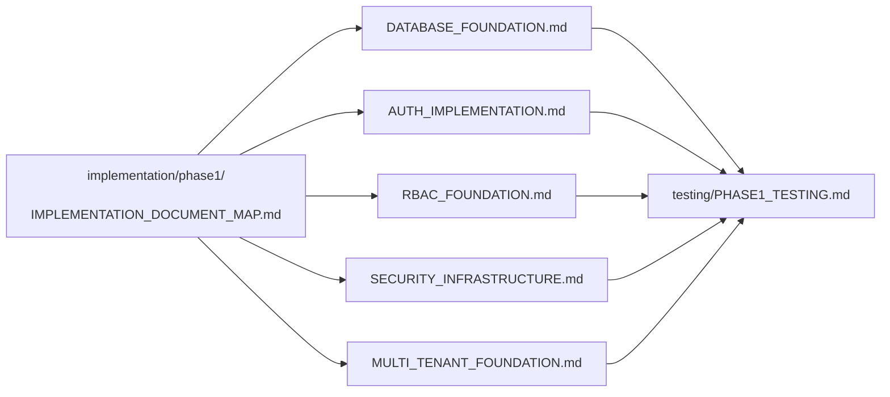
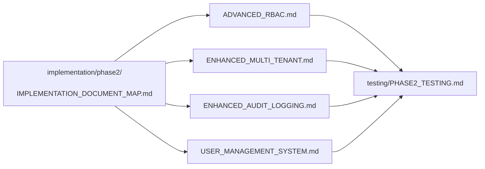
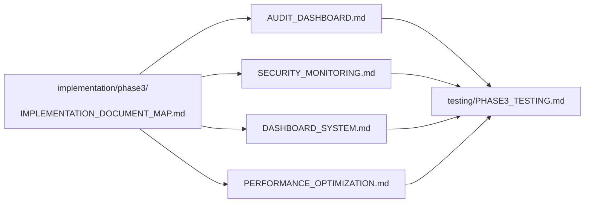
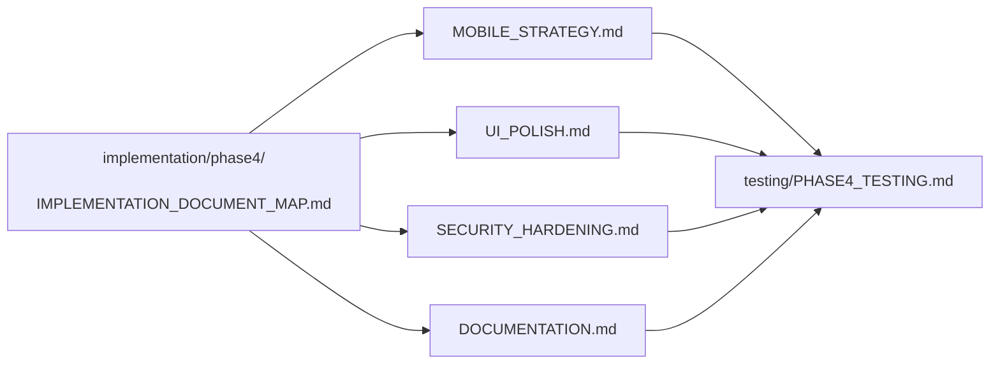

# Global Documentation Map

> **Version**: 3.0.0  
> **Last Updated**: 2025-05-23

## Documentation Hierarchy

This project follows a three-tier documentation structure designed for clarity and effective AI processing:

### 1. Master Entry Points
High-level guides and starting points that provide overview and navigation.

### 2. Implementation Guides
Phase-specific, actionable instructions organized by implementation phase.

### 3. Reference Documents
Detailed specifications, standards, and component-specific documentation.

## Master Entry Points

Start here for high-level understanding:

- **[README.md](README.md)**: Project overview
- **[CORE_ARCHITECTURE.md](CORE_ARCHITECTURE.md)**: System architecture
- **[DEVELOPMENT_ROADMAP.md](DEVELOPMENT_ROADMAP.md)**: Timeline and milestones
- **[DOCUMENTATION_MAP.md](DOCUMENTATION_MAP.md)**: Documentation structure
- **[implementation/MASTER_DOCUMENT_MAP.md](implementation/MASTER_DOCUMENT_MAP.md)**: Implementation guide
- **[RBAC_SYSTEM.md](RBAC_SYSTEM.md)**: Access control overview
- **[SECURITY_IMPLEMENTATION.md](SECURITY_IMPLEMENTATION.md)**: Security overview
- **[TEST_FRAMEWORK.md](TEST_FRAMEWORK.md)**: Testing approach

## Implementation Paths

### Phase 1: Foundation

### Phase 2: Core Features

### Phase 3: Advanced Features

### Phase 4: Polish & Production

## Canonical References

These are the definitive specifications for key subsystems:

- **[audit/LOG_FORMAT_STANDARDIZATION.md](audit/LOG_FORMAT_STANDARDIZATION.md)**: Audit log format
- **[integration/EVENT_CORE_PATTERNS.md](integration/EVENT_CORE_PATTERNS.md)**: Event patterns
- **[rbac/ROLE_ARCHITECTURE.md](rbac/ROLE_ARCHITECTURE.md)**: RBAC architecture
- **[data-model/DATABASE_SCHEMA.md](data-model/DATABASE_SCHEMA.md)**: Database schema
- **[implementation/AUDIT_INTEGRATION_CHECKLIST.md](implementation/AUDIT_INTEGRATION_CHECKLIST.md)**: Audit requirements
- **[ui/DESIGN_SYSTEM.md](ui/DESIGN_SYSTEM.md)**: UI design system
- **[multitenancy/DATA_ISOLATION.md](multitenancy/DATA_ISOLATION.md)**: Multi-tenant isolation

## For AI Implementation

When implementing features, follow this process:

1. **Start with the phase implementation map**
   - Find the relevant phase for your feature
   - Follow the implementation sequence

2. **Reference canonical specifications**
   - Use canonical references for specifications
   - Do not modify canonical references

3. **Implement with phase-specific guides**
   - Use phase-specific implementation guides
   - Follow testing requirements from phase testing guide

4. **Validate against success criteria**
   - Check implementation against phase success criteria
   - Run tests specified in testing guides

## Related Documentation

- **[DOCUMENTATION_MAP.md](DOCUMENTATION_MAP.md)**: Detailed documentation structure
- **[VERSION_COMPATIBILITY.md](VERSION_COMPATIBILITY.md)**: Version compatibility matrix
- **[CROSS_REFERENCE_STANDARDS.md](CROSS_REFERENCE_STANDARDS.md)**: Documentation standards

## Version History

- **3.0.0**: Implemented three-tier documentation hierarchy (2025-05-23)
- **2.0.0**: Refactored to reference specialized documentation maps (2025-05-22)
- **1.0.0**: Initial global documentation map (2025-05-22)
