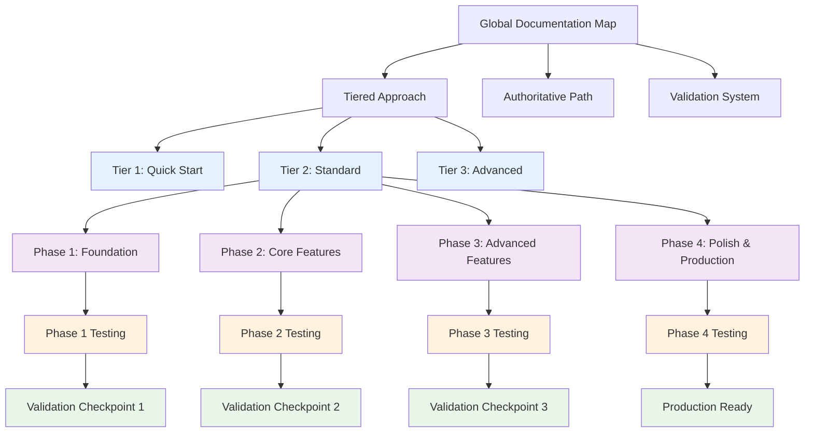

# Global Documentation Map

> **Version**: 4.5.0  
> **Last Updated**: 2025-05-27

## AI Context Management

### 📋 Critical AI Implementation Guidelines

#### Document Session Limits
- **Maximum 3-4 documents per implementation session**
- **Complete current session before starting next**
- **Follow phase-based grouping strictly**

#### Context Processing Order
1. **Phase Document Map** (provides context and grouping)
2. **Core Implementation Documents** (3-4 max per session)
3. **Testing Integration** (validate implementation)
4. **Validation Checkpoint** (before next phase)

#### Session Management
```typescript
// AI Session Tracking
interface DocumentSession {
  phase: number;
  sessionId: string;
  documents: string[];
  maxDocuments: 4;
  implementation: string;
  validationRequired: boolean;
}
```

**⚠️ CRITICAL**: Never mix documents from different phases in the same session. Always complete validation checkpoints before proceeding.

## Visual Documentation Structure



## Official Implementation Path

The **only** official implementation path is:

- **[ai-development/AUTHORITATIVE_IMPLEMENTATION_PATH.md](ai-development/AUTHORITATIVE_IMPLEMENTATION_PATH.md)**

All implementations must follow this path exactly with mandatory validation checkpoints between phases.

## NEW: Tiered Documentation Approach

**For AI Implementation**, use the new tiered approach for optimal context management:

### Tier 1: Quick Start (1-2 hours)
- **[ai-development/TIER1_QUICK_START.md](ai-development/TIER1_QUICK_START.md)**: Essential implementation
- **[ai-development/TIERED_NAVIGATION_GUIDE.md](ai-development/TIERED_NAVIGATION_GUIDE.md)**: Navigation rules

### Tier 2: Standard (2-4 weeks)
- **[ai-development/TIER2_STANDARD.md](ai-development/TIER2_STANDARD.md)**: Production-ready implementation
- **[ai-development/AUTHORITATIVE_IMPLEMENTATION_PATH.md](ai-development/AUTHORITATIVE_IMPLEMENTATION_PATH.md)**: Full implementation sequence

### Tier 3: Advanced (Reference-only)
- **[ai-development/TIER3_ADVANCED.md](ai-development/TIER3_ADVANCED.md)**: Specialized optimization and edge cases

### Tiered Approach Overview
- **[ai-development/TIERED_APPROACH_OVERVIEW.md](ai-development/TIERED_APPROACH_OVERVIEW.md)**: Complete tiered system explanation

## Enhanced Documentation Maps

**NEW**: Updated documentation maps with visual diagrams and testing integration:

### Phase-Specific Maps (with Visual Diagrams)
- **[implementation/phase1/DOCUMENT_MAP.md](implementation/phase1/DOCUMENT_MAP.md)**: Phase 1 Foundation (18 documents)
- **[implementation/phase2/DOCUMENT_MAP.md](implementation/phase2/DOCUMENT_MAP.md)**: Phase 2 Core Features (14 documents)
- **[implementation/phase3/DOCUMENT_MAP.md](implementation/phase3/DOCUMENT_MAP.md)**: Phase 3 Advanced Features (15 documents)
- **[implementation/phase4/DOCUMENT_MAP.md](implementation/phase4/DOCUMENT_MAP.md)**: Phase 4 Polish & Production (11 documents)

### Enhanced Testing Integration
- **[testing/COMPONENT_INTEGRATION_MAP.md](testing/COMPONENT_INTEGRATION_MAP.md)**: Visual component integration map
- **[integration/DOCUMENTATION_MAP.md](integration/DOCUMENTATION_MAP.md)**: Visual integration architecture
- **[documentation-maps/TESTING_MAP.md](documentation-maps/TESTING_MAP.md)**: Visual testing architecture

## Mandatory Validation System

**NEW**: Validation checkpoints are now mandatory between all implementation phases:

- **[implementation/PHASE_VALIDATION_CHECKPOINTS.md](implementation/PHASE_VALIDATION_CHECKPOINTS.md)**: Complete validation requirements
- **[implementation/testing/QUANTIFIABLE_METRICS.md](implementation/testing/QUANTIFIABLE_METRICS.md)**: Quantifiable validation criteria

**No phase transition is allowed without passing all validation criteria.**

## Documentation Hierarchy

For reference purposes, this project follows a three-tier documentation structure:

### 1. Master Entry Points
High-level guides and starting points that provide overview and navigation.

### 2. Implementation Guides
Phase-specific, actionable instructions organized by implementation phase with validation gates.

### 3. Reference Documents
Detailed specifications, standards, and component-specific documentation.

## Database Documentation

### Core Schema and Migrations
- **[data-model/DATABASE_SCHEMA.md](data-model/DATABASE_SCHEMA.md)**: Current database schema reference
- **[data-model/SCHEMA_MIGRATIONS.md](data-model/SCHEMA_MIGRATIONS.md)**: Detailed migration descriptions
- **[data-model/MIGRATION_HISTORY.md](data-model/MIGRATION_HISTORY.md)**: Migration status and tracking
- **[data-model/RUNNING_MIGRATIONS.md](data-model/RUNNING_MIGRATIONS.md)**: How to run migrations
- **[data-model/MIGRATION_PATTERNS.md](data-model/MIGRATION_PATTERNS.md)**: Advanced migration patterns
- **[data-model/ENHANCED_MIGRATION_SYSTEM.md](data-model/ENHANCED_MIGRATION_SYSTEM.md)**: Enhanced migration features

### Entity Relationships
- **[data-model/entity-relationships/README.md](data-model/entity-relationships/README.md)**: Entity relationship overview
- **[data-model/entity-relationships/USER_IDENTITY_MODEL.md](data-model/entity-relationships/USER_IDENTITY_MODEL.md)**: User identity system
- **[data-model/entity-relationships/RBAC_MODEL.md](data-model/entity-relationships/RBAC_MODEL.md)**: RBAC relationships
- **[data-model/entity-relationships/MULTI_TENANT_MODEL.md](data-model/entity-relationships/MULTI_TENANT_MODEL.md)**: Multi-tenant architecture
- **[data-model/entity-relationships/SESSION_CONTEXT_MODEL.md](data-model/entity-relationships/SESSION_CONTEXT_MODEL.md)**: Session management
- **[data-model/entity-relationships/CROSS_ENTITY_RELATIONSHIPS.md](data-model/entity-relationships/CROSS_ENTITY_RELATIONSHIPS.md)**: Cross-entity relationships
- **[data-model/entity-relationships/QUERY_PATTERNS.md](data-model/entity-relationships/QUERY_PATTERNS.md)**: Common query patterns
- **[data-model/entity-relationships/DATABASE_IMPLEMENTATION.md](data-model/entity-relationships/DATABASE_IMPLEMENTATION.md)**: Implementation details

### Migration Files
- **Location**: `src/services/migrations/migrations/`
- **Current Version**: 007 (fix_rls_policies_for_initial_setup)
- **Debugging Scripts**: `sql-scripts/debugging/`

## Canonical References

These are the definitive specifications for key subsystems:

- **[audit/LOG_FORMAT_STANDARDIZATION.md](audit/LOG_FORMAT_STANDARDIZATION.md)**: Audit log format
- **[integration/EVENT_CORE_PATTERNS.md](integration/EVENT_CORE_PATTERNS.md)**: Event patterns
- **[rbac/ROLE_ARCHITECTURE.md](rbac/ROLE_ARCHITECTURE.md)**: RBAC architecture
- **[data-model/DATABASE_SCHEMA.md](data-model/DATABASE_SCHEMA.md)**: Database schema
- **[data-model/SCHEMA_MIGRATIONS.md](data-model/SCHEMA_MIGRATIONS.md)**: Migration specifications
- **[data-model/MIGRATION_HISTORY.md](data-model/MIGRATION_HISTORY.md)**: Applied migrations tracking
- **[data-model/entity-relationships/README.md](data-model/entity-relationships/README.md)**: Entity relationship models
- **[implementation/AUDIT_INTEGRATION_CHECKLIST.md](implementation/AUDIT_INTEGRATION_CHECKLIST.md)**: Audit requirements
- **[ui/DESIGN_SYSTEM.md](ui/DESIGN_SYSTEM.md)**: UI design system
- **[multitenancy/DATA_ISOLATION.md](multitenancy/DATA_ISOLATION.md)**: Multi-tenant isolation

## For AI Implementation

When implementing features:

1. **Choose appropriate tier**: Quick Start (Tier 1) or Standard (Tier 2)
   - **[ai-development/TIERED_NAVIGATION_GUIDE.md](ai-development/TIERED_NAVIGATION_GUIDE.md)**: Navigation rules
   - **[ai-development/TIER1_QUICK_START.md](ai-development/TIER1_QUICK_START.md)**: 1-2 hour implementation
   - **[ai-development/TIER2_STANDARD.md](ai-development/TIER2_STANDARD.md)**: Production implementation

2. **Follow the authoritative implementation path**
   - [ai-development/AUTHORITATIVE_IMPLEMENTATION_PATH.md](ai-development/AUTHORITATIVE_IMPLEMENTATION_PATH.md)
   - Implement exactly in the order specified

3. **Use enhanced documentation maps with visual diagrams**
   - [implementation/phase1/DOCUMENT_MAP.md](implementation/phase1/DOCUMENT_MAP.md): Foundation with visual relationships
   - [testing/COMPONENT_INTEGRATION_MAP.md](testing/COMPONENT_INTEGRATION_MAP.md): Integration testing with diagrams

4. **Pass mandatory validation checkpoints**
   - [implementation/PHASE_VALIDATION_CHECKPOINTS.md](implementation/PHASE_VALIDATION_CHECKPOINTS.md)
   - [implementation/testing/QUANTIFIABLE_METRICS.md](implementation/testing/QUANTIFIABLE_METRICS.md)
   - Cannot proceed without 100% validation pass rate

5. **Reference canonical specifications**
   - Use canonical references for specifications
   - Do not modify canonical references

6. **Consult Tier 3 only when needed**
   - [ai-development/TIER3_ADVANCED.md](ai-development/TIER3_ADVANCED.md)
   - Use for specific optimization or edge cases

## Quality Gates Enforcement

### Automated Validation
- All phases require automated test validation
- Performance benchmarks must be met
- Security reviews are mandatory

### Manual Sign-off
- Product owner approval required for phase completion
- Documentation must be current and accurate
- No critical issues can remain unresolved

## Related Documentation

- **[DOCUMENTATION_MAP.md](DOCUMENTATION_MAP.md)**: Detailed documentation structure
- **[VERSION_COMPATIBILITY.md](VERSION_COMPATIBILITY.md)**: Version compatibility matrix
- **[CROSS_REFERENCE_STANDARDS.md](CROSS_REFERENCE_STANDARDS.md)**: Documentation standards
- **[KNOWLEDGE_GRAPH.md](KNOWLEDGE_GRAPH.md)**: Document relationships and navigation

## Version History

- **4.5.0**: Added comprehensive database documentation section with migrations and entity relationships (2025-05-27)
- **4.4.0**: Added enhanced documentation maps with visual diagrams and improved testing integration (2025-05-23)
- **4.3.0**: Added AI Context Management rules and comprehensive testing integration (2025-05-23)
- **4.2.0**: Added tiered documentation approach for optimal AI context management (2025-05-23)
- **4.1.0**: Added mandatory validation checkpoint system for all phase transitions (2025-05-23)
- **4.0.0**: Established single authoritative implementation path (2025-05-23)
- **3.0.0**: Implemented three-tier documentation hierarchy (2025-05-23)
- **2.0.0**: Refactored to reference specialized documentation maps (2025-05-22)
- **1.0.0**: Initial global documentation map (2025-05-22)
