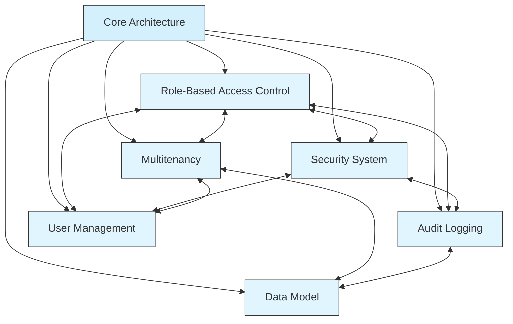

# Global Documentation Map

> **Version**: 2.0.0  
> **Last Updated**: 2025-05-22

## Overview

This document provides a comprehensive overview of the documentation structure for the project. For detailed documentation maps for each specific subsystem, please refer to the specialized maps in the [documentation-maps](documentation-maps/) directory.

## Specialized Documentation Maps

The documentation has been refactored into the following specialized maps:

- [Core Architecture Map](documentation-maps/CORE_ARCHITECTURE_MAP.md): Central architecture documents
- [RBAC System Map](documentation-maps/RBAC_SYSTEM_MAP.md): Role-based access control documentation
- [Security System Map](documentation-maps/SECURITY_SYSTEM_MAP.md): Security implementation documentation
- [Audit System Map](documentation-maps/AUDIT_SYSTEM_MAP.md): Audit logging documentation
- [Multi-Tenant Map](documentation-maps/MULTI_TENANT_MAP.md): Multi-tenant implementation documentation
- [Integration Map](documentation-maps/INTEGRATION_MAP.md): System integration documentation
- [Implementation Map](documentation-maps/IMPLEMENTATION_MAP.md): Implementation phases and decisions
- [Mobile Map](documentation-maps/MOBILE_MAP.md): Mobile application documentation
- [Testing Map](documentation-maps/TESTING_MAP.md): Testing strategies and approaches
- [User Management Map](documentation-maps/USER_MANAGEMENT_MAP.md): User management documentation

## Core Documentation Structure

```
project-plan/
├── README.md                          # Project overview
├── GLOBAL_DOCUMENTATION_MAP.md        # This file - comprehensive documentation map
├── DOCUMENTATION_MAP.md               # Documentation structure within project-plan
├── CORE_ARCHITECTURE.md               # Core architectural principles
├── DEVELOPMENT_ROADMAP.md             # Timeline and milestones
├── TECHNOLOGIES.md                    # Technology stack decisions
├── TEST_FRAMEWORK.md                  # Testing strategy
├── UI_STANDARDS.md                    # UI design guidelines
├── GLOSSARY.md                        # Terminology standardization
├── VERSION_COMPATIBILITY.md           # Version compatibility matrix
└── documentation-maps/                # Specialized documentation maps
```

## High-Level System Relationships



## Documentation Navigation Guide

### How to Navigate the Documentation

1. **Start with Core Architecture**
   - Begin with [CORE_ARCHITECTURE.md](CORE_ARCHITECTURE.md) for system overview
   - Review [DEVELOPMENT_ROADMAP.md](DEVELOPMENT_ROADMAP.md) for implementation timeline
   - Reference [GLOSSARY.md](GLOSSARY.md) for standardized terminology

2. **Explore System-Specific Documentation**
   - Use specialized documentation maps in the [documentation-maps](documentation-maps/) directory
   - Follow links within each map for detailed navigation
   - Use cross-references to understand relationships between documents

3. **Understand Cross-System Integration**
   - Review the [Integration Map](documentation-maps/INTEGRATION_MAP.md) for system connections
   - Focus on boundary areas between systems
   - Understand cross-cutting concerns

### Documentation for Key Workflows

Navigate documentation for key user workflows:

1. **User Authentication & Authorization Flow**:
   - Start: [security/AUTH_SYSTEM.md](security/AUTH_SYSTEM.md)
   - Then: [user-management/AUTHENTICATION.md](user-management/AUTHENTICATION.md)
   - Then: [rbac/permission-resolution/RESOLUTION_ALGORITHM.md](rbac/permission-resolution/RESOLUTION_ALGORITHM.md)

2. **Multi-Tenant Data Access Flow**:
   - Start: [multitenancy/SESSION_MANAGEMENT.md](multitenancy/SESSION_MANAGEMENT.md)
   - Then: [multitenancy/DATA_ISOLATION.md](multitenancy/DATA_ISOLATION.md)
   - Then: [data-model/entity-relationships/QUERY_PATTERNS.md](data-model/entity-relationships/QUERY_PATTERNS.md)

3. **Role & Permission Management Flow**:
   - Start: [rbac/ROLE_ARCHITECTURE.md](rbac/ROLE_ARCHITECTURE.md)
   - Then: [rbac/PERMISSION_TYPES.md](rbac/PERMISSION_TYPES.md)
   - Then: [user-management/RBAC_INTEGRATION.md](user-management/RBAC_INTEGRATION.md)

## Related Documentation

- **[CORE_ARCHITECTURE.md](CORE_ARCHITECTURE.md)**: Core architectural principles
- **[DOCUMENTATION_MAP.md](DOCUMENTATION_MAP.md)**: Project plan documentation structure
- **[VERSION_COMPATIBILITY.md](VERSION_COMPATIBILITY.md)**: Version compatibility matrix
- **[documentation-maps/README.md](documentation-maps/README.md)**: Documentation maps overview

## Version History

- **2.0.0**: Refactored to reference specialized documentation maps (2025-05-22)
- **1.0.0**: Initial global documentation map (2025-05-22)
