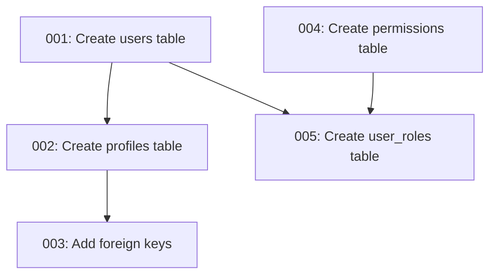

# Automated Migration & Documentation System
## Overview

The Automated Migration & Documentation System is a core infrastructure component that ensures the database schema, migrations, and related documentation remain in perfect synchronization. This system provides multiple benefits:

1. **Single Source of Truth**: Database schema is documented in a clear, consistent format
2. **Reduced Documentation Drift**: Automated processes keep documentation in sync with actual schema
3. **Migration Safety**: Checksums verify migration integrity and prevent duplicate applications
4. **Developer Workflow Integration**: Seamless integration with existing development processes
5. **Audit Trail**: Complete history of database changes with attribution

## System Components

### 1. Schema Documentation Automation

**Schema Introspection Engine**
- Connects to Supabase database to extract current schema information
- Captures tables, columns, relationships, policies, functions, and triggers
- Preserves database comments as documentation
- Generates complete markdown documentation with proper formatting

**Schema Documentation Repository**
- Central `DATABASE_SCHEMA.md` file serves as the definitive reference
- Structured sections for tables, views, functions, policies, and access patterns
- Protected with windsurf documentation preservation rules
- Includes common query patterns and usage examples

**Schema Comparison Tools**
- Detects discrepancies between documented schema and live database
- Highlights missing or outdated documentation
- Generates automated documentation update suggestions
- Integrated with CI/CD pipelines for regular verification

**Database Contract Testing**
- Validates that all application queries match the current schema
- Periodic execution against development database
- Failed contract tests block deployment to production
- Detailed reports of query/schema mismatches

### 2. Migration Management System

**Migration Registry**
- `migrations` table in database tracks all applied migrations
- Stores critical metadata:
  - `version`: Sequential identifier (e.g., "001")
  - `name`: Descriptive name (e.g., "create_users_table")
  - `script`: Full SQL content for reference and validation
  - `hash`: SHA-256 checksum for integrity verification
  - `applied_at`: Timestamp of application
  - `applied_by`: User who applied the migration
  - `breaking_change`: Flag for dangerous operations requiring special attention
  - `dependencies`: List of migration versions this migration depends on

**Migration File Standards**
- Consistent naming: `[version]_[description].sql`
- Well-documented headers:
  ```sql
  -- Migration: 001_create_users_table
  -- Description: Creates the base users table with authentication fields
  -- Date: 2025-01-01
  -- Author: Developer Name
  -- Breaking Change: No
  -- Dependencies: None
  ```
- Clear structure with sections:
  - Up migration (creating/modifying objects)
  - Documentation comments
  - Down migration (for reverting changes)
  - Migration registration statement

**Migration Utilities**
- Detection of unapplied migrations
- Safe application with proper transaction handling
- Automatic documentation updates
- Integration with development tools
- Checksum verification to prevent tampering

**Migration Lifecycle Hooks**
- Pre-migration hooks for environment setup or validation
- Post-migration hooks for data seeding or cleanup operations
- Configurable per environment (dev, staging, production)
- Hookable test execution to validate migration results

**Migration Dependency Management**
- Dependency graph visualization in documentation
- Automatic detection of execution order requirements
- Verification of complete dependency chains
- Visual migration history with dependency arrows

### 3. Integration Components

**Continuous Integration**
- Schema verification runs on every CI build
- Flags out-of-sync documentation for review
- Validates migration checksums for integrity
- Optional automated documentation PRs
- Database version compatibility testing against minimum supported versions

**Developer Tools**
- CLI utilities for schema verification
- Migration application helpers
- Documentation generation commands
- Local validation tools
- Database dependency graph generators

## Security Considerations

The system is designed with security as a top priority:

1. **Access Control**
   - Migration functions use `SECURITY DEFINER` to run with proper privileges
   - Only SuperAdmin role can apply migrations
   - All migration attempts are logged for audit purposes

2. **Data Integrity**
   - Checksum verification prevents modified migrations
   - Transaction handling ensures atomic migrations
   - Validation checks prevent common errors

3. **Execution Safety**
   - SQL execution is wrapped in controlled functions
   - Error handling preserves database state on failure
   - Clear logs of all execution attempts
   - Breaking change migrations require explicit confirmation

## Implementation Details

### Database Functions

**Migration Management Functions**

```sql
-- Check if migration has already been applied
CREATE OR REPLACE FUNCTION public.migration_exists(version_param VARCHAR)
RETURNS BOOLEAN
LANGUAGE plpgsql
SECURITY DEFINER
AS $$
BEGIN
  RETURN EXISTS (
    SELECT 1 
    FROM public.migrations 
    WHERE version = version_param
  );
END;
$$;

-- Register a migration as applied
CREATE OR REPLACE FUNCTION public.register_migration(
  version_param VARCHAR,
  name_param VARCHAR,
  script_param TEXT,
  hash_param VARCHAR,
  applied_by_param VARCHAR DEFAULT NULL,
  breaking_change_param BOOLEAN DEFAULT FALSE,
  dependencies_param TEXT[] DEFAULT NULL
)
RETURNS UUID
LANGUAGE plpgsql
SECURITY DEFINER
AS $$
DECLARE
  new_id UUID;
BEGIN
  -- Insert the migration record
  INSERT INTO public.migrations (
    version, 
    name, 
    script, 
    hash, 
    applied_by, 
    breaking_change,
    dependencies
  )
  VALUES (
    version_param, 
    name_param, 
    script_param, 
    hash_param, 
    applied_by_param,
    breaking_change_param,
    dependencies_param
  )
  RETURNING id INTO new_id;
  
  RETURN new_id;
END;
$$;

-- Execute SQL with proper logging
CREATE OR REPLACE FUNCTION public.exec_sql(sql_query TEXT)
RETURNS JSONB
LANGUAGE plpgsql
SECURITY DEFINER
AS $$
DECLARE
  result JSONB;
BEGIN
  -- Security check - ensure this is only executable by super_admin
  IF NOT EXISTS (
    SELECT 1 FROM public.user_roles 
    WHERE user_id = auth.uid() AND role::text = 'super_admin'
  ) THEN
    RAISE EXCEPTION 'Only super_admin can execute direct SQL';
  END IF;
  
  -- Log the SQL execution for audit purposes
  INSERT INTO public.sql_execution_logs (user_id, sql_query, execution_time)
  VALUES (auth.uid(), sql_query, now());
  
  -- Execute the SQL and capture any result
  EXECUTE sql_query INTO result;
  
  -- Return success
  RETURN COALESCE(result, '{"success": true}'::JSONB);
EXCEPTION WHEN OTHERS THEN
  -- Log the error
  INSERT INTO public.sql_execution_errors (user_id, sql_query, error_message, execution_time)
  VALUES (auth.uid(), sql_query, SQLERRM, now());
  
  -- Return the error as JSON
  RETURN jsonb_build_object(
    'success', false,
    'error', SQLERRM,
    'detail', SQLSTATE
  );
END;
$$;

-- Execute migration with pre/post hooks
CREATE OR REPLACE FUNCTION public.exec_migration_with_hooks(
  migration_script TEXT,
  pre_hook_script TEXT DEFAULT NULL,
  post_hook_script TEXT DEFAULT NULL
)
RETURNS JSONB
LANGUAGE plpgsql
SECURITY DEFINER
AS $$
DECLARE
  result JSONB;
  hook_result JSONB;
BEGIN
  -- Execute pre-hook if provided
  IF pre_hook_script IS NOT NULL THEN
    hook_result := public.exec_sql(pre_hook_script);
    IF (hook_result->>'success')::BOOLEAN = false THEN
      RETURN jsonb_build_object(
        'success', false,
        'stage', 'pre-hook',
        'error', hook_result->>'error',
        'detail', hook_result->>'detail'
      );
    END IF;
  END IF;
  
  -- Execute main migration
  result := public.exec_sql(migration_script);
  IF (result->>'success')::BOOLEAN = false THEN
    RETURN jsonb_build_object(
      'success', false,
      'stage', 'migration',
      'error', result->>'error',
      'detail', result->>'detail'
    );
  END IF;
  
  -- Execute post-hook if provided
  IF post_hook_script IS NOT NULL THEN
    hook_result := public.exec_sql(post_hook_script);
    IF (hook_result->>'success')::BOOLEAN = false THEN
      RETURN jsonb_build_object(
        'success', false,
        'stage', 'post-hook',
        'error', hook_result->>'error',
        'detail', hook_result->>'detail'
      );
    END IF;
  END IF;
  
  -- All steps successful
  RETURN jsonb_build_object(
    'success', true,
    'message', 'Migration with hooks executed successfully'
  );
END;
$$;
```

### TypeScript Utilities

**Schema Helper Implementation**

```typescript
export class SchemaHelper {
  /**
   * Get information about all tables in the public schema
   */
  static async getTables(): Promise<TableInfo[]> {
    try {
      // This requires sufficient permissions to query the information schema
      const { data, error } = await supabase.rpc('exec_sql', {
        sql_query: `
          WITH table_rls AS (
            SELECT
              table_name,
              row_security_active
            FROM information_schema.tables
            WHERE table_schema = 'public'
          )
          SELECT 
            c.table_name,
            json_agg(json_build_object(
              'name', c.column_name,
              'type', c.data_type,
              'nullable', c.is_nullable = 'YES',
              'default_value', c.column_default
            )) AS columns,
            t.row_security_active AS has_rls
          FROM information_schema.columns c
          JOIN table_rls t ON c.table_name = t.table_name
          WHERE c.table_schema = 'public'
          GROUP BY c.table_name, t.row_security_active
          ORDER BY c.table_name;
        `
      });
      
      if (error) {
        logger.error('Failed to get schema information', {
          details: { error: error.message }
        });
        throw error;
      }
      
      return data as TableInfo[];
    } catch (error) {
      logger.error('Error getting schema information', {
        details: { 
          error: error instanceof Error ? error.message : String(error)
        }
      });
      return [];
    }
  }
  
  /**
   * Generate a comprehensive schema report including tables, columns and policies
   */
  static async generateSchemaReport(): Promise<string> {
    try {
      const tables = await this.getTables();
      
      let report = `# Database Schema Report\nGenerated: ${new Date().toISOString()}\n\n`;
      
      for (const table of tables) {
        report += `## Table: ${table.name}\n`;
        report += table.has_rls ? "Row Level Security: **Enabled**\n\n" : "Row Level Security: Disabled\n\n";
        
        report += "### Columns\n\n";
        report += "| Name | Type | Nullable | Default |\n";
        report += "|------|------|----------|--------|\n";
        
        for (const column of table.columns) {
          report += `| ${column.name} | ${column.type} | ${column.nullable ? 'YES' : 'NO'} | ${column.default_value || ''} |\n`;
        }
        
        report += "\n### RLS Policies\n\n";
        const policies = await this.getRlsPolicies(table.name);
        
        if (policies.length === 0) {
          report += "No policies defined\n\n";
        } else {
          report += "| Name | Command | Using (Qualifier) | With Check |\n";
          report += "|------|---------|-------------------|------------|\n";
          
          for (const policy of policies) {
            report += `| ${policy.policyname} | ${policy.cmd} | ${policy.qual || ''} | ${policy.with_check || ''} |\n`;
          }
        }
        
        report += "\n---\n\n";
      }
      
      return report;
    } catch (error) {
      logger.error('Error generating schema report', {
        details: { 
          error: error instanceof Error ? error.message : String(error)
        }
      });
      return `Failed to generate schema report: ${error instanceof Error ? error.message : String(error)}`;
    }
  }
  
  /**
   * Run database contract tests to verify application queries match the schema
   */
  static async runDatabaseContractTests(): Promise<ContractTestResult[]> {
    try {
      // Read all SQL queries from application files
      const appQueries = await this.extractQueriesFromApplication();
      const results: ContractTestResult[] = [];
      
      // Test each query against the database
      for (const query of appQueries) {
        try {
          // Replace parameters with dummy values for testing
          const testableQuery = this.replaceParametersWithDummyValues(query.sql);
          
          // Add EXPLAIN ANALYZE to verify query plan without executing
          const explainQuery = `EXPLAIN ANALYZE ${testableQuery}`;
          
          // Execute the validation
          const { data, error } = await supabase.rpc('exec_sql_no_logging', {
            sql_query: explainQuery
          });
          
          results.push({
            filePath: query.filePath,
            lineNumber: query.lineNumber,
            status: error ? 'failed' : 'passed',
            errorMessage: error ? error.message : undefined,
            queryPlan: data
          });
        } catch (error) {
          results.push({
            filePath: query.filePath,
            lineNumber: query.lineNumber,
            status: 'failed',
            errorMessage: error instanceof Error ? error.message : String(error)
          });
        }
      }
      
      return results;
    } catch (error) {
      logger.error('Error running database contract tests', {
        details: { 
          error: error instanceof Error ? error.message : String(error)
        }
      });
      throw error;
    }
  }
}
```

**Migration Helper Implementation**

```typescript
export interface Migration {
  version: string;
  name: string;
  script: string;
  breakingChange?: boolean;
  dependencies?: string[];
  preHookScript?: string;
  postHookScript?: string;
}

export class MigrationHelper {
  /**
   * Checks if a migration has already been applied
   */
  static async isMigrationApplied(version: string): Promise<boolean> {
    try {
      // Use custom SQL query instead of rpc for better type-safety
      const { data, error } = await supabase
        .from('migrations')
        .select('id')
        .eq('version', version)
        .maybeSingle();
      
      if (error) {
        logger.error('Failed to check migration status', {
          details: { error: error.message, version }
        });
        throw error;
      }
      
      return !!data;
    } catch (error) {
      logger.error('Error checking migration status', {
        details: { 
          error: error instanceof Error ? error.message : String(error), 
          version 
        }
      });
      throw error;
    }
  }
  
  /**
   * Gets all applied migrations
   */
  static async getAppliedMigrations(): Promise<any[]> {
    try {
      const { data, error } = await supabase
        .from('migrations')
        .select('*')
        .order('version', { ascending: true });
      
      if (error) {
        logger.error('Failed to get applied migrations', {
          details: { error: error.message }
        });
        throw error;
      }
      
      return data || [];
    } catch (error) {
      logger.error('Error getting applied migrations', {
        details: { 
          error: error instanceof Error ? error.message : String(error)
        }
      });
      throw error;
    }
  }
  
  /**
   * Applies a migration if it hasn't been applied yet
   */
  static async applyMigration(migration: Migration): Promise<boolean> {
    try {
      // Check if already applied
      const isApplied = await this.isMigrationApplied(migration.version);
      
      if (isApplied) {
        logger.info(`Migration ${migration.version} (${migration.name}) already applied, skipping.`);
        return false;
      }
      
      // Special handling for breaking migrations
      if (migration.breakingChange) {
        logger.warn(`Migration ${migration.version} (${migration.name}) is marked as a BREAKING CHANGE.`);
        // In production, could require additional confirmation
      }
      
      // Execute the migration with hooks if provided
      const { data: execData, error: execError } = await supabase.rpc(
        migration.preHookScript || migration.postHookScript 
          ? 'exec_migration_with_hooks' 
          : 'exec_sql',
        migration.preHookScript || migration.postHookScript 
          ? {
              migration_script: migration.script,
              pre_hook_script: migration.preHookScript || null,
              post_hook_script: migration.postHookScript || null
            }
          : {
              sql_query: migration.script
            }
      );
      
      if (execError) {
        logger.error('Failed to execute migration', {
          details: { error: execError.message, migration }
        });
        throw execError;
      }
      
      // Register the migration
      await this.registerMigration(migration);
      
      logger.info(`Successfully applied migration ${migration.version} (${migration.name})`);
      return true;
    } catch (error) {
      logger.error('Error applying migration', {
        details: { 
          error: error instanceof Error ? error.message : String(error), 
          migration 
        }
      });
      throw error;
    }
  }
  
  /**
   * Generate a migration dependency graph visualization
   */
  static async generateMigrationDependencyGraph(): Promise<string> {
    try {
      const migrations = await this.getAppliedMigrations();
      
      // Start Mermaid graph definition
      let mermaidGraph = 'graph TD;\n';
      
      // Add nodes for each migration
      for (const migration of migrations) {
        mermaidGraph += `  ${migration.version}["${migration.version}: ${migration.name}"];\n`;
      }
      
      // Add edges based on dependencies
      for (const migration of migrations) {
        if (migration.dependencies && migration.dependencies.length > 0) {
          for (const dep of migration.dependencies) {
            mermaidGraph += `  ${dep} --> ${migration.version};\n`;
          }
        }
      }
      
      return mermaidGraph;
    } catch (error) {
      logger.error('Error generating migration dependency graph', {
        details: { 
          error: error instanceof Error ? error.message : String(error)
        }
      });
      throw error;
    }
  }
  
  /**
   * Verify database compatibility with minimum supported versions
   */
  static async checkDatabaseVersionCompatibility(): Promise<{
    compatible: boolean;
    currentVersion: string;
    minimumVersion: string;
    details?: string;
  }> {
    try {
      const minimumVersion = '14.0.0'; // Example minimum PostgreSQL version
      
      const { data, error } = await supabase.rpc('exec_sql', {
        sql_query: 'SHOW server_version;'
      });
      
      if (error) {
        throw error;
      }
      
      const currentVersion = data[0].server_version;
      const isCompatible = this.isVersionAtLeast(currentVersion, minimumVersion);
      
      return {
        compatible: isCompatible,
        currentVersion,
        minimumVersion,
        details: isCompatible ? 
          undefined : 
          `Current PostgreSQL version ${currentVersion} is below minimum required version ${minimumVersion}`
      };
    } catch (error) {
      logger.error('Error checking database version compatibility', {
        details: { 
          error: error instanceof Error ? error.message : String(error)
        }
      });
      throw error;
    }
  }
}
```

## Migration Dependency Management

The system includes a visual representation of migration dependencies to ensure proper execution order and identify potential conflicts. This is particularly valuable for complex database schemas with interdependent tables and constraints.

### Dependency Graph Visualization

The migration dependency graph is generated using Mermaid syntax and can be included in documentation or displayed in tools. For example:



### Dependency Resolution

The system automatically:
1. Scans migration files for explicit dependencies
2. Infers implicit dependencies based on object references
3. Validates that all dependencies are satisfied before execution
4. Prevents circular dependencies that could cause migration failures

## Database Contract Testing

To ensure that application code remains compatible with the database schema, the system includes automated contract testing that:

1. Extracts SQL queries from application code
2. Validates queries against the current database schema
3. Identifies potential issues before deployment
4. Generates reports of schema/query mismatches

This approach catches issues like:
- References to dropped columns or tables
- Invalid column types or constraints
- Missing indexes that might impact performance
- Data type mismatches between application and database

## Database Version Compatibility

The system maintains a list of minimum supported database versions and verifies compatibility:

| Component | Minimum Version | Notes |
|-----------|-----------------|-------|
| PostgreSQL | 14.0 | Required for newer JSON functions |
| PostGIS | 3.1 | If spatial features are used |
| pgcrypto | 1.3 | Required for encryption features |
| pg_stat_statements | 1.8 | For query performance monitoring |

Compatibility checks run during CI/CD pipelines to prevent deployment to incompatible environments.

## Breaking Change Management

Migrations that include potentially dangerous operations are flagged with a `breaking_change` attribute. These operations include:

- `DROP COLUMN`
- `ALTER COLUMN TYPE`
- `DROP TABLE`
- `DROP CONSTRAINT`
- Schema-level changes to permissions

Breaking changes:
1. Require explicit confirmation before execution
2. Are highlighted in documentation and reports
3. Trigger additional verification steps in CI/CD
4. Include mandatory rollback instructions
5. Require review by a database administrator

## Migration Lifecycle Hooks

The system supports pre- and post-migration hooks for operations that should run before or after the main migration:

### Pre-Migration Hooks
- Validation of database state
- Setup of temporary structures
- Backup of affected data
- Permission checks

### Post-Migration Hooks
- Data seeding
- Validation of migration results
- Cleanup of temporary objects
- Notification of stakeholders

Hooks can be environment-specific, enabling different behaviors in development, staging, and production environments.
