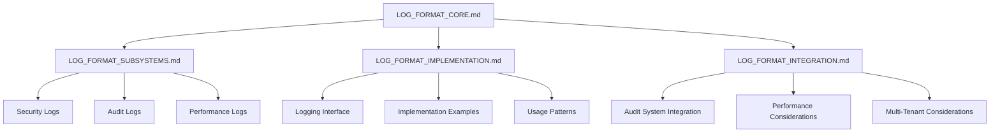

# Log Format Standardization

> **Version**: 2.0.0  
> **Last Updated**: 2025-05-23

## Overview

This document provides an entry point to the standardized log format documentation that ensures consistency, searchability, and compliance with logging requirements across all subsystems.

## Documentation Structure

The log format standardization has been refactored into these specialized documents:

1. **[LOG_FORMAT_CORE.md](LOG_FORMAT_CORE.md)**: Core log format structure, fields, categories, and levels
2. **[LOG_FORMAT_SUBSYSTEMS.md](LOG_FORMAT_SUBSYSTEMS.md)**: Subsystem-specific log formats (security, audit, performance)
3. **[LOG_FORMAT_IMPLEMENTATION.md](LOG_FORMAT_IMPLEMENTATION.md)**: Implementation guidelines, interfaces, and examples
4. **[LOG_FORMAT_INTEGRATION.md](LOG_FORMAT_INTEGRATION.md)**: Integration with other systems and performance considerations

## Architecture Diagram

## Key Principles

1. **Structured Logging**: All logs must be structured (JSON) rather than plain text
2. **Required Fields**: Every log entry must include a base set of required fields
3. **Consistent Naming**: Field names must follow established naming conventions
4. **Proper Typing**: Field values must use appropriate data types
5. **Context Preservation**: Contextual information must be preserved in all logs

## Related Documentation

- **[LOGGING_SERVICE.md](LOGGING_SERVICE.md)**: Audit logging service implementation
- **[DATABASE_STRUCTURE.md](DATABASE_STRUCTURE.md)**: Audit log storage schema
- **[SECURITY_INTEGRATION.md](SECURITY_INTEGRATION.md)**: Security audit integration
- **[STORAGE_RETENTION.md](STORAGE_RETENTION.md)**: Log retention policies
- **[../security/ERROR_HANDLING.md](../security/ERROR_HANDLING.md)**: Error handling standards
- **[../integration/EVENT_ARCHITECTURE.md](../integration/EVENT_ARCHITECTURE.md)**: Event architecture

## Version History

- **2.0.0**: Refactored into smaller specialized documents (2025-05-23)
- **1.0.0**: Initial document creation (2025-05-22)
