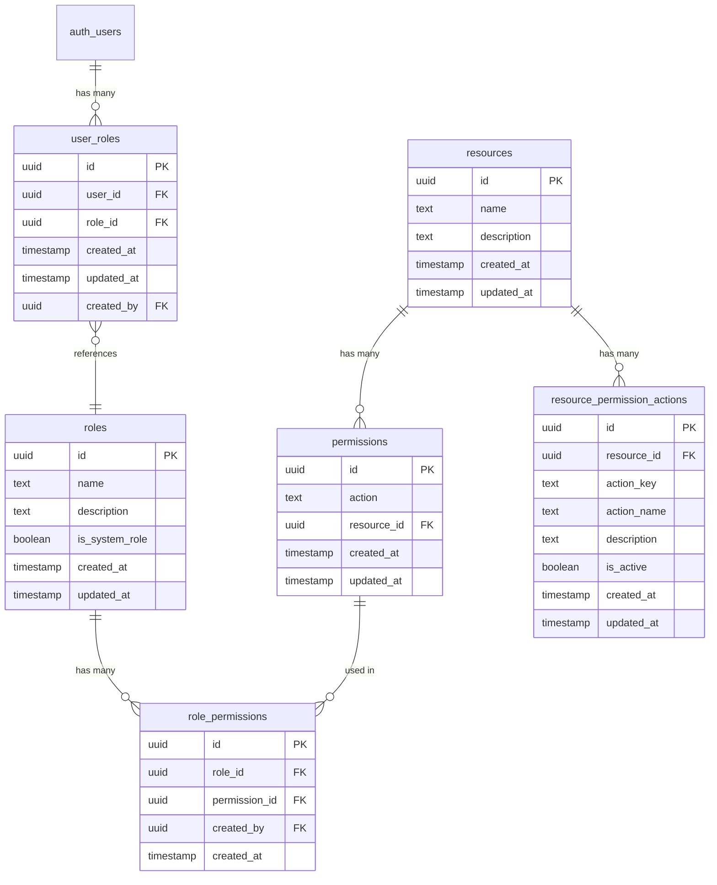

# Role-Based Access Control (RBAC) Model

> **Version**: 1.0.0  
> **Last Updated**: 2025-05-22

## Overview

This document defines the entity relationships for the Role-Based Access Control (RBAC) system, describing how roles, permissions, and resources interact.

## Entity Relationship Diagram

## Entity Descriptions

### Roles

Defines user roles within the system using a flat role structure.

**Key Properties**:
- Name and description
- System role flag (for protected roles like SuperAdmin)

**Relationships**:
- One-to-many with role permissions
- Many-to-many with users through user roles

### Resources

Represents system resources that can be protected by permissions.

**Key Properties**:
- Name and description

**Relationships**:
- One-to-many with permissions
- One-to-many with resource permission actions

### Permissions

Links resources with specific actions that can be performed on them.

**Key Properties**:
- Action identifier
- Resource reference

**Relationships**:
- Many-to-one with resources
- One-to-many with role permissions

### Role Permissions

Junction table connecting roles to their granted permissions.

**Key Properties**:
- Role reference
- Permission reference
- Creation audit information

**Relationships**:
- Many-to-one with roles
- Many-to-one with permissions

### Resource Permission Actions

Defines the available actions that can be performed on each resource.

**Key Properties**:
- Action key and descriptive name
- Active status

**Relationships**:
- Many-to-one with resources

### User Roles

Associates users with their assigned roles.

**Key Properties**:
- User reference
- Role reference
- Creation audit information

**Relationships**:
- Many-to-one with users
- Many-to-one with roles

## Permission Implementation

The system implements a direct permission assignment model with these characteristics:

1. **Flat Permission Structure**: Permissions are directly assigned to roles without hierarchical inheritance
2. **Union-Based Resolution**: Users with multiple roles have the union of all permissions from their roles
3. **Explicit Permissions**: All permissions must be explicitly granted to roles

## Related Documentation

- **[USER_IDENTITY_MODEL.md](USER_IDENTITY_MODEL.md)**: User identity model
- **[MULTI_TENANT_MODEL.md](MULTI_TENANT_MODEL.md)**: Multi-tenant role relationships
- **[CROSS_ENTITY_RELATIONSHIPS.md](CROSS_ENTITY_RELATIONSHIPS.md)**: User to permission flow
- **[../../rbac/README.md](../../rbac/README.md)**: RBAC system overview
- **[../../rbac/PERMISSION_TYPES.md](../../rbac/PERMISSION_TYPES.md)**: Permission taxonomy

## Version History

- **1.0.0**: Initial document creation from entity relationships refactoring (2025-05-22)
