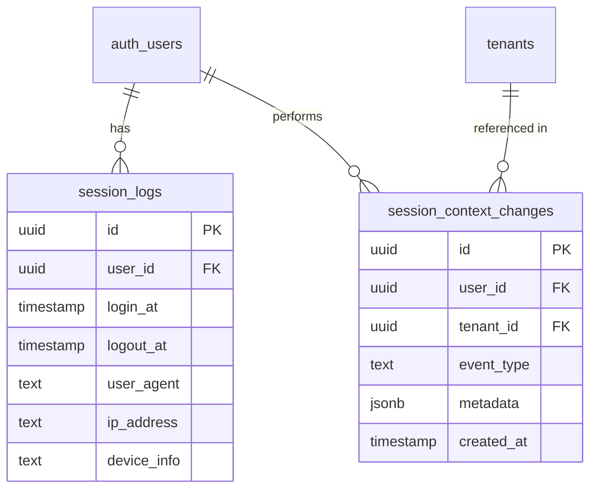
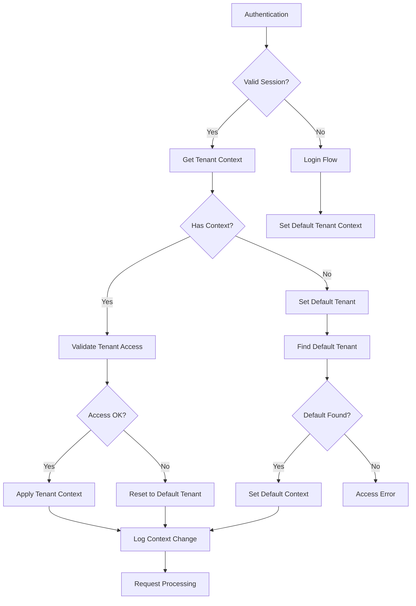

# Session and Context Management

> **Version**: 1.0.0  
> **Last Updated**: 2025-05-22

## Overview

This document defines the entity relationships for session tracking and context management, focusing on user sessions and tenant context changes.

## Entity Relationship Diagram

## Entity Descriptions

### Session Logs

Tracks user authentication sessions.

**Key Properties**:
- User reference
- Login and logout timestamps
- User agent and IP address
- Device information

**Relationships**:
- Many-to-one with users

### Session Context Changes

Records tenant context switch events.

**Key Properties**:
- User reference
- Tenant reference
- Event type (e.g., "SWITCH_TENANT", "SET_DEFAULT_TENANT")
- Additional metadata as JSON
- Timestamp

**Relationships**:
- Many-to-one with users
- Many-to-one with tenants

## Session Context Implementation

The session context management follows these principles:

1. **Explicit Tenant Context**: Every request operates in the context of a specific tenant
2. **Context Validation**: Tenant context changes require validation of user's tenant access
3. **Context Persistence**: Session maintains tenant context between requests
4. **Audit Trail**: All context changes are logged for security audit

## Session Context Flow

## Related Documentation

- **[USER_IDENTITY_MODEL.md](USER_IDENTITY_MODEL.md)**: User identity model
- **[MULTI_TENANT_MODEL.md](MULTI_TENANT_MODEL.md)**: Multi-tenant data model
- **[CROSS_ENTITY_RELATIONSHIPS.md](CROSS_ENTITY_RELATIONSHIPS.md)**: Session context resolution
- **[../../multitenancy/SESSION_MANAGEMENT.md](../../multitenancy/SESSION_MANAGEMENT.md)**: Session management
- **[../../security/AUTH_SYSTEM.md](../../security/AUTH_SYSTEM.md)**: Authentication system

## Version History

- **1.0.0**: Initial document creation from entity relationships refactoring (2025-05-22)
