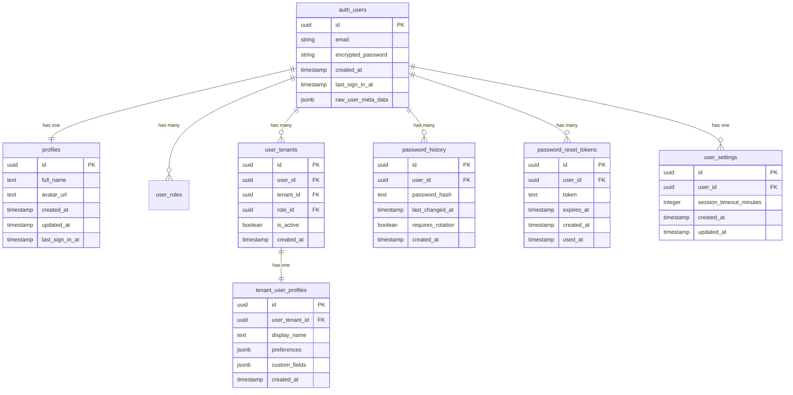

# User Authentication and Identity Model

> **Version**: 1.1.0  
> **Last Updated**: 2025-05-22

## Overview

This document defines the entity relationships for user authentication and identity within the system.

## Entity Relationship Diagram

## Entity Descriptions

### Auth Users

The core user identity entity managed by the authentication system.

**Key Properties**:
- Unique identifier
- Email address (used for authentication)
- Encrypted password
- Creation and sign-in timestamps

**Relationships**:
- One-to-one with user profile
- One-to-many with password history
- One-to-many with password reset tokens
- One-to-one with user settings
- One-to-many with user tenants (tenant memberships)

### Profiles

Extended user information that is publicly accessible and shared across all tenant contexts.

**Key Properties**:
- Full name
- Avatar URL
- Last sign-in timestamp

**Relationships**:
- One-to-one with auth users

### User Tenants

Associates users with specific tenants and their tenant-specific roles.

**Key Properties**:
- User reference
- Tenant reference
- Role reference
- Active status

**Relationships**:
- Many-to-one with auth users
- One-to-one with tenant user profiles

### Tenant User Profiles

Tenant-specific extensions of the user profile, isolated per tenant.

**Key Properties**:
- User-tenant reference
- Tenant-specific display name
- Preferences JSON
- Custom fields JSON

**Relationships**:
- One-to-one with user tenants

For a detailed implementation of how profiles are extended and isolated across tenants, see [../../multitenancy/DATA_ISOLATION.md#user-profiles-and-tenant-specific-settings](../../multitenancy/DATA_ISOLATION.md#user-profiles-and-tenant-specific-settings).

### Password History

Tracks password changes for security policy enforcement.

**Key Properties**:
- Password hash
- Timestamp of last change
- Rotation requirement flag

**Relationships**:
- Many-to-one with auth users

### Password Reset Tokens

Manages password reset flows.

**Key Properties**:
- Unique token
- Expiration timestamp
- Usage timestamp (if used)

**Relationships**:
- Many-to-one with auth users

### User Settings

User-specific application settings.

**Key Properties**:
- Session timeout duration
- Other configurable preferences

**Relationships**:
- One-to-one with auth users

## Database Implementation Considerations

1. **Security Enforcement**:
   - Passwords are never stored in plain text
   - Password history enforces rotation and reuse policies
   - Session timeouts are configurable per user

2. **Performance Optimizations**:
   - Index on email for fast authentication lookups
   - Separate profile table for commonly accessed data

3. **Profile Data Isolation**:
   - Core profile is tenant-agnostic
   - Tenant-specific profile extensions are isolated using RLS
   - Identity information shared across tenants, but tenant-specific attributes remain isolated

## Related Documentation

- **[RBAC_MODEL.md](RBAC_MODEL.md)**: User role relationships
- **[MULTI_TENANT_MODEL.md](MULTI_TENANT_MODEL.md)**: User tenant relationships
- **[SESSION_CONTEXT_MODEL.md](SESSION_CONTEXT_MODEL.md)**: User session context
- **[../../user-management/README.md](../../user-management/README.md)**: User management system overview
- **[../../multitenancy/DATA_ISOLATION.md](../../multitenancy/DATA_ISOLATION.md#user-profiles-and-tenant-specific-settings)**: Tenant data isolation with user profile implementation details

## Version History

- **1.1.0**: Added tenant user profiles and references to enhanced data isolation documentation (2025-05-22)
- **1.0.0**: Initial document creation from entity relationships refactoring (2025-05-22)
