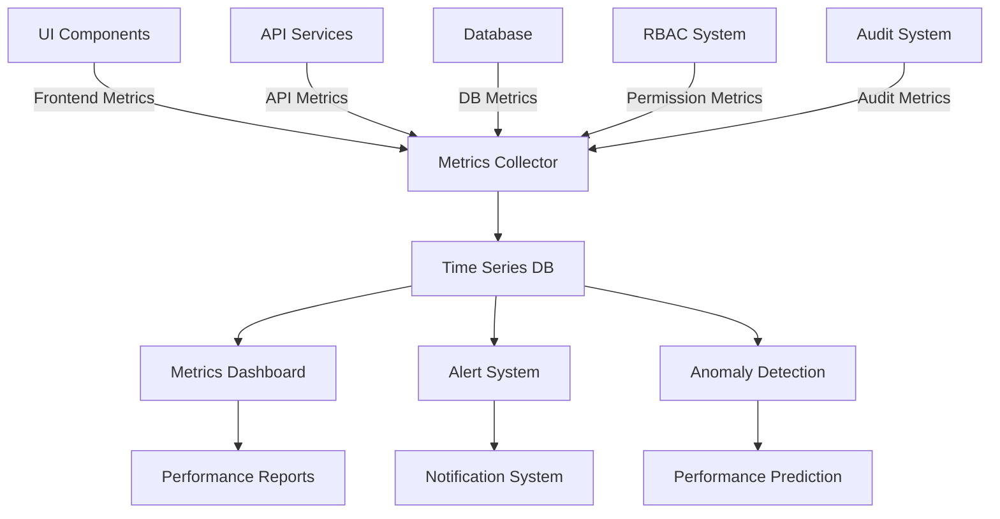
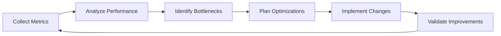

# Centralized Performance Monitoring

> **Version**: 1.0.0  
> **Last Updated**: 2025-05-23

## Overview

This document outlines the comprehensive strategy for centralized performance monitoring across all system components. It establishes a unified approach to performance tracking, analysis, and optimization that ensures consistent visibility and proactive management of performance metrics.

## Performance Monitoring Architecture

### Unified Metrics Collection



### Standardized Metric Categories

The system collects and centralizes metrics across five core categories:

1. **Response Time Metrics**
   - End-to-end response times
   - Component-specific processing times
   - Queue and wait times
   - Database query times

2. **Throughput Metrics**
   - Requests per second
   - Transactions per second
   - Records processed per second
   - API calls per minute

3. **Resource Utilization Metrics**
   - CPU usage by component
   - Memory consumption patterns
   - Network bandwidth utilization
   - Database connection usage

4. **Error Rate Metrics**
   - Error counts by type
   - Error percentages by component
   - Retry statistics
   - Circuit breaker activations

5. **Business KPI Metrics**
   - User-facing performance
   - Business transaction times
   - SLA compliance rates
   - Performance by tenant

## Implementation Components

### Core Instrumentation Layer

```typescript
// Core performance instrumentation
class PerformanceMetrics {
  private static instance: PerformanceMetrics;
  private metricsClient: MetricsClient;
  
  private constructor() {
    this.metricsClient = new MetricsClient({
      endpoint: config.metrics.endpoint,
      flushInterval: 15000, // 15 seconds
      batchSize: 100,
      tags: {
        environment: process.env.NODE_ENV,
        service: config.serviceName,
        version: config.version
      }
    });
    
    this.setupDefaultInstrumentations();
  }
  
  static getInstance(): PerformanceMetrics {
    if (!PerformanceMetrics.instance) {
      PerformanceMetrics.instance = new PerformanceMetrics();
    }
    return PerformanceMetrics.instance;
  }
  
  trackResponseTime(name: string, timeMs: number, tags: Record<string, string>): void {
    this.metricsClient.histogram(`response_time.${name}`, timeMs, {...tags});
  }
  
  trackThroughput(name: string, count: number = 1, tags: Record<string, string>): void {
    this.metricsClient.increment(`throughput.${name}`, count, {...tags});
  }
  
  trackResourceUtilization(resource: string, value: number, tags: Record<string, string>): void {
    this.metricsClient.gauge(`resource.${resource}`, value, {...tags});
  }
  
  trackErrorRate(name: string, isError: boolean, tags: Record<string, string>): void {
    const value = isError ? 1 : 0;
    this.metricsClient.increment(`errors.${name}`, value, {...tags});
  }
  
  startTimer(name: string, tags: Record<string, string> = {}): () => void {
    const startTime = performance.now();
    return () => {
      const duration = performance.now() - startTime;
      this.trackResponseTime(name, duration, tags);
    };
  }
  
  private setupDefaultInstrumentations(): void {
    // Setup automatic instrumentation for common components
    this.instrumentHttp();
    this.instrumentDatabase();
    this.instrumentCacheSystem();
    this.instrumentRbacSystem();
    
    // Track system resources
    this.startResourceMonitoring();
  }
}

// Usage example
const metrics = PerformanceMetrics.getInstance();
const endTimer = metrics.startTimer('user_authentication', { method: 'password' });

try {
  // Perform authentication
  const user = await authenticateUser(credentials);
  metrics.trackThroughput('successful_auth');
  endTimer(); // Stops timer and logs duration
} catch (error) {
  metrics.trackErrorRate('authentication', true, { reason: error.code });
  endTimer(); // Even on error, track the response time
  throw error;
}
```

### Component-Specific Instrumentation

#### Frontend Performance Monitoring

```typescript
// React component performance tracking
const useComponentPerformance = (componentName: string): void => {
  // Track render performance
  const renderStart = useRef(performance.now());
  
  useEffect(() => {
    const renderTime = performance.now() - renderStart.current;
    
    // Send to centralized system via web beacon
    navigator.sendBeacon('/api/metrics/component-render', JSON.stringify({
      component: componentName,
      renderTime,
      timestamp: new Date().toISOString(),
      route: window.location.pathname
    }));
    
    // Also track client-side metrics for local analysis
    if (window.performance && window.performance.mark) {
      window.performance.mark(`${componentName}-rendered`);
    }
    
    return () => {
      // Track unmount performance
      const unmountStart = performance.now();
      window.requestIdleCallback(() => {
        const unmountTime = performance.now() - unmountStart;
        navigator.sendBeacon('/api/metrics/component-unmount', JSON.stringify({
          component: componentName,
          unmountTime,
          timestamp: new Date().toISOString()
        }));
      });
    };
  }, [componentName]);
};

// Core Web Vitals tracking
const trackWebVitals = (): void => {
  if ('web-vitals' in window) {
    // @ts-ignore
    import('web-vitals').then(({ getCLS, getFID, getLCP }) => {
      getCLS(sendToAnalytics);
      getFID(sendToAnalytics);
      getLCP(sendToAnalytics);
    });
  }
  
  function sendToAnalytics(metric) {
    // Send to centralized metrics system
    navigator.sendBeacon('/api/metrics/web-vitals', JSON.stringify({
      name: metric.name,
      value: metric.value,
      id: metric.id,
      timestamp: new Date().toISOString()
    }));
  }
};
```

#### Database Performance Monitoring

```typescript
// Database query performance tracking
const trackQueryPerformance = (queryId: string, tenantId?: string): QueryDecorator => {
  return async (query, params) => {
    const metrics = PerformanceMetrics.getInstance();
    const endTimer = metrics.startTimer('database_query', { 
      query_id: queryId,
      tenant_id: tenantId || 'global'
    });
    
    try {
      const result = await query(params);
      
      // Track result size
      if (Array.isArray(result)) {
        metrics.trackThroughput('db_records_fetched', result.length, { 
          query_id: queryId 
        });
      }
      
      endTimer();
      return result;
    } catch (error) {
      metrics.trackErrorRate('database_query', true, { 
        query_id: queryId,
        error_code: error.code || 'unknown'
      });
      endTimer();
      throw error;
    }
  };
};

// Enhanced query with performance tracking
const getUsersWithRoles = trackQueryPerformance('get_users_with_roles', tenantId)(
  async (params) => {
    const { db, tenantId, limit, offset } = params;
    return db
      .from('users')
      .select(`
        id, 
        name,
        email,
        created_at,
        user_roles(role_id, role_name)
      `)
      .eq('tenant_id', tenantId)
      .limit(limit)
      .offset(offset);
  }
);
```

#### RBAC Performance Tracking

```typescript
// RBAC performance instrumentation
const instrumentRbacSystem = (): void => {
  const metrics = PerformanceMetrics.getInstance();
  
  // Wrap permission check function
  const originalCheckPermission = checkPermission;
  
  // @ts-ignore - Replace global function
  checkPermission = async (context: PermissionContext): Promise<boolean> => {
    const endTimer = metrics.startTimer('permission_check', {
      resource_type: context.resourceType,
      action: context.action,
      has_resource_id: Boolean(context.resourceId).toString()
    });
    
    // Track cache hits/misses
    const cacheKey = `perm:${context.userId}:${context.tenantId}:${context.resourceType}:${context.action}:${context.resourceId || 'any'}`;
    const cacheHit = permissionCache.has(cacheKey);
    
    metrics.trackThroughput(
      cacheHit ? 'permission_cache_hit' : 'permission_cache_miss',
      1,
      { resource_type: context.resourceType }
    );
    
    try {
      const result = await originalCheckPermission(context);
      endTimer();
      return result;
    } catch (error) {
      metrics.trackErrorRate('permission_check', true, {
        resource_type: context.resourceType
      });
      endTimer();
      throw error;
    }
  };
};
```

### Performance Dashboard Integration

The system includes a comprehensive performance dashboard that centralizes metrics:

1. **Real-Time Performance Views**
   - System-wide performance health indicators
   - Component-specific performance metrics
   - Custom dashboard views by role

2. **Historical Analysis Tools**
   - Performance trend visualization
   - Anomaly highlighting and investigation
   - Comparative analysis across releases

3. **SLA and Compliance Reporting**
   - Automated SLA compliance tracking
   - Performance standards adherence
   - Tenant-specific performance reporting

## Performance Optimization Workflow



### Automated Performance Analysis

```typescript
// Automated performance anomaly detection
interface PerformanceAnomaly {
  metricName: string;
  timestamp: Date;
  value: number;
  expectedRange: [number, number];
  severity: 'low' | 'medium' | 'high';
  affectedComponents: string[];
  possibleCauses: string[];
  recommendedActions: string[];
}

// Example anomaly detection system
class PerformanceAnomalyDetector {
  private modelsById: Map<string, AnomalyModel> = new Map();
  
  async detectAnomalies(
    metrics: MetricTimeSeries[]
  ): Promise<PerformanceAnomaly[]> {
    const anomalies: PerformanceAnomaly[] = [];
    
    for (const metric of metrics) {
      const model = await this.getOrCreateModel(metric.id);
      const results = await model.analyze(metric.data);
      
      if (results.isAnomaly) {
        anomalies.push({
          metricName: metric.name,
          timestamp: results.timestamp,
          value: results.value,
          expectedRange: results.expectedRange,
          severity: this.calculateSeverity(results),
          affectedComponents: await this.identifyAffectedComponents(metric, results),
          possibleCauses: await this.analyzePossibleCauses(metric, results),
          recommendedActions: await this.generateRecommendations(metric, results)
        });
      }
    }
    
    return anomalies;
  }
  
  private async getOrCreateModel(metricId: string): Promise<AnomalyModel> {
    if (!this.modelsById.has(metricId)) {
      // Create and train model for this metric
      const model = new AnomalyModel(metricId);
      await model.train();
      this.modelsById.set(metricId, model);
    }
    
    return this.modelsById.get(metricId)!;
  }
}
```

### Performance Budget Enforcement

```typescript
// Performance budget definition
interface PerformanceBudget {
  metricName: string;
  threshold: number;
  timeWindow: number;  // seconds
  action: 'alert' | 'block-deploy' | 'auto-scale' | 'circuit-break';
}

// Budget enforcement middleware
const enforceBudgets = async (req, res, next) => {
  const metrics = PerformanceMetrics.getInstance();
  const startTime = performance.now();
  
  // Continue processing the request
  next();
  
  // After response is sent, check if we exceeded budgets
  res.on('finish', () => {
    const duration = performance.now() - startTime;
    const budgets = getPerformanceBudgets(req.path);
    
    for (const budget of budgets) {
      if (duration > budget.threshold) {
        metrics.trackThroughput('budget_exceeded', 1, {
          path: req.path,
          budget: budget.metricName
        });
        
        // Take appropriate action based on budget configuration
        performBudgetAction(budget, req.path, duration);
      }
    }
  });
};

// Deploy-time budget enforcement in CI/CD
const checkPerformanceBudgets = async (buildId: string): Promise<boolean> => {
  const results = await runPerformanceTests();
  const budgets = getDeployPerformanceBudgets();
  
  for (const budget of budgets) {
    const metric = results.metrics.find(m => m.name === budget.metricName);
    
    if (metric && metric.value > budget.threshold) {
      console.error(`Performance budget exceeded: ${budget.metricName}`);
      console.error(`Value: ${metric.value}, Threshold: ${budget.threshold}`);
      
      if (budget.action === 'block-deploy') {
        return false;
      }
    }
  }
  
  return true;
};
```

## Integration with System Architecture

### Service Mesh Integration

The performance monitoring system integrates with the service mesh:

1. **Proxy-Level Metrics Collection**
   - Request/response timing at mesh boundaries
   - Service-to-service communication metrics
   - Protocol-specific performance data

2. **Traffic Control Based on Performance**
   - Automatic circuit breaking on performance degradation
   - Dynamic rate limiting based on service health
   - Performance-aware load balancing

### Infrastructure Metrics Correlation

```typescript
// Correlating application and infrastructure metrics
interface CorrelatedMetrics {
  applicationMetrics: MetricPoint[];
  infrastructureMetrics: MetricPoint[];
  correlationScore: number;
  potentialCauses: {
    description: string;
    confidence: number;
  }[];
}

// Example correlation analysis
const correlatePerfIssues = async (
  appMetric: string,
  timeWindow: [Date, Date]
): Promise<CorrelatedMetrics> => {
  const appMetrics = await fetchApplicationMetrics(appMetric, timeWindow);
  const infraMetrics = await fetchInfrastructureMetrics(timeWindow);
  
  // Calculate correlation between app and infra metrics
  const correlations = calculateTimeSeriesCorrelations(appMetrics, infraMetrics);
  
  // Find strongest correlations
  const significantCorrelations = correlations
    .filter(c => c.score > 0.7) // Strong correlation threshold
    .sort((a, b) => b.score - a.score);
  
  // Generate potential causes based on correlations
  const potentialCauses = generateCausalHypotheses(
    significantCorrelations, 
    appMetric
  );
  
  return {
    applicationMetrics: appMetrics,
    infrastructureMetrics: significantCorrelations.map(c => c.metrics).flat(),
    correlationScore: significantCorrelations[0]?.score || 0,
    potentialCauses
  };
};
```

## Related Documentation

- **[PERFORMANCE_STANDARDS.md](../PERFORMANCE_STANDARDS.md)**: System-wide performance standards and SLAs
- **[testing/PERFORMANCE_TESTING.md](../testing/PERFORMANCE_TESTING.md)**: Performance testing methodology
- **[rbac/permission-resolution/PERFORMANCE_OPTIMIZATION.md](../rbac/permission-resolution/PERFORMANCE_OPTIMIZATION.md)**: RBAC performance optimization

## Version History

- **1.0.0**: Initial centralized performance monitoring documentation (2025-05-23)
