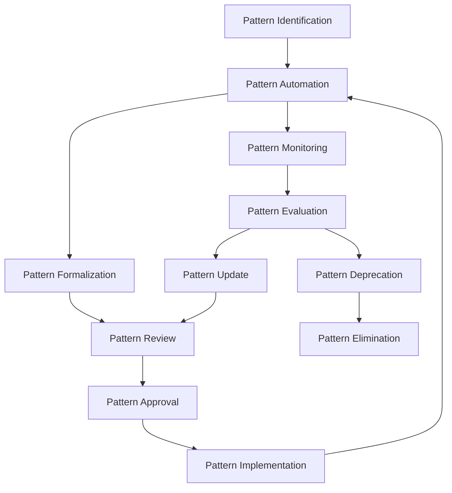

# Pattern Enforcement Mechanisms

> **Version**: 1.0.0  
> **Last Updated**: 2025-05-23

## Overview

This document outlines the mechanisms used to enforce architectural patterns and coding standards across the system. It establishes a comprehensive approach to pattern compliance that combines automated tools, development workflows, and governance processes.

## Pattern Enforcement Architecture

### Tiered Enforcement Strategy

The system implements a multi-tiered approach to pattern enforcement:

1. **Development-Time Enforcement**
   - IDE plugins and extensions
   - Pre-commit hooks
   - Custom linting rules

2. **Build-Time Enforcement**
   - Static code analysis
   - Architecture validation
   - Dependency compliance checks

3. **Review-Time Enforcement**
   - Automated code review for patterns
   - PR templates with pattern checklists
   - Documentation compliance verification

4. **Runtime Enforcement**
   - Pattern violation telemetry
   - Runtime assertion of architectural boundaries
   - Performance pattern monitoring

### Core Pattern Registry

```typescript
// Pattern definition system
interface PatternDefinition {
  id: string;
  name: string;
  description: string;
  category: 'security' | 'performance' | 'maintainability' | 'reliability';
  enforcementLevel: 'required' | 'recommended' | 'optional';
  validationRules: PatternRule[];
  examples: {
    correct: string[];
    incorrect: string[];
  };
  automationSupport: {
    linting: boolean;
    staticAnalysis: boolean;
    runtime: boolean;
  };
}

interface PatternRule {
  id: string;
  description: string;
  validator: (code: string) => boolean;
  errorMessage: string;
  fixSuggestion?: string;
}

// Pattern registry example
const corePatterns: PatternDefinition[] = [
  {
    id: 'auth-001',
    name: 'Authentication Token Handling',
    description: 'Secure handling of authentication tokens',
    category: 'security',
    enforcementLevel: 'required',
    validationRules: [
      {
        id: 'auth-001-1',
        description: 'JWT tokens must not be stored in localStorage',
        validator: (code) => !code.includes('localStorage.setItem') || !code.match(/localStorage\.setItem\([^)]*token[^)]*\)/i),
        errorMessage: 'Authentication tokens should not be stored in localStorage due to XSS vulnerability',
        fixSuggestion: 'Use httpOnly cookies or a more secure storage mechanism'
      }
    ],
    examples: {
      correct: [
        '// Tokens handled via httpOnly cookies set by the server',
        'await fetch("/api/auth/login", { credentials: "include" });'
      ],
      incorrect: [
        'localStorage.setItem("authToken", token);',
        'sessionStorage.setItem("jwt", response.token);'
      ]
    },
    automationSupport: {
      linting: true,
      staticAnalysis: true,
      runtime: false
    }
  }
  // Additional patterns would be defined here
];
```

## Automated Enforcement Tools

### Custom ESLint Rules

```typescript
// Example ESLint rule for enforcing multi-tenant patterns
module.exports = {
  rules: {
    'enforce-tenant-context': {
      create: function(context) {
        return {
          CallExpression(node) {
            // Check for database queries without tenant filtering
            if (isQueryFunction(node) && !hasTenantFilter(node)) {
              context.report({
                node,
                message: 'Database queries must include tenant context filtering',
                fix: function(fixer) {
                  return fixer.insertTextAfter(
                    node.callee,
                    '.withTenantContext(tenantId)'
                  );
                }
              });
            }
          }
        };
      }
    }
  }
};
```

### Architecture Validation Tools

The system includes custom tools for validating architectural compliance:

1. **Dependency Analysis**
   - Enforces allowed dependencies between modules
   - Prevents circular dependencies
   - Maintains layered architecture integrity

2. **Component Structure Validation**
   - Ensures components follow established patterns
   - Validates proper separation of concerns
   - Checks for UI/business logic separation

3. **API Contract Enforcement**
   - Validates API implementations against contracts
   - Ensures consistent error handling
   - Enforces versioning standards

### Runtime Pattern Monitoring

```typescript
// Runtime pattern violation detection
class PatternViolationMonitor {
  private violationMetrics: Map<string, number> = new Map();
  
  initialize(): void {
    // Set up instrumentation for pattern monitoring
    this.monitorAuthenticationPatterns();
    this.monitorDataAccessPatterns();
    this.monitorUIPatterns();
    
    // Report violations periodically
    setInterval(() => this.reportViolations(), 3600000); // Hourly
  }
  
  private monitorDataAccessPatterns(): void {
    // Intercept database queries to verify tenant context
    instrumentDataQueries((query, context) => {
      if (!context.tenantId && !context.isSuperAdmin) {
        this.recordViolation('tenant-context-missing');
        logWarning('Data query attempted without tenant context');
      }
    });
  }
  
  private recordViolation(patternId: string): void {
    const current = this.violationMetrics.get(patternId) || 0;
    this.violationMetrics.set(patternId, current + 1);
  }
  
  private reportViolations(): void {
    for (const [pattern, count] of this.violationMetrics.entries()) {
      metrics.gauge(`pattern_violations.${pattern}`, count);
    }
    this.violationMetrics.clear();
  }
}
```

## Pattern Compliance Workflows

### Continuous Integration Checks

```yaml
# Pattern validation workflow
name: Pattern Compliance

on:
  push:
    branches: [ main, develop ]
  pull_request:
    branches: [ main, develop ]

jobs:
  validate-patterns:
    runs-on: ubuntu-latest
    steps:
      - uses: actions/checkout@v3
      
      - name: Setup Node.js
        uses: actions/setup-node@v3
        with:
          node-version: '18'
          
      - name: Install dependencies
        run: npm ci
      
      - name: Run pattern linting
        run: npm run lint:patterns
      
      - name: Validate architectural boundaries
        run: npm run validate:architecture
      
      - name: Check dependency constraints
        run: npm run check:dependencies
      
      - name: Generate compliance report
        run: npm run generate:compliance-report
        
      - name: Upload compliance report
        uses: actions/upload-artifact@v3
        with:
          name: pattern-compliance-report
          path: reports/pattern-compliance.html
```

### Developer Workflow Integration

The pattern enforcement system is integrated into the developer workflow:

1. **IDE Integration**
   - Custom VS Code extension for real-time pattern validation
   - IntelliJ plugin with pattern quick-fixes
   - Code snippets that follow approved patterns

2. **Code Review Automation**
   - Automated pattern comments on PRs
   - Compliance score for each PR
   - Pattern violation highlighting

3. **Developer Documentation**
   - Pattern catalog with examples
   - Decision trees for pattern selection
   - Searchable pattern database

## Pattern Governance Process

### Pattern Evolution Process



### Pattern Exceptions Management

The system includes a formal process for managing exceptions to established patterns:

1. **Exception Request Process**
   - Justification documentation
   - Risk assessment
   - Alternative implementation proposal
   - Expiration timeline

2. **Exception Approval Workflow**
   - Architecture review committee assessment
   - Security impact analysis
   - Maintenance impact evaluation
   - Conditional approval with constraints

3. **Exception Monitoring**
   - Tracking of approved exceptions
   - Regular review of exception status
   - Proactive remediation planning

## Related Documentation

- **[ARCHITECTURE_DECISION_RECORDS.md](ARCHITECTURE_DECISION_RECORDS.md)**: Records of architectural decisions
- **[CODE_QUALITY_STANDARDS.md](../development/CODE_QUALITY_STANDARDS.md)**: Code quality requirements
- **[TECHNICAL_GOVERNANCE.md](../governance/TECHNICAL_GOVERNANCE.md)**: Technical decision-making process

## Version History

- **1.0.0**: Initial pattern enforcement mechanisms documentation (2025-05-23)
