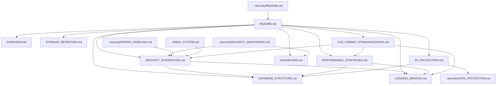

# Audit System Documentation Map

> **Version**: 1.0.0  
> **Last Updated**: 2025-05-22

This document provides a visual guide to the audit logging documentation files in the project plan.

## Audit Documentation Structure

```
audit/
├── README.md                  # Entry point and overview
├── OVERVIEW.md                # Audit logging overview
├── DATABASE_STRUCTURE.md      # Database structure for audit logs
├── LOGGING_SERVICE.md         # Logging service architecture
├── SECURITY_INTEGRATION.md    # Integration with security system
├── PERFORMANCE_STRATEGIES.md  # Performance optimization strategies
├── DASHBOARD.md               # SuperAdmin audit dashboard
├── STORAGE_RETENTION.md       # Log storage and retention
├── PII_PROTECTION.md          # PII protection and compliance
└── LOG_FORMAT_STANDARDIZATION.md # Standardized log format
```

## Document Relationships



## Integration with Other Systems

- **Security System**: Audit logs security-relevant events through SECURITY_INTEGRATION.md
- **RBAC System**: Permission changes and checks are logged
- **Multi-tenant System**: Logs maintain tenant context isolation
- **Error Handling**: Security errors are logged in standardized format

## Key Audit System Features

1. **Standardized Log Format**: Consistent structure across all systems
2. **PII Protection**: Compliance with privacy regulations
3. **Performance Optimization**: Efficient logging with minimal impact
4. **Retention Policies**: Configurable storage duration
5. **Audit Dashboard**: Visualization and analysis tools

## How to Use This Map

1. Start with **README.md** for an audit system overview
2. Review **OVERVIEW.md** for implementation approach
3. Explore specialized documents based on audit concerns:
   - For log structure, see **DATABASE_STRUCTURE.md**
   - For security integration, see **SECURITY_INTEGRATION.md**
   - For standardized formats, see **LOG_FORMAT_STANDARDIZATION.md**

## Related Maps

- [Core Architecture Map](CORE_ARCHITECTURE_MAP.md)
- [RBAC System Map](RBAC_SYSTEM_MAP.md)
- [Security System Map](SECURITY_SYSTEM_MAP.md)
- [Integration Map](INTEGRATION_MAP.md)

## Version History

- **1.0.0**: Initial audit system documentation map (2025-05-22)
