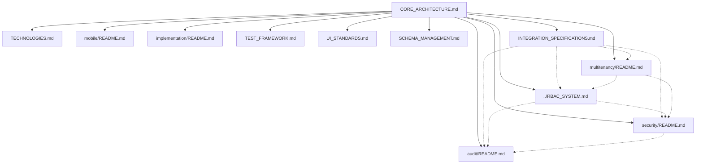

# Core Architecture Documentation Map

> **Version**: 1.0.0  
> **Last Updated**: 2025-05-22

This document provides a visual guide to the core architecture documentation files in the project plan.

## Core Architecture Documents

```
project-plan/
├── README.md                  # Entry point and overview
├── CORE_ARCHITECTURE.md       # System architecture principles
├── DEVELOPMENT_ROADMAP.md     # Timeline and milestones
├── TECHNOLOGIES.md            # Technology stack decisions
├── SCHEMA_MANAGEMENT.md       # Database schema approach
├── TEST_FRAMEWORK.md          # Testing strategy
├── UI_STANDARDS.md            # UI design guidelines
├── CLONING_GUIDELINES.md      # Project reproduction guidelines
├── GLOSSARY.md                # Terminology standardization
├── VERSION_COMPATIBILITY.md   # Version compatibility matrix
└── CROSS_REFERENCE_STANDARDS.md # Documentation cross-reference standards
```

## Document Relationships



## Key Cross-System Relationships

1. **CORE_ARCHITECTURE.md** defines the foundational principles that all other documents build upon
2. **RBAC_SYSTEM.md** integrates with security, audit, and multi-tenancy implementations
3. **INTEGRATION_SPECIFICATIONS.md** defines how major systems connect
4. **VERSION_COMPATIBILITY.md** ensures document version alignment

## How to Use This Map

1. Start with **README.md** for the project overview
2. Review **CORE_ARCHITECTURE.md** for system architecture principles
3. Follow connections to other documents based on your area of interest

## Related Maps

- [RBAC System Map](RBAC_SYSTEM_MAP.md)
- [Security System Map](SECURITY_SYSTEM_MAP.md)
- [Audit System Map](AUDIT_SYSTEM_MAP.md)
- [Multi-Tenant Map](MULTI_TENANT_MAP.md)
- [Integration Map](INTEGRATION_MAP.md)
- [Implementation Map](IMPLEMENTATION_MAP.md)
- [Mobile Map](MOBILE_MAP.md)

## Version History

- **1.0.0**: Initial core architecture documentation map (2025-05-22)
