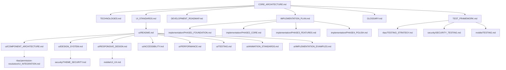

# Core Architecture Documentation Map

> **Version**: 1.2.0  
> **Last Updated**: 2025-05-23

This document provides a visual guide to the core architecture documentation files in the project plan.

## Core Architecture Structure

```
/
├── CORE_ARCHITECTURE.md           # Main architecture overview
├── TECHNOLOGIES.md                # Technology stack and decisions
├── IMPLEMENTATION_PLAN.md         # Implementation strategy and phases
├── DEVELOPMENT_ROADMAP.md         # Development timeline and milestones
├── UI_STANDARDS.md               # UI design and implementation standards
├── GLOSSARY.md                   # Terminology and definitions
├── TEST_FRAMEWORK.md             # Testing strategy and framework
└── ui/                           # Comprehensive UI implementation documentation
    ├── README.md                 # UI documentation overview
    ├── COMPONENT_ARCHITECTURE.md # Component design patterns
    ├── DESIGN_SYSTEM.md          # Design system implementation
    ├── RESPONSIVE_DESIGN.md      # Responsive design guidelines
    ├── ACCESSIBILITY.md          # Accessibility standards
    ├── PERFORMANCE.md            # UI performance optimization
    ├── TESTING.md               # UI testing strategies
    ├── ANIMATION_STANDARDS.md   # Animation guidelines
    └── IMPLEMENTATION_EXAMPLES.md # Concrete UI examples
```

## Document Relationships



## Integration with Other Systems


## Key Architectural Components

- **Core Modules**: Authentication, authorization, data management, and UI
- **Technology Stack**: React, Node.js, PostgreSQL, and cloud services
- **Security**: Authentication, authorization, data protection, and communication security
- **RBAC**: Role-based access control with permission management
- **Multi-Tenancy**: Data isolation, resource management, and tenant context
- **Mobile**: Responsive design, native apps, and offline capabilities

## How to Use This Map

1. Start with **CORE_ARCHITECTURE.md** for a high-level overview
2. Explore **TECHNOLOGIES.md** for technology stack details
3. Review **IMPLEMENTATION_PLAN.md** for implementation phases
4. Check **UI_STANDARDS.md** for UI design and implementation guidelines
5. Refer to specialized documents based on concerns:
   - For security, see **security/** documents
   - For RBAC, see **rbac/** documents
   - For multi-tenancy, see **multitenancy/** documents
   - For mobile, see **mobile/** documents

## Related Maps

- [RBAC System Map](RBAC_SYSTEM_MAP.md)
- [Security System Map](SECURITY_SYSTEM_MAP.md)
- [Multi-Tenant Map](MULTI_TENANT_MAP.md)
- [Integration Map](INTEGRATION_MAP.md)
- [Implementation Map](IMPLEMENTATION_MAP.md)
- [Testing Map](TESTING_MAP.md)

## Version History

- **1.2.0**: Added comprehensive UI documentation structure and relationships (2025-05-23)
- **1.1.0**: Enhanced with implementation maps and testing integration (2025-05-23)
- **1.0.0**: Initial core architecture documentation map (2025-05-22)
