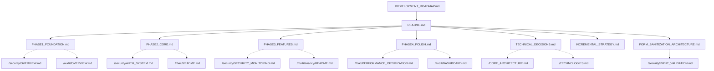

# Implementation Documentation Map

> **Version**: 1.0.0  
> **Last Updated**: 2025-05-22

This document provides a visual guide to the implementation documentation files in the project plan.

## Implementation Documentation Structure

```
implementation/
├── README.md                      # Entry point and overview
├── PHASE1_FOUNDATION.md           # Phase 1 implementation details
├── PHASE2_CORE.md                 # Phase 2 implementation details
├── PHASE3_FEATURES.md             # Phase 3 implementation details
├── PHASE4_POLISH.md               # Phase 4 implementation details
├── TECHNICAL_DECISIONS.md         # Technical decisions and rationale
├── INCREMENTAL_STRATEGY.md        # Incremental development strategy
└── FORM_SANITIZATION_ARCHITECTURE.md # Form sanitization architecture
```

## Document Relationships



## Implementation Phases

### Phase 1: Foundation
- Core architecture
- Basic security infrastructure
- Logging framework

### Phase 2: Core Features
- Authentication system
- RBAC implementation
- API foundation

### Phase 3: Advanced Features
- Multi-tenant support
- Security monitoring
- Advanced RBAC features

### Phase 4: Polish
- Performance optimization
- Advanced dashboards
- Final security hardening

## Key Technical Decisions

1. **Direct Permission Assignment**: No role hierarchy or permission inheritance
2. **Event-Driven Integration**: Using the canonical event architecture
3. **Multi-Tenant First**: Design for multi-tenant from the foundation
4. **Comprehensive Logging**: Full audit trail of all operations

## How to Use This Map

1. Start with **README.md** for an implementation overview
2. Review **DEVELOPMENT_ROADMAP.md** for the project timeline
3. Explore phase-specific documents for implementation details:
   - For foundation, see **PHASE1_FOUNDATION.md**
   - For core features, see **PHASE2_CORE.md**
   - For technical decisions, see **TECHNICAL_DECISIONS.md**

## Related Maps

- [Core Architecture Map](CORE_ARCHITECTURE_MAP.md)
- [RBAC System Map](RBAC_SYSTEM_MAP.md)
- [Security System Map](SECURITY_SYSTEM_MAP.md)
- [Integration Map](INTEGRATION_MAP.md)

## Version History

- **1.0.0**: Initial implementation documentation map (2025-05-22)
