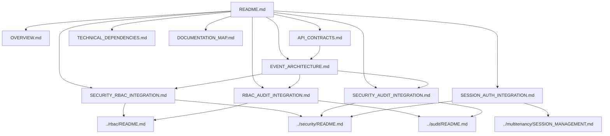
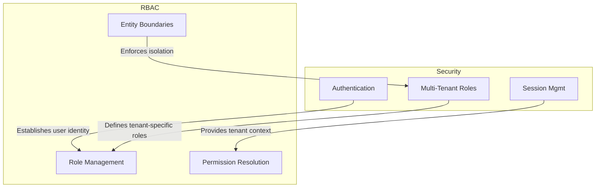
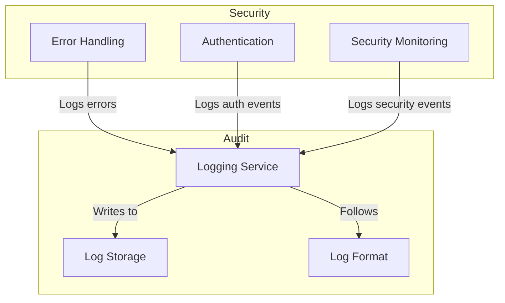

# Integration Documentation Map

> **Version**: 1.0.0  
> **Last Updated**: 2025-05-22

This document provides a visual guide to the integration documentation files in the project plan.

## Integration Documentation Structure

```
integration/
├── README.md                      # Entry point and overview
├── OVERVIEW.md                    # High-level overview of system integrations
├── SECURITY_RBAC_INTEGRATION.md   # Security and RBAC integration
├── RBAC_AUDIT_INTEGRATION.md      # RBAC and Audit integration
├── SECURITY_AUDIT_INTEGRATION.md  # Security and Audit integration
├── SESSION_AUTH_INTEGRATION.md    # Session and Authentication integration
├── EVENT_ARCHITECTURE.md          # Canonical event architecture
├── API_CONTRACTS.md               # API contracts between components
├── TECHNICAL_DEPENDENCIES.md      # Technical dependencies between components
└── DOCUMENTATION_MAP.md           # Integration documentation map
```

## Document Relationships



## Key Integration Points

### Security and RBAC Integration


### Security and Audit Integration


## Core Integration Principles

1. **Standardized Error Handling**: Following [Error Handling Standards](../security/ERROR_HANDLING.md)
2. **Consistent Log Formats**: Adhering to [Log Format Standardization](../audit/LOG_FORMAT_STANDARDIZATION.md)
3. **Optimized Permission Queries**: Implementing [Permission Query Optimization](../rbac/PERMISSION_QUERY_OPTIMIZATION.md)
4. **Multi-tenant Data Access**: Following [Database Query Patterns](../multitenancy/DATABASE_QUERY_PATTERNS.md)

## How to Use This Map

1. Start with **README.md** for an integration overview
2. Review **OVERVIEW.md** for high-level integration approach
3. Explore specialized integration documents:
   - For security and RBAC, see **SECURITY_RBAC_INTEGRATION.md**
   - For event architecture, see **EVENT_ARCHITECTURE.md**
   - For API contracts, see **API_CONTRACTS.md**

## Related Maps

- [Core Architecture Map](CORE_ARCHITECTURE_MAP.md)
- [RBAC System Map](RBAC_SYSTEM_MAP.md)
- [Security System Map](SECURITY_SYSTEM_MAP.md)
- [Audit System Map](AUDIT_SYSTEM_MAP.md)
- [Multi-Tenant Map](MULTI_TENANT_MAP.md)

## Version History

- **1.0.0**: Initial integration documentation map (2025-05-22)
