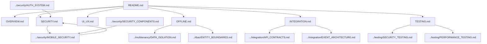

# Mobile Documentation Map

> **Version**: 1.0.0  
> **Last Updated**: 2025-05-22

This document provides a visual guide to the mobile application documentation files in the project plan.

## Mobile Documentation Structure

```
mobile/
├── README.md                  # Entry point and overview
├── OVERVIEW.md                # Mobile implementation approach
├── SECURITY.md                # Mobile-specific security
├── UI_UX.md                   # Mobile UI/UX considerations
├── OFFLINE.md                 # Offline functionality
├── INTEGRATION.md             # Integration with core platform
└── TESTING.md                 # Mobile testing strategy
```

## Document Relationships



## Key Mobile Features

### Security Implementation
- Biometric authentication
- Secure credential storage
- Encrypted local storage
- Offline permission caching

### Offline Functionality
- Data synchronization
- Conflict resolution
- Permission enforcement offline
- Audit logging queue

### Integration with Core Platform
- API integration
- Event-based synchronization
- Entity boundary preservation
- Permission synchronization

## How to Use This Map

1. Start with **README.md** for a mobile application overview
2. Review **OVERVIEW.md** for implementation approach
3. Explore specialized documents based on mobile concerns:
   - For security, see **SECURITY.md**
   - For offline functionality, see **OFFLINE.md**
   - For integration, see **INTEGRATION.md**

## Related Maps

- [Core Architecture Map](CORE_ARCHITECTURE_MAP.md)
- [Security System Map](SECURITY_SYSTEM_MAP.md)
- [RBAC System Map](RBAC_SYSTEM_MAP.md)
- [Integration Map](INTEGRATION_MAP.md)

## Version History

- **1.0.0**: Initial mobile documentation map (2025-05-22)

