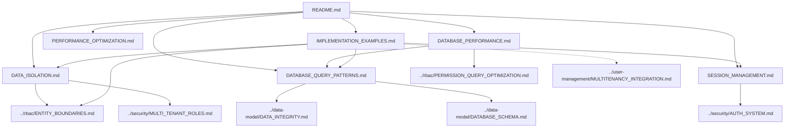

# Multi-Tenant System Documentation Map

> **Version**: 1.3.0  
> **Last Updated**: 2025-05-23

This document provides a visual guide to the multi-tenant implementation documentation files in the project plan.

## Multi-Tenant Documentation Structure

```
multitenancy/
├── README.md                     # Entry point and overview
├── DATA_ISOLATION.md             # Tenant data isolation
├── DATABASE_QUERY_PATTERNS.md    # Multi-tenant database query patterns
├── DATABASE_PERFORMANCE.md       # Multi-tenant database performance
├── SESSION_MANAGEMENT.md         # Multi-tenant session management
├── PERFORMANCE_OPTIMIZATION.md   # Performance optimization strategies
├── IMPLEMENTATION_EXAMPLES.md    # Concrete implementation examples
```

## Document Relationships



## Integration with Other Systems

- **RBAC System**: Entity boundaries enforce tenant isolation in permissions (see [../rbac/ENTITY_BOUNDARIES.md](../rbac/ENTITY_BOUNDARIES.md))
- **Security System**: Multi-tenant roles and session context
- **Data Model**: Schema design supports tenant isolation
- **User Management**: User identity and profiles across tenants
- **Audit System**: Logs maintain tenant context

## Key Multi-Tenant Features

1. **Data Isolation**: Complete tenant boundary enforcement
2. **Query Patterns**: Standardized approach to multi-tenant queries
3. **Database Performance**: Optimized for multi-tenant environments
4. **Session Management**: Tenant context preserved in user sessions
5. **Implementation Examples**: Concrete code patterns for implementing multi-tenant features

## How to Use This Map

1. Start with **README.md** for a multi-tenant system overview
2. Review **DATA_ISOLATION.md** for core isolation principles
3. For practical implementation guidance, see **IMPLEMENTATION_EXAMPLES.md**
4. Explore specialized documents based on multi-tenant concerns:
   - For database queries, see **DATABASE_QUERY_PATTERNS.md**
   - For performance optimization, see **DATABASE_PERFORMANCE.md**
   - For session handling, see **SESSION_MANAGEMENT.md**

## Related Maps

- [Core Architecture Map](CORE_ARCHITECTURE_MAP.md)
- [RBAC System Map](RBAC_SYSTEM_MAP.md)
- [Security System Map](SECURITY_SYSTEM_MAP.md)
- [Integration Map](INTEGRATION_MAP.md)
- [User Management Map](USER_MANAGEMENT_MAP.md)
- [Implementation Map](IMPLEMENTATION_MAP.md)

## Version History

- **1.3.0**: Updated entity boundaries references to use canonical source (2025-05-23)
- **1.2.0**: Added connection to user management integration and enhanced document relationships (2025-05-23)
- **1.1.0**: Added implementation examples document to the map (2025-05-23)
- **1.0.0**: Initial multi-tenant system documentation map (2025-05-22)
