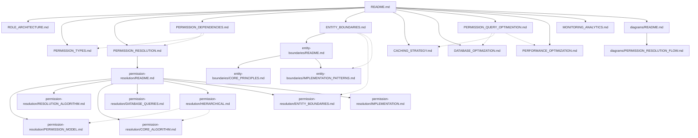
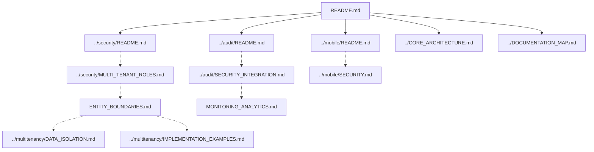

# RBAC System Documentation Map

> **Version**: 1.2.0  
> **Last Updated**: 2025-05-23

This document provides a visual guide to the Role-Based Access Control (RBAC) documentation files using the direct permission assignment model.

## RBAC Documentation Structure

```
rbac/
├── README.md                      # Entry point and overview
├── ROLE_ARCHITECTURE.md           # Direct role definition and flat structure
├── PERMISSION_TYPES.md            # Permission taxonomy and implementation
├── PERMISSION_RESOLUTION.md       # How permissions are resolved for users
├── PERMISSION_DEPENDENCIES.md     # Functional dependencies between permission types
├── ENTITY_BOUNDARIES.md           # Canonical entity boundary implementation
├── CACHING_STRATEGY.md            # Multi-level caching approach
├── DATABASE_OPTIMIZATION.md       # Database design for permissions
├── PERMISSION_QUERY_OPTIMIZATION.md # Query optimization strategies
├── PERFORMANCE_OPTIMIZATION.md    # Performance techniques
├── MONITORING_ANALYTICS.md        # Monitoring and analytics
├── entity-boundaries/             # Detailed entity boundary documentation
│   ├── README.md                  # Entity boundaries overview
│   ├── CORE_PRINCIPLES.md         # Core principles of entity boundaries
│   └── IMPLEMENTATION_PATTERNS.md # Implementation patterns for entity boundaries
└── permission-resolution/         # Detailed permission resolution documentation
    ├── README.md                  # Permission resolution overview
    ├── PERMISSION_MODEL.md        # Direct permission model details
    ├── RESOLUTION_ALGORITHM.md    # Resolution algorithm details
    ├── CORE_ALGORITHM.md          # Core algorithm implementation
    ├── DATABASE_QUERIES.md        # Direct permission SQL queries
    ├── HIERARCHICAL.md            # Direct assignment implementation (replaces hierarchy)
    ├── ENTITY_BOUNDARIES.md       # Entity boundaries in permission resolution
    └── IMPLEMENTATION.md          # Implementation details
```

## Document Relationships



## Integration with Other Systems



## Key Implementation Details

- **Direct permission assignment model** with no role hierarchy or inheritance
- Functional dependencies between permissions for logical consistency
- Entity boundaries for multi-tenant isolation
- Multi-level caching for performance optimization
- Optimized permission queries with monitoring and analytics

## How to Use This Map

1. Start with **README.md** for a high-level overview of the direct permission assignment RBAC system
2. For **role management**, continue to **ROLE_ARCHITECTURE.md** (flat structure)
3. For **permission types**, see **PERMISSION_TYPES.md**
4. For **permission resolution**, refer to **PERMISSION_RESOLUTION.md** and **PERMISSION_DEPENDENCIES.md**
5. For **multi-tenant boundaries**, check **ENTITY_BOUNDARIES.md** (canonical implementation) 
6. For **performance and optimization**, explore the caching and optimization documents
7. For **implementation examples**, see **../multitenancy/IMPLEMENTATION_EXAMPLES.md**

## Related Maps

- [Core Architecture Map](CORE_ARCHITECTURE_MAP.md)
- [Security System Map](SECURITY_SYSTEM_MAP.md)
- [Multi-Tenant Map](MULTI_TENANT_MAP.md)
- [Integration Map](INTEGRATION_MAP.md)
- [Implementation Map](IMPLEMENTATION_MAP.md)

## Version History

- **1.2.0**: Updated to align with direct permission assignment model throughout (2025-05-23)
- **1.1.0**: Updated document relationships to show entity boundaries as canonical reference, added implementation examples (2025-05-23)
- **1.0.0**: Initial RBAC system documentation map (2025-05-22)
