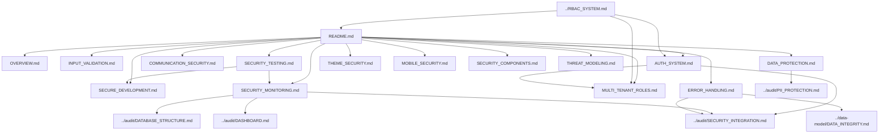

# Security System Documentation Map

> **Version**: 1.0.0  
> **Last Updated**: 2025-05-22

This document provides a visual guide to the security implementation documentation files in the project plan.

## Security Documentation Structure

```
security/
├── README.md                  # Entry point and overview
├── OVERVIEW.md                # Security implementation overview
├── INPUT_VALIDATION.md        # Input validation and sanitization
├── AUTH_SYSTEM.md             # Authentication and authorization
├── COMMUNICATION_SECURITY.md  # Secure communication
├── DATA_PROTECTION.md         # Data protection strategies
├── SECURE_DEVELOPMENT.md      # Secure development practices
├── SECURITY_TESTING.md        # Security testing
├── SECURITY_MONITORING.md     # Security monitoring
├── THEME_SECURITY.md          # Theme security framework
├── MOBILE_SECURITY.md         # Mobile application security
├── SECURITY_COMPONENTS.md     # Reusable security components
├── MULTI_TENANT_ROLES.md      # Multi-tenant role management
├── ERROR_HANDLING.md          # Error handling standards
└── THREAT_MODELING.md         # Security threat modeling
```

## Document Relationships



## Integration with Other Systems

- **RBAC System**: Security integrates with permission management through AUTH_SYSTEM.md
- **Audit System**: Security events are logged through SECURITY_MONITORING.md
- **Multi-tenant System**: Tenant boundaries enforced through MULTI_TENANT_ROLES.md
- **Mobile Application**: Platform-specific security through MOBILE_SECURITY.md

## Key Security Implementations

1. **Authentication and Authorization**: JWT-based authentication with RBAC
2. **Data Protection**: Encryption, secure storage, and PII handling
3. **Input Validation**: Comprehensive validation and sanitization
4. **Error Handling**: Standardized error responses and logging
5. **Security Monitoring**: Event detection and response

## How to Use This Map

1. Start with **README.md** for a security overview
2. Review **OVERVIEW.md** for implementation approach
3. Explore specialized documents based on security concerns:
   - For authentication, see **AUTH_SYSTEM.md**
   - For data security, see **DATA_PROTECTION.md**
   - For error handling, see **ERROR_HANDLING.md**

## Related Maps

- [Core Architecture Map](CORE_ARCHITECTURE_MAP.md)
- [RBAC System Map](RBAC_SYSTEM_MAP.md)
- [Audit System Map](AUDIT_SYSTEM_MAP.md)
- [Multi-Tenant Map](MULTI_TENANT_MAP.md)

## Version History

- **1.0.0**: Initial security system documentation map (2025-05-22)
