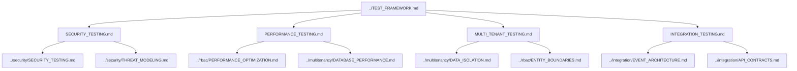

# Testing Documentation Map

> **Version**: 1.0.0  
> **Last Updated**: 2025-05-22

This document provides a visual guide to the testing documentation files in the project plan.

## Testing Documentation Structure

```
testing/
├── SECURITY_TESTING.md           # Security testing strategy
├── PERFORMANCE_TESTING.md        # Performance testing strategy
├── MULTI_TENANT_TESTING.md       # Multi-tenant testing approach
└── INTEGRATION_TESTING.md        # Integration testing approach
```

## Document Relationships



## Testing Categories

### Security Testing
- Authentication testing
- Authorization testing
- Input validation testing
- Data protection testing
- Multi-tenant security testing

### Performance Testing
- Load testing
- Stress testing
- Endurance testing
- Spike testing

### Multi-Tenant Testing
- Tenant isolation testing
- Cross-tenant access testing
- Shared infrastructure security testing
- Tenant-specific data protection testing

### Integration Testing
- Component integration testing
- System integration testing
- API contract verification
- Event flow validation

## Testing Methodologies

- Unit Testing: Component-level testing
- Integration Testing: Cross-component interaction testing
- End-to-End Testing: Complete user flow testing
- Performance Testing: System behavior under load
- Security Testing: Vulnerability and threat assessment

## How to Use This Map

1. Start with **TEST_FRAMEWORK.md** for the overall testing approach
2. Review specialized testing documents based on testing concerns:
   - For security testing, see **SECURITY_TESTING.md**
   - For performance testing, see **PERFORMANCE_TESTING.md**
   - For multi-tenant testing, see **MULTI_TENANT_TESTING.md**

## Related Maps

- [Core Architecture Map](CORE_ARCHITECTURE_MAP.md)
- [Security System Map](SECURITY_SYSTEM_MAP.md)
- [RBAC System Map](RBAC_SYSTEM_MAP.md)
- [Multi-Tenant Map](MULTI_TENANT_MAP.md)

## Version History

- **1.0.0**: Initial testing documentation map (2025-05-22)
