# Testing Documentation Map

> **Version**: 2.1.0  
> **Last Updated**: 2025-05-23

## Visual Testing Architecture

```mermaid
graph TD
    TEST_FRAME[Test Framework] --> CORE_TEST[Core Testing]
    TEST_FRAME --> SEC_TEST[Security Testing]
    TEST_FRAME --> PERF_TEST[Performance Testing]
    TEST_FRAME --> INT_TEST[Integration Testing]
    
    CORE_TEST --> PHASE1[Phase 1 Testing]
    CORE_TEST --> PHASE2[Phase 2 Testing]
    CORE_TEST --> PHASE3[Phase 3 Testing]
    CORE_TEST --> PHASE4[Phase 4 Testing]
    
    SEC_TEST --> AUTH_TEST[Auth Testing]
    SEC_TEST --> RBAC_TEST[RBAC Testing]
    SEC_TEST --> THREAT_TEST[Threat Testing]
    
    PERF_TEST --> RBAC_PERF[RBAC Performance]
    PERF_TEST --> MULTI_PERF[Multi-tenant Performance]
    PERF_TEST --> STANDARDS[Performance Standards]
    
    INT_TEST --> CORE_COMP[Core Components]
    INT_TEST --> ADV_PAT[Advanced Patterns]
    INT_TEST --> TEST_ENV[Test Environment]
    
    %% Testing Validation
    PHASE1 -.-> QUANT_MET[Quantifiable Metrics]
    PHASE2 -.-> QUANT_MET
    PHASE3 -.-> QUANT_MET
    PHASE4 -.-> QUANT_MET
    
    classDef framework fill:#e3f2fd
    classDef core fill:#f3e5f5
    classDef security fill:#ffebee
    classDef performance fill:#e8f5e8
    classDef integration fill:#fff3e0
    classDef validation fill:#fce4ec
    
    class TEST_FRAME framework
    class CORE_TEST,PHASE1,PHASE2,PHASE3,PHASE4 core
    class SEC_TEST,AUTH_TEST,RBAC_TEST,THREAT_TEST security
    class PERF_TEST,RBAC_PERF,MULTI_PERF,STANDARDS performance
    class INT_TEST,CORE_COMP,ADV_PAT,TEST_ENV integration
    class QUANT_MET validation
```

## Document Structure

### Core Testing Documents
- **[../testing/SECURITY_TESTING.md](../testing/SECURITY_TESTING.md)**: Security testing strategy and implementation
- **[../testing/PERFORMANCE_TESTING.md](../testing/PERFORMANCE_TESTING.md)**: Performance testing strategy and benchmarks
- **[../testing/MULTI_TENANT_TESTING.md](../testing/MULTI_TENANT_TESTING.md)**: Multi-tenant testing approach and validation
- **[../testing/INTEGRATION_TESTING.md](../testing/INTEGRATION_TESTING.md)**: Integration testing approach and patterns

### Enhanced Integration Testing
- **[../testing/CORE_COMPONENT_INTEGRATION.md](../testing/CORE_COMPONENT_INTEGRATION.md)**: Essential component integration tests
- **[../testing/ADVANCED_INTEGRATION_PATTERNS.md](../testing/ADVANCED_INTEGRATION_PATTERNS.md)**: Complex integration scenarios
- **[../testing/INTEGRATION_TEST_ENVIRONMENT.md](../testing/INTEGRATION_TEST_ENVIRONMENT.md)**: Test environment setup
- **[COMPONENT_INTEGRATION_MAP.md](../testing/COMPONENT_INTEGRATION_MAP.md)**: Visual component integration map

### Phase-Based Testing
- **[../implementation/testing/PHASE1_TESTING.md](../implementation/testing/PHASE1_TESTING.md)**: Phase 1 testing integration
- **[../implementation/testing/PHASE2_TESTING.md](../implementation/testing/PHASE2_TESTING.md)**: Phase 2 testing integration
- **[../implementation/testing/PHASE3_TESTING.md](../implementation/testing/PHASE3_TESTING.md)**: Phase 3 testing integration
- **[../implementation/testing/PHASE4_TESTING.md](../implementation/testing/PHASE4_TESTING.md)**: Phase 4 testing integration

### Testing Validation
- **[../implementation/testing/QUANTIFIABLE_METRICS.md](../implementation/testing/QUANTIFIABLE_METRICS.md)**: Quantifiable validation criteria

### Framework and Standards
- **[../TEST_FRAMEWORK.md](../TEST_FRAMEWORK.md)**: Overall testing framework and approach
- **[../PERFORMANCE_STANDARDS.md](../PERFORMANCE_STANDARDS.md)**: Performance standards and benchmarks

## Navigation Sequence

### For Testing Framework Overview
1. **Framework**: [TEST_FRAMEWORK.md](../TEST_FRAMEWORK.md) - Overall testing approach
2. **Standards**: [PERFORMANCE_STANDARDS.md](../PERFORMANCE_STANDARDS.md) - Performance benchmarks
3. **Security**: [SECURITY_TESTING.md](../testing/SECURITY_TESTING.md) - Security testing strategy
4. **Integration**: [INTEGRATION_TESTING.md](../testing/INTEGRATION_TESTING.md) - Integration testing approach

### For Security Testing Implementation
1. **Security Testing**: [SECURITY_TESTING.md](../testing/SECURITY_TESTING.md) - Security testing strategy
2. **Security Framework**: [../security/SECURITY_TESTING.md](../security/SECURITY_TESTING.md) - Security testing implementation
3. **Threat Modeling**: [../security/THREAT_MODELING.md](../security/THREAT_MODELING.md) - Security threat assessment
4. **Integration**: Cross-system security testing validation

### For Performance Testing Implementation
1. **Performance Testing**: [PERFORMANCE_TESTING.md](../testing/PERFORMANCE_TESTING.md) - Performance testing strategy
2. **RBAC Performance**: [../rbac/PERFORMANCE_OPTIMIZATION.md](../rbac/PERFORMANCE_OPTIMIZATION.md) - RBAC performance testing
3. **Multi-tenant Performance**: [../multitenancy/DATABASE_PERFORMANCE.md](../multitenancy/DATABASE_PERFORMANCE.md) - Multi-tenant performance
4. **Standards**: [PERFORMANCE_STANDARDS.md](../PERFORMANCE_STANDARDS.md) - Performance benchmarks

### For Multi-Tenant Testing Implementation
1. **Multi-tenant Testing**: [MULTI_TENANT_TESTING.md](../testing/MULTI_TENANT_TESTING.md) - Multi-tenant testing approach
2. **Data Isolation**: [../multitenancy/DATA_ISOLATION.md](../multitenancy/DATA_ISOLATION.md) - Isolation testing
3. **Entity Boundaries**: [../rbac/ENTITY_BOUNDARIES.md](../rbac/ENTITY_BOUNDARIES.md) - Boundary testing
4. **Cross-tenant Validation**: Multi-tenant security and isolation testing

### For Integration Testing Implementation
1. **Integration Overview**: [INTEGRATION_TESTING.md](../testing/INTEGRATION_TESTING.md) - Integration testing strategy
2. **Core Components**: [CORE_COMPONENT_INTEGRATION.md](../testing/CORE_COMPONENT_INTEGRATION.md) - Essential integration tests
3. **Advanced Patterns**: [ADVANCED_INTEGRATION_PATTERNS.md](../testing/ADVANCED_INTEGRATION_PATTERNS.md) - Complex scenarios
4. **Test Environment**: [INTEGRATION_TEST_ENVIRONMENT.md](../testing/INTEGRATION_TEST_ENVIRONMENT.md) - Environment setup

### For Phase-Based Testing
1. **Phase 1**: [PHASE1_TESTING.md](../implementation/testing/PHASE1_TESTING.md) - Foundation testing
2. **Phase 2**: [PHASE2_TESTING.md](../implementation/testing/PHASE2_TESTING.md) - Core features testing
3. **Phase 3**: [PHASE3_TESTING.md](../implementation/testing/PHASE3_TESTING.md) - Advanced features testing
4. **Phase 4**: [PHASE4_TESTING.md](../implementation/testing/PHASE4_TESTING.md) - Production testing

## Integration Points

### With Security System
- **Authentication Testing**: User authentication flow validation
- **Authorization Testing**: Permission and role-based access testing
- **Input Validation Testing**: Security input sanitization testing
- **Threat Testing**: Security threat modeling and penetration testing

### With RBAC System
- **Permission Testing**: Permission resolution and enforcement testing
- **Role Testing**: Role assignment and hierarchy testing
- **Boundary Testing**: Entity boundary enforcement testing
- **Performance Testing**: Permission system performance validation

### With Multi-tenant System
- **Isolation Testing**: Tenant data isolation validation
- **Cross-tenant Testing**: Cross-tenant access prevention testing
- **Performance Testing**: Multi-tenant system performance validation
- **Data Testing**: Tenant-specific data integrity testing

### With Integration System
- **API Testing**: API contract and integration testing
- **Event Testing**: Event-driven architecture testing
- **Cross-system Testing**: Integration between system components
- **End-to-end Testing**: Complete system workflow validation

## Usage Guidelines

### For Testing Architects
- Start with TEST_FRAMEWORK.md for overall testing strategy
- Use component-specific testing documents for detailed testing approaches
- Reference performance standards for benchmark establishment
- Check integration testing for cross-system validation

### For Security Testing Teams
- Use SECURITY_TESTING.md for security testing strategy
- Reference security implementation documents for testing scope
- Follow threat modeling for security test case development
- Check integration points for cross-system security testing

### For Performance Testing Teams
- Use PERFORMANCE_TESTING.md for performance testing strategy
- Reference PERFORMANCE_STANDARDS.md for benchmark targets
- Check component performance documents for specific testing approaches
- Use multi-tenant testing for tenant-specific performance validation

### For QA Teams
- Follow TEST_FRAMEWORK.md for overall testing approach
- Use component-specific testing documents for detailed test planning
- Reference integration testing for cross-system test scenarios
- Check multi-tenant testing for tenant isolation validation

## Related Maps

- **[SECURITY_SYSTEM_MAP.md](SECURITY_SYSTEM_MAP.md)**: Security testing integration
- **[RBAC_SYSTEM_MAP.md](RBAC_SYSTEM_MAP.md)**: RBAC testing integration
- **[MULTI_TENANT_MAP.md](MULTI_TENANT_MAP.md)**: Multi-tenant testing integration
- **[INTEGRATION_MAP.md](INTEGRATION_MAP.md)**: Cross-system testing integration
- **[CORE_ARCHITECTURE_MAP.md](CORE_ARCHITECTURE_MAP.md)**: Architecture testing integration

## Version History

- **2.1.0**: Added visual testing architecture and enhanced integration testing documents (2025-05-23)
- **2.0.0**: Standardized format with consistent navigation structure (2025-05-23)
- **1.0.0**: Initial testing documentation map (2025-05-22)
