# User Management Documentation Map

> **Version**: 1.0.0  
> **Last Updated**: 2025-05-22

This document provides a visual guide to the user management documentation files in the project plan.

## User Management Documentation Structure

```
user-management/
├── README.md                      # Entry point and overview
├── IDENTITY_ARCHITECTURE.md       # Identity architecture
├── AUTHENTICATION.md              # Authentication process
├── REGISTRATION_ONBOARDING.md     # Registration and onboarding
├── PROFILE_MANAGEMENT.md          # User profile management
├── RBAC_INTEGRATION.md            # RBAC integration
├── MULTITENANCY_INTEGRATION.md    # Multitenancy integration
├── AUDIT_SECURITY.md              # Audit and security
├── ERROR_HANDLING.md              # Error handling standards
├── CORE_USER_MODEL.md             # Core user model
└── USER_EXTENSIONS.md             # User extensions
```

## Document Relationships

```mermaid
graph TD
    USER["README.md"] --> IDENTITY["IDENTITY_ARCHITECTURE.md"]
    USER --> AUTH["AUTHENTICATION.md"]
    USER --> REG["REGISTRATION_ONBOARDING.md"]
    USER --> PROFILE["PROFILE_MANAGEMENT.md"]
    USER --> RBAC_INT["RBAC_INTEGRATION.md"]
    USER --> MT_INT["MULTITENANCY_INTEGRATION.md"]
    USER --> AUDIT_SEC["AUDIT_SECURITY.md"]
    USER --> ERR["ERROR_HANDLING.md"]
    USER --> CORE["CORE_USER_MODEL.md"]
    USER --> EXT["USER_EXTENSIONS.md"]
    
    AUTH --> SEC_AUTH["../security/AUTH_SYSTEM.md"]
    
    RBAC_INT --> RBAC["../rbac/README.md"]
    RBAC_INT --> PERM["../rbac/PERMISSION_TYPES.md"]
    
    MT_INT --> MT_DATA["../multitenancy/DATA_ISOLATION.md"]
    MT_INT --> MT_SESSION["../multitenancy/SESSION_MANAGEMENT.md"]
    
    AUDIT_SEC --> AUDIT["../audit/README.md"]
    AUDIT_SEC --> SEC_AUDIT["../integration/SECURITY_AUDIT_INTEGRATION.md"]
    
    ERR --> SEC_ERR["../security/ERROR_HANDLING.md"]
    ERR --> LOG_FORMAT["../audit/LOG_FORMAT_STANDARDIZATION.md"]
    
    CORE --> DATA_MODEL["../data-model/entity-relationships/USER_IDENTITY_MODEL.md"]
    
    EXT --> MT_DATA
```



## User Management Processes

### User Identity
- Core user model definition
- Identity verification
- User profile attributes
- Profile data isolation

### Authentication
- Credential validation
- Multi-factor authentication
- Session management
- Token validation

### RBAC Integration
- User role assignment
- Permission resolution
- Resource access control
- Entity boundary enforcement

### Multi-Tenant Integration
- Entity-specific user profiles
- Tenant context management
- Cross-tenant isolation
- Tenant-specific roles

## Error Handling

User management errors are categorized into:

- Authentication errors
- Registration errors
- Profile management errors
- Permission and role errors

All errors follow standardized error response structures and logging.

## How to Use This Map

1. Start with **README.md** for a user management overview
2. Review specialized user management documents:
   - For identity architecture, see **IDENTITY_ARCHITECTURE.md**
   - For authentication, see **AUTHENTICATION.md**
   - For error handling, see **ERROR_HANDLING.md**

## Related Maps

- [Core Architecture Map](CORE_ARCHITECTURE_MAP.md)
- [Security System Map](SECURITY_SYSTEM_MAP.md)
- [RBAC System Map](RBAC_SYSTEM_MAP.md)
- [Multi-Tenant Map](MULTI_TENANT_MAP.md)

## Version History

- **1.0.0**: Initial user management documentation map (2025-05-22)
