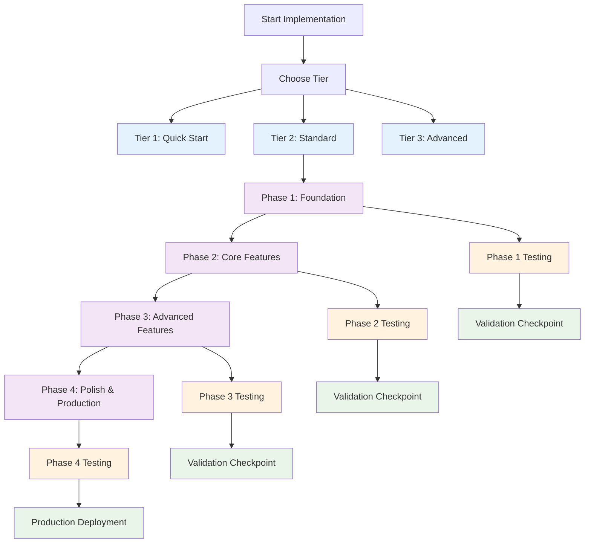

# Implementation Documentation

> **Version**: 2.1.0  
> **Last Updated**: 2025-05-23

## Overview

This directory contains implementation guidance organized by phase for optimal AI context management.

## Visual Implementation Architecture

## Document Structure

### Overview Documents
- **[DOCUMENT_MAP_OVERVIEW.md](docs/implementation/DOCUMENT_MAP_OVERVIEW.md)**: Complete implementation overview
- **[TESTING_INTEGRATION_OVERVIEW.md](docs/implementation/TESTING_INTEGRATION_OVERVIEW.md)**: Testing integration approach
- **[CANONICAL_REFERENCES.md](docs/implementation/CANONICAL_REFERENCES.md)**: Definitive specification index

### Phase-Specific Implementation
- **[Phase 1 Document Map](docs/implementation/phase1/DOCUMENT_MAP.md)**: Phase 1 Foundation (18 documents)
- **[Phase 2 Document Map](docs/implementation/phase2/DOCUMENT_MAP.md)**: Phase 2 Core Features (14 documents)
- **[Phase 3 Document Map](docs/implementation/phase3/DOCUMENT_MAP.md)**: Phase 3 Advanced Features (15 documents)
- **[Phase 4 Document Map](docs/implementation/phase4/DOCUMENT_MAP.md)**: Phase 4 Polish & Production (11 documents)

### Testing Integration
- **[Phase 1 Testing](docs/implementation/testing/PHASE1_TESTING.md)**: Foundation testing
- **[Phase 2 Testing](docs/implementation/testing/PHASE2_TESTING.md)**: Core features testing
- **[Phase 3 Testing](docs/implementation/testing/PHASE3_TESTING.md)**: Advanced features testing
- **[Phase 4 Testing](docs/implementation/testing/PHASE4_TESTING.md)**: Production testing
- **[Quantifiable Metrics](docs/implementation/testing/QUANTIFIABLE_METRICS.md)**: Validation criteria

## Implementation Guidelines

- **[TECHNICAL_DECISIONS.md](docs/implementation/TECHNICAL_DECISIONS.md)**: Key technical decisions
- **[INCREMENTAL_STRATEGY.md](docs/implementation/INCREMENTAL_STRATEGY.md)**: Incremental development strategy
- **[TESTING_INTEGRATION_GUIDE.md](docs/implementation/TESTING_INTEGRATION_GUIDE.md)**: Master testing integration guide
- **[PHASE_VALIDATION_CHECKPOINTS.md](docs/implementation/PHASE_VALIDATION_CHECKPOINTS.md)**: Validation requirements

## AI Implementation Path

### For Quick Implementation (1-2 hours)
- **[AI Development Quick Start](docs/ai-development/TIER1_QUICK_START.md)**: Essential features only

### For Production Implementation (2-4 weeks)
- **[Authoritative Implementation Path](docs/ai-development/AUTHORITATIVE_IMPLEMENTATION_PATH.md)**: Complete implementation sequence

### For Advanced Optimization
- **[Advanced Tier Guide](docs/ai-development/TIER3_ADVANCED.md)**: Optimization and edge cases

## Knowledge Graph Navigation

For AI implementation, follow the knowledge graph:
- **[Knowledge Graph](docs/KNOWLEDGE_GRAPH.md)**: Document relationships and navigation paths
- **[Cross-Reference Standards](docs/CROSS_REFERENCE_STANDARDS.md)**: Updated cross-reference guidelines
- **[AI Context Management](docs/ai-development/AI_CONTEXT_MANAGEMENT_GUIDELINES.md)**: AI navigation rules

## Related Documentation

- **[Development Roadmap](docs/DEVELOPMENT_ROADMAP.md)**: Development timeline
- **[Core Architecture](docs/CORE_ARCHITECTURE.md)**: System architecture
- **[AI Development Guides](docs/ai-development/README.md)**: AI development guides
- **[Testing Documentation](docs/testing/INTEGRATION_TESTING.md)**: Testing strategy

## Version History

- **2.1.0**: Added visual implementation architecture and enhanced testing integration (2025-05-23)
- **2.0.0**: Updated to absolute path standard and added knowledge graph integration (2025-05-23)
- **1.0.0**: Refactored from MASTER_DOCUMENT_MAP.md into focused documents (2025-05-22)
