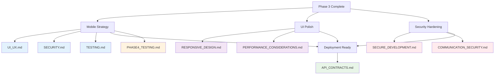

# Phase 4: Polish & Production - Document Map

> **Version**: 1.2.0  
> **Last Updated**: 2025-05-23

## AI Context Management

### 📋 Document Processing Groups
**Process these documents in separate AI sessions to maintain context:**

#### Session 4A: Mobile Strategy & UI Polish
- `docs/mobile/UI_UX.md`
- `docs/mobile/SECURITY.md`
- `docs/ui/RESPONSIVE_DESIGN.md`

#### Session 4B: Security Hardening & Testing
- `docs/security/SECURE_DEVELOPMENT.md`
- `docs/security/COMMUNICATION_SECURITY.md`
- `docs/implementation/testing/PHASE4_TESTING.md`

#### Session 4C: Documentation & Deployment
- `docs/mobile/TESTING.md`
- `docs/ui/responsive/PERFORMANCE_CONSIDERATIONS.md`
- `docs/integration/API_CONTRACTS.md`

**⚠️ AI Implementation Rule**: Maximum 3-4 documents per session. Must complete Phase 3 validation checkpoint before starting Phase 4.

## Overview

This map consolidates all documentation references needed for Phase 4 implementation - the final polish, mobile integration, and production readiness phase.

## Document Count: 8 Total
- Mobile Strategy: 3 documents
- UI Polish: 2 documents
- Security Hardening: 2 documents
- Documentation & Deployment: 1 document

## Visual Relationship Diagram



## Essential Documents for Phase 4

### 1. Mobile Strategy
- **[../../mobile/UI_UX.md](../../mobile/UI_UX.md)**: Mobile UI/UX implementation
- **[../../mobile/SECURITY.md](../../mobile/SECURITY.md)**: Mobile security features
- **[../../mobile/TESTING.md](../../mobile/TESTING.md)**: Mobile testing strategy

### 2. UI Polish
- **[../../ui/RESPONSIVE_DESIGN.md](../../ui/RESPONSIVE_DESIGN.md)**: Responsive design refinement
- **[../../ui/responsive/PERFORMANCE_CONSIDERATIONS.md](../../ui/responsive/PERFORMANCE_CONSIDERATIONS.md)**: Performance considerations

### 3. Security Hardening
- **[../../security/SECURE_DEVELOPMENT.md](../../security/SECURE_DEVELOPMENT.md)**: Secure development practices
- **[../../security/COMMUNICATION_SECURITY.md](../../security/COMMUNICATION_SECURITY.md)**: Communication security

### 4. Documentation & Deployment
- **[../../integration/API_CONTRACTS.md](../../integration/API_CONTRACTS.md)**: API documentation standards

### 5. Testing Integration
- **[../testing/PHASE4_TESTING.md](../testing/PHASE4_TESTING.md)**: Phase 4 testing integration

## Implementation Sequence

```
Week 13-14: Mobile Strategy & UI Polish
├── UI_UX.md → Mobile UI Implementation
├── SECURITY.md → Mobile Security Features  
├── RESPONSIVE_DESIGN.md → UI Refinement
├── PERFORMANCE_CONSIDERATIONS.md → Performance Optimization
└── TESTING.md → Mobile Testing

Week 15: Security Hardening
├── SECURE_DEVELOPMENT.md → Production Security
├── COMMUNICATION_SECURITY.md → Secure Communications
└── PHASE4_TESTING.md → Security Testing

Week 16: Documentation & Launch
├── API_CONTRACTS.md → Complete Documentation
└── Final Validation & Launch Preparation
```

## Success Criteria
✅ All 8 documents referenced and implemented correctly  
✅ Native mobile application functional  
✅ UI polished and accessibility compliant  
✅ Security hardened for production deployment  
✅ Complete documentation suite available  
✅ All phase 4 validation metrics met  

## Mobile vs Responsive Clarification

### Already Implemented (Phases 1-3)
- ✅ Mobile-first responsive web design
- ✅ Touch-friendly UI components
- ✅ Responsive breakpoints and layouts

### New in Phase 4
- 🆕 Native mobile app development
- 🆕 Offline functionality and data sync
- 🆕 Platform-specific native features
- 🆕 Mobile app store deployment

## Validation Checkpoints

### Phase 4A: Mobile & UI (Week 13-14)
- Mobile app builds and runs successfully
- UI polish meets design system standards
- Responsive design works across all devices

### Phase 4B: Security (Week 15)
- Security audit passes all requirements
- Production security measures implemented
- Communication security validated

### Phase 4C: Launch Ready (Week 16)
- Complete documentation available
- API contracts documented
- All testing phases passed
- Launch preparation complete

## Version History
- **1.2.0**: Completed document with full context and implementation details (2025-05-23)
- **1.1.0**: Added testing integration documents and visual relationship diagram (2025-05-23)
- **1.0.0**: Created from MASTER_DOCUMENT_MAP.md refactoring (2025-05-23)
